# System Architecture Overview

This document provides a comprehensive architecture reference covering application patterns, deployment strategy, scaling models, security, observability, disaster recovery, CI/CD, data flow, and cloud deployments.

## 1. Application Architecture Overview

### 1.1 Monolithic Architecture

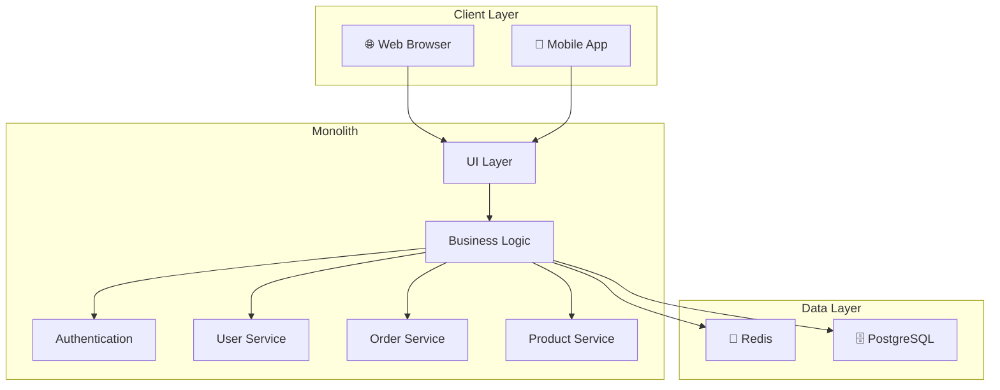

### 1.2 Microservices Architecture

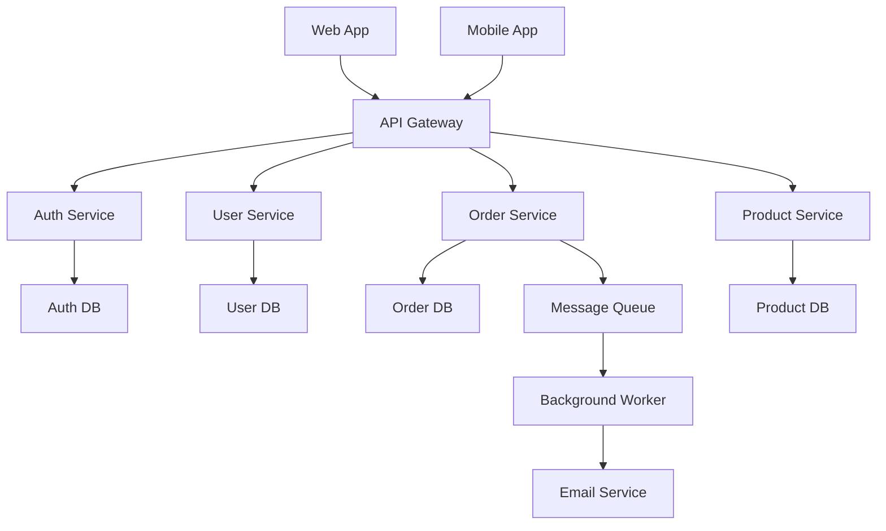

### 1.3 Event-Driven Architecture

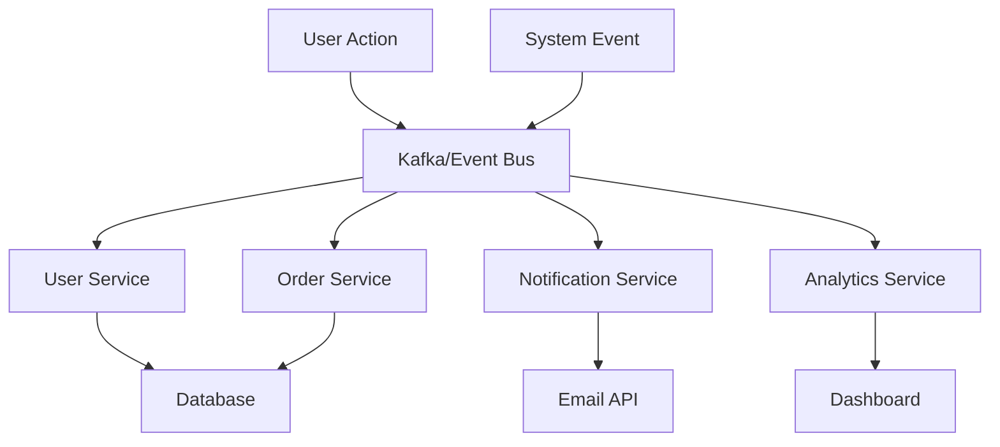

### 1.4 Serverless Architecture

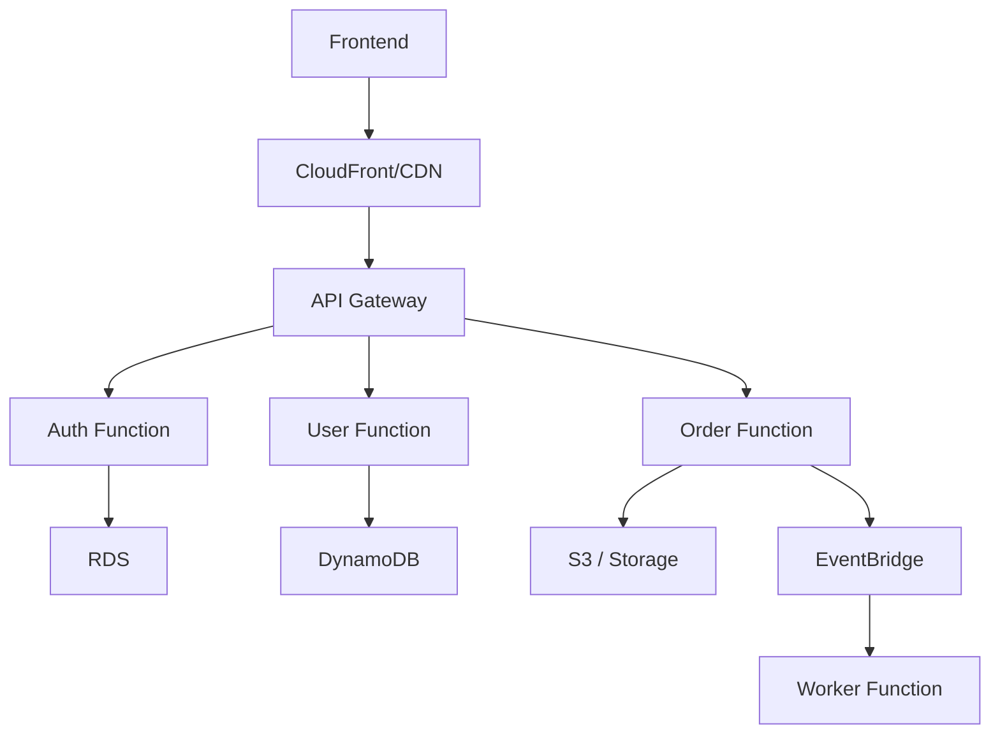

---

## 2. Security Architecture

Security should be treated as a core design concern, not an afterthought. A well-designed system uses layers of protection across identity, access, network, infrastructure, and data handling.

### 2.1 Identity and Access Security

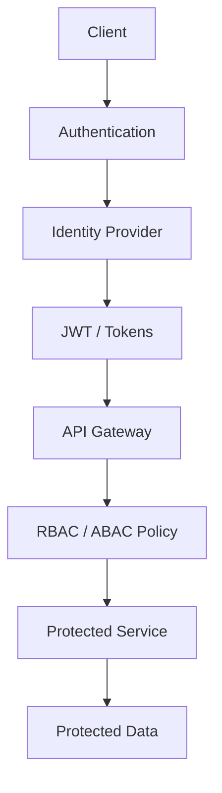

### 2.2 Security Layered Model

- Identity and Access Management
  - OAuth 2.0 / OIDC
  - SSO and MFA
  - RBAC / ABAC
- Network Security
  - Private subnets
  - WAF and API gateway protections
  - TLS everywhere
  - IP allow lists and VPC isolation
- Application Security
  - Input validation
  - Parameterized queries
  - CSRF and XSS protection
  - Rate limiting and request signing
- Data Security
  - Encryption at rest and in transit
  - Secret management
  - Key rotation
  - Data masking and tokenization
- Operations Security
  - Least privilege IAM policies
  - Security scanning in CI/CD
  - Patch management
  - Audit logs and detection rules

### 2.3 Recommended Security Controls

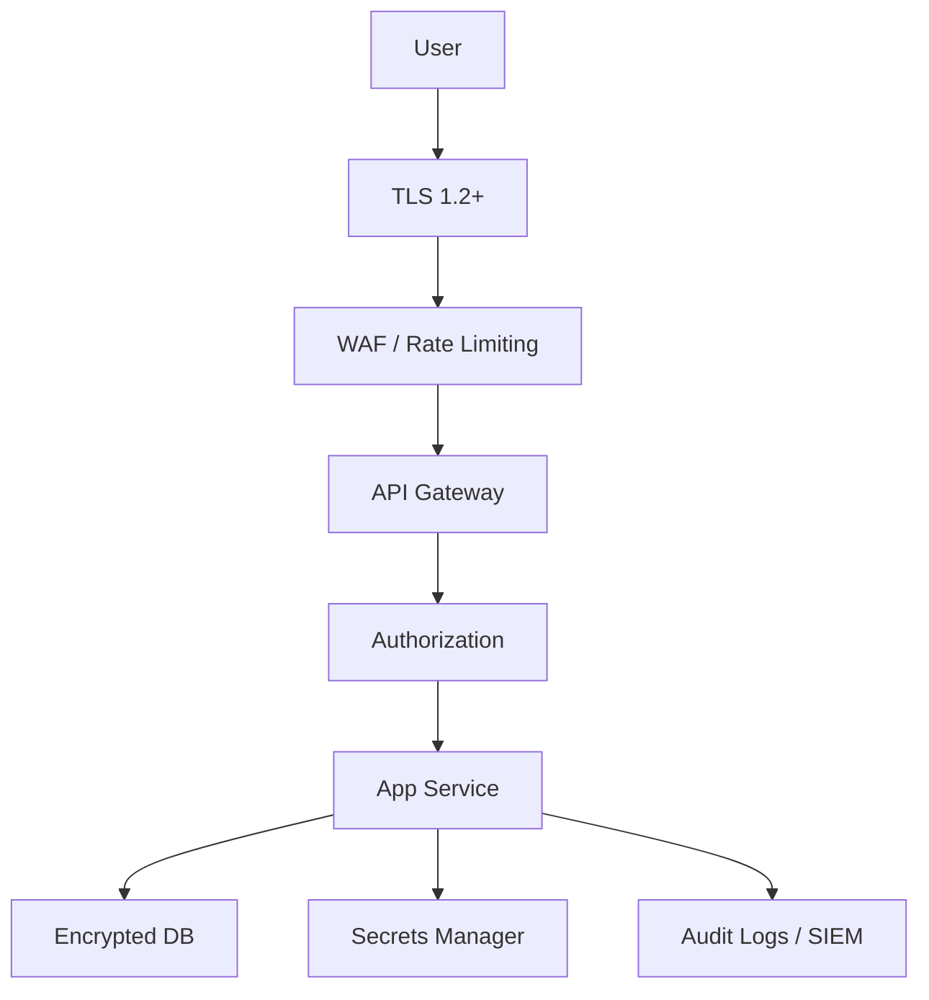

### 2.4 Key Security Best Practices

- Use short-lived tokens and refresh tokens
- Apply least-privilege IAM roles
- Enable MFA for administration and privileged users
- Keep secrets out of source control
- Run dependency and container vulnerability scans
- Use network segmentation between tiers
- Protect secrets with KMS/HSM-backed services
- Monitor failed auth attempts and privilege escalations

---

## 3. Observability Architecture

Observability is the ability to understand system health, behavior, and root cause from metrics, logs, traces, and events.

### 3.1 Observability Stack

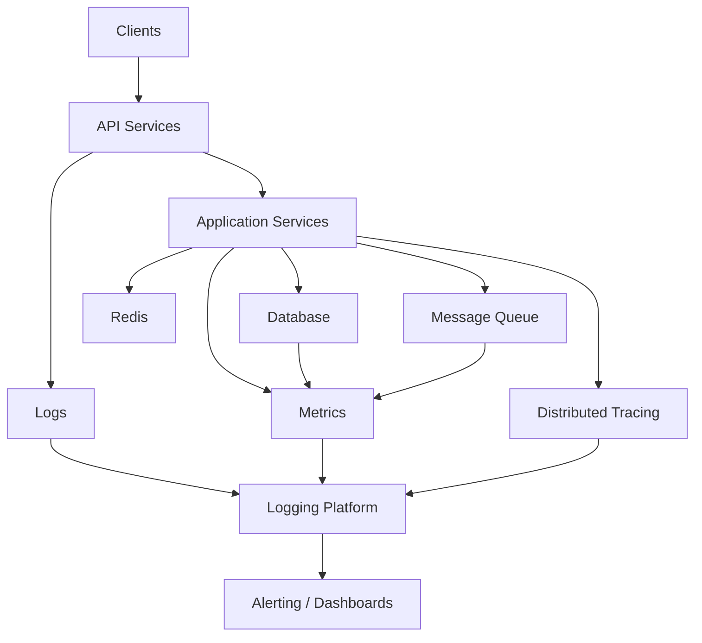

### 3.2 Signals to Collect

- Metrics
  - CPU, memory, request latency, error rate, throughput
  - Saturation metrics and SLO/SLI tracking
- Logs
  - Structured logs from application, infrastructure, and network
  - Trace correlation IDs
- Traces
  - End-to-end request path across services
  - Database queries and downstream calls
- Events
  - Deployment events, autoscaling, config changes, security events

### 3.3 Recommended Observability Model

- Define service-level objectives (SLOs) and service-level indicators (SLIs)
- Instrument every service with logs and traces
- Sample traces intelligently to balance cost and coverage
- Correlate logs with request IDs and trace IDs
- Centralize telemetry in a monitoring backend
- Alert only on high-signal conditions

### 3.4 Dashboard Examples

- Request success rate
- P95/P99 latency
- Error budget burn
- Database latency
- Queue backlog and processing lag
- Cloud resource saturation
- Auth failures and suspicious traffic

---

## 4. Disaster Recovery and Business Continuity

Disaster recovery ensures the system remains available or can be restored quickly after failures, outages, or incidents.

### 4.1 DR Patterns

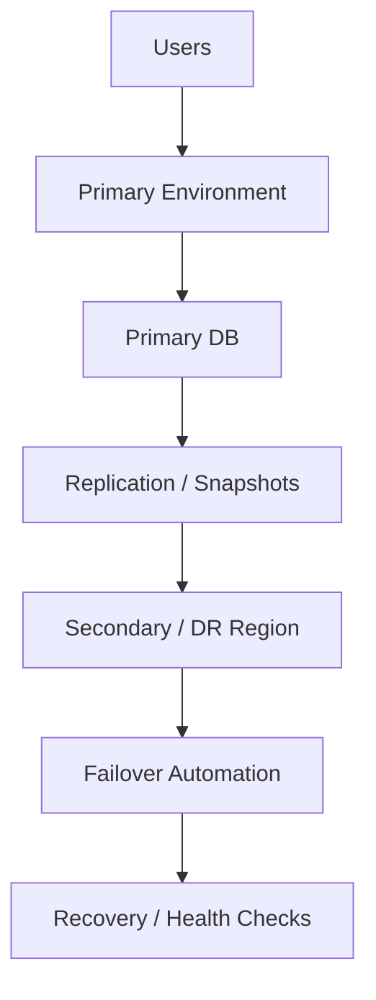

### 4.2 DR Strategies

- Backup-only
  - Restore from backup when needed
  - Suitable for low-criticality workloads
- Warm standby
  - Secondary environment runs in reduced capacity
  - Fast activation with minimal data loss
- Hot standby
  - Live replica serving traffic or ready to take over immediately
- Multi-region active-active
  - Traffic is distributed across regions
  - Highest availability, highest complexity

### 4.3 Recovery Objectives

- RTO (Recovery Time Objective): How fast the system must recover
- RPO (Recovery Point Objective): How much data loss is acceptable

Examples:
- RTO < 15 minutes, RPO < 5 minutes for critical workloads
- RTO < 4 hours, RPO < 24 hours for non-critical workloads

### 4.4 Key DR Controls

- Automated backups with retention policies
- Cross-region replication
- Database failover orchestration
- Infrastructure-as-code for recovery automation
- Periodic tabletop disaster drills
- Dependency inventory and recovery runbooks

### 4.5 Example Recovery Workflow

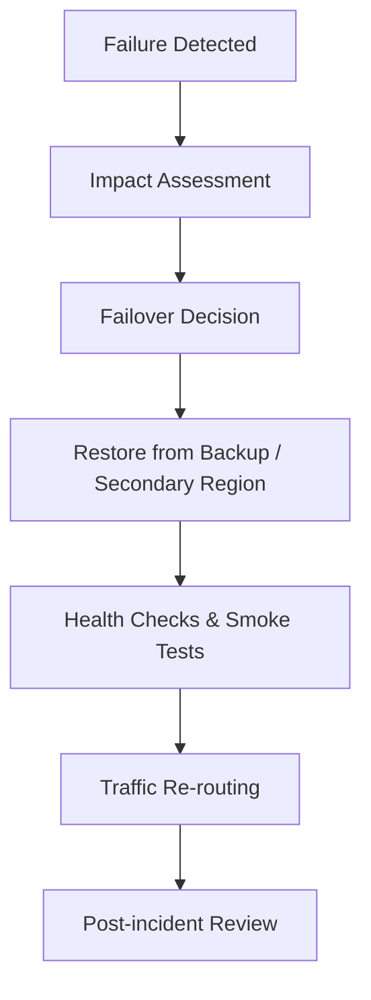

---

## 5. CI/CD Pipelines

A healthy CI/CD pipeline reduces manual work and improves reliability. It should support quality checks, automation, and deployment safety.

### 5.1 CI/CD Flow

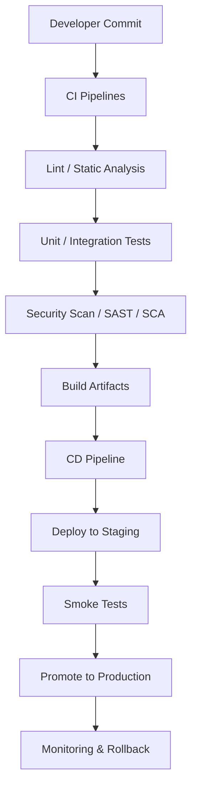

### 5.2 CI Best Practices

- Run on every pull request and merge
- Enforce code quality checks
- Use deterministic builds and versioning
- Run tests in isolated environments
- Scan container images and dependencies
- Cache dependencies to keep pipelines fast

### 5.3 CD Best Practices

- Deploy through environments: dev → test → staging → prod
- Use immutable artifacts and versioned releases
- Add canary or blue-green deployment gates
- Validate service health before full rollout
- Automate rollback on failure
- Keep deployment runbooks in version control

### 5.4 Common Pipeline Gates

- Code quality gate
- Unit test gate
- Integration and contract test gate
- Security scan gate
- Performance regression gate
- Manual approval gate for production rollout

---

## 6. Data Flow Diagrams

This section shows how data moves through a typical system and where transformations or checks occur.

### 6.1 Request Flow

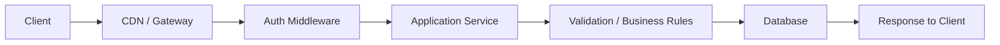

### 6.2 Event Processing Flow

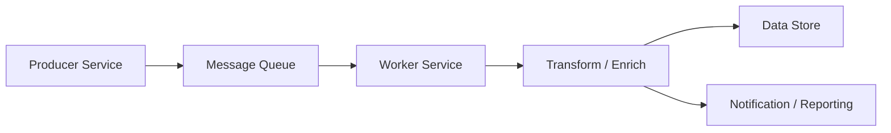

### 6.3 Payment Processing Flow

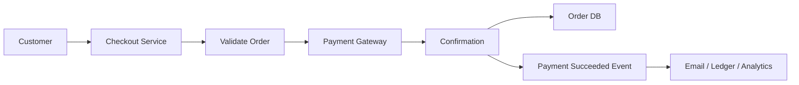

### 6.4 Data Flow Best Practices

- Minimize data retention and scope of permissions
- Validate and sanitize data before persistence
- Encrypt sensitive data in transit and at rest
- Add request IDs and correlation IDs to trace flow
- Ensure idempotency for message-driven systems
- Log schema or protocol changes explicitly

---

## 7. Cloud-Specific Deployment Patterns

Different cloud providers offer similar core services but with provider-specific naming and implementation details.

### 7.1 AWS Architecture Pattern

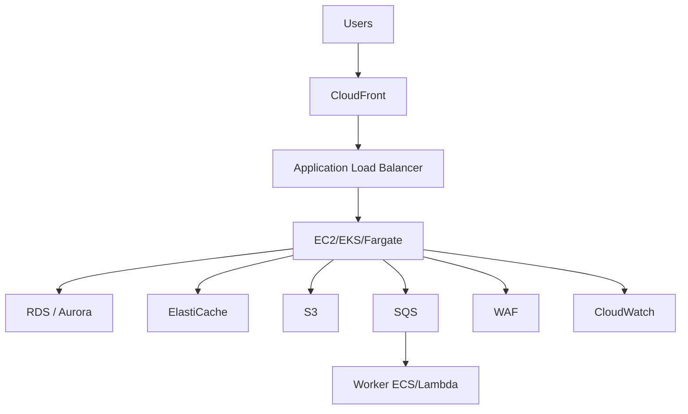

### 7.2 Azure Architecture Pattern

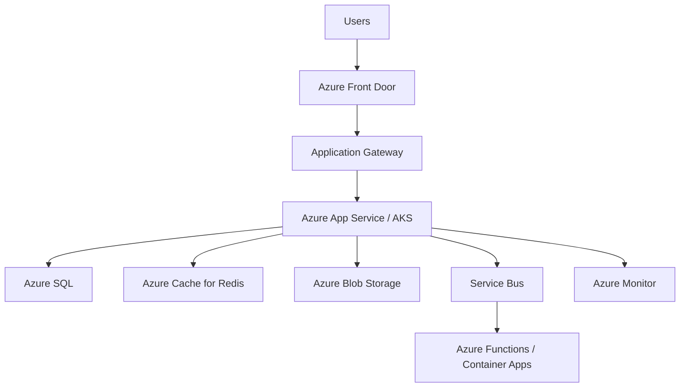

### 7.3 GCP Architecture Pattern

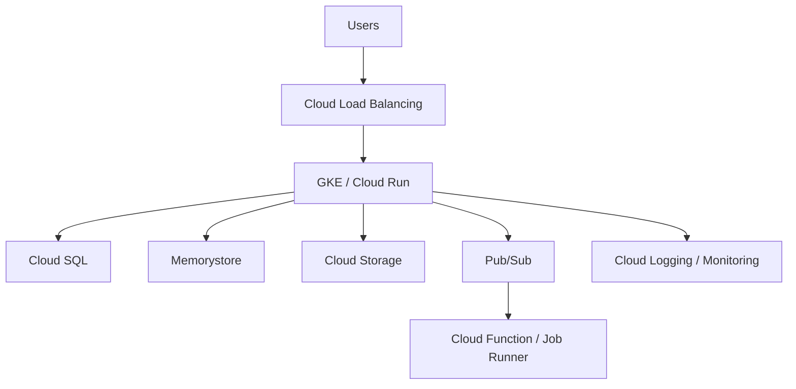

### 7.4 Cloud Deployment Recommendations

- Prefer managed services for databases, caches, queues, and monitoring
- Use autoscaling groups or managed Kubernetes for stateless workloads
- Use regional redundancy for critical workloads
- Use private networking for internal communication
- Separate ingress, application, data, and worker layers
- Keep infrastructure as code for repeatable environments

---

## 8. Security + Observability + DR + CI/CD Combined View

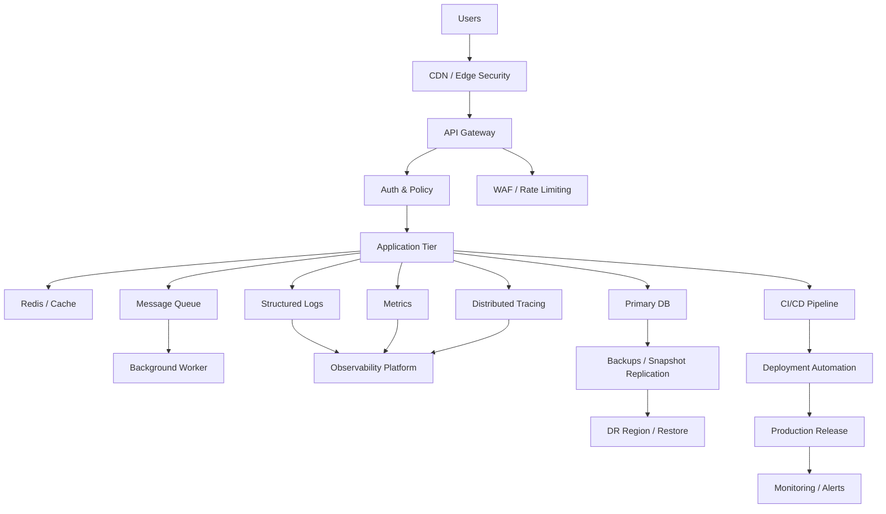

---

## 9. Practical Architecture Decision Guide

### Use a Monolith when:
- You are validating a product idea
- The system is small or medium-sized
- The team is small and co-located
- The domain is not yet complex

### Use Microservices when:
- Multiple teams own separate domains
- You need independent deployability
- High scale or resilience is important
- Clear service boundaries exist

### Use Serverless when:
- Workloads are bursty or event-driven
- You want to minimize infrastructure management
- You are okay with managed runtime constraints

### Use Event Driven when:
- You need decoupled systems
- There are multiple downstream consumers
- Real-time or asynchronous processing matters

### Use CQRS when:
- Reads and writes have different shapes and latencies
- Reporting or search is expensive
- You need highly optimized query paths

### Use Hybrid when:
- Legacy systems remain in place
- Compliance and data residency laws matter
- Migration to the cloud is staged

---

## 10. Final Recommendations

Production systems are usually not built around one architecture pattern alone. A realistic architecture combines several models:

- API gateway for request routing and protection
- Service-based application decomposition for modularity
- Caching and queueing for scale and resilience
- CI/CD automation for safe release management
- Monitoring and tracing for system visibility
- Backups and DR plans for continuity
- Cloud-managed services to reduce ops burden

The most robust design is often the simplest architecture that meets availability, scale, and maintainability requirements while keeping operational complexity under control.

---

*Last updated: 2026-09-29*
