# 🚀 Modern System Architecture Blueprint

A polished overview of how modern software systems are typically designed, secured, scaled, and deployed.

## 🧭 Executive Summary

Most production systems combine multiple patterns instead of relying on a single architecture model. A strong design usually includes:

- A scalable entry layer
- A secure application tier
- Managed data services
- Asynchronous processing for heavy work
- Detailed observability and alerting
- Safe deployment pipelines
- Disaster recovery and backups

## 📊 At a Glance

| Area | Typical Choice | Why It Matters |
|---|---|---|
| Entry Layer | CDN, Load Balancer, API Gateway | Controls traffic, security, and routing |
| App Layer | Monolith, Microservices, Serverless | Determines scaling and team boundaries |
| Data Layer | PostgreSQL, Redis, Object Storage, Search | Stores and accelerates system data |
| Async Layer | Queue, Event Bus, Workers | Handles background tasks and bursts |
| Security | WAF, IAM, TLS, Secrets Manager | Reduces risk and limits exposure |
| Reliability | Backups, replicas, failover | Preserves availability during incidents |
| Operations | CI/CD, monitoring, alerts | Speeds delivery and detection |

---

## 🏗️ Core Production Architecture

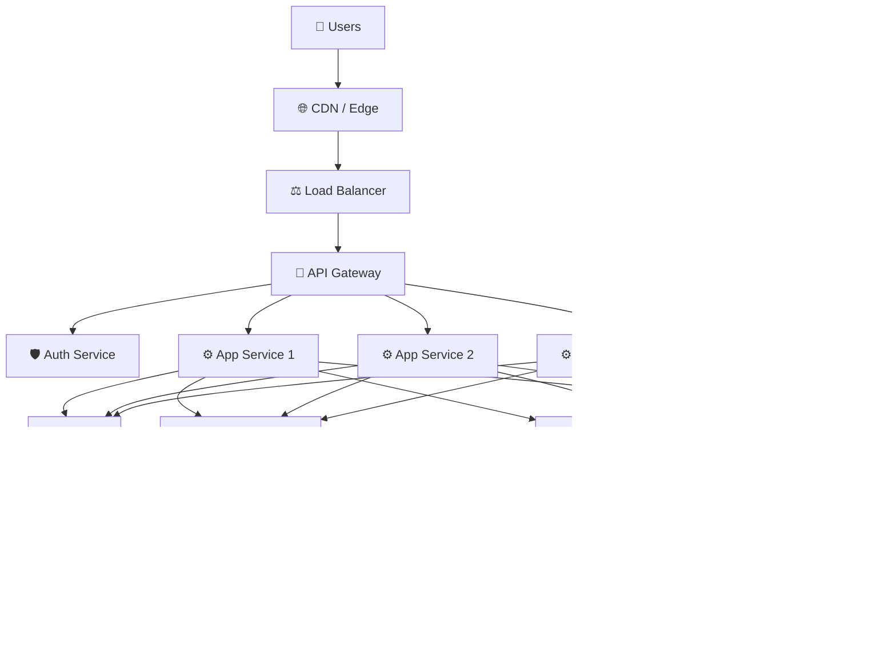
```mermaid
graph TB
    Users["👥 Users"] --> CDN["🌐 CDN / Edge"]
    CDN --> LB["⚖️ Load Balancer"]
    LB --> GW["🔐 API Gateway"]
    GW --> Auth["🛡️ Auth Service"]
    GW --> App1["⚙️ App Service 1"]
    GW --> App2["⚙️ App Service 2"]
    GW --> App3["⚙️ App Service 3"]

    App1 --> Cache["💾 Redis"]
    App2 --> Cache
    App3 --> Cache

    App1 --> DB["🗄️ Primary Database"]
    App2 --> DB
    App3 --> DB

    App1 --> MQ["📬 Message Queue"]
    App2 --> MQ
    App3 --> MQ

    MQ --> Worker1["⚡ Worker 1"]
    MQ --> Worker2["⚡ Worker 2"]
    Worker1 --> External["📨 Email / Payments / Analytics"]
    Worker2 --> External

    App1 --> Obs["📊 Metrics & Logs"]
    App2 --> Obs
    App3 --> Obs
```

This is the most common pattern for a resilient, production-ready application: edge security, request routing, stateless app services, managed data stores, and async worker processing.

---

## 🧱 Architecture Patterns

### 1) Monolithic Architecture

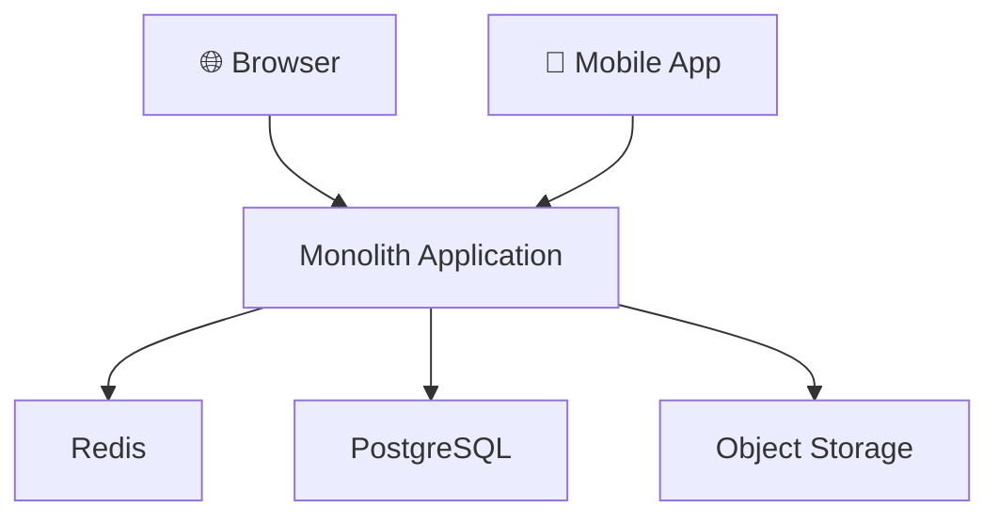
```mermaid
graph TB
    Browser["🌐 Browser"] --> App["Monolith Application"]
    Mobile["📱 Mobile App"] --> App
    App --> Cache["Redis"]
    App --> DB["PostgreSQL"]
    App --> Files["Object Storage"]
```

Best for:
- Small teams
- Early-stage products
- Simpler deployments

Trade-offs:
- Tighter coupling
- Harder independent scaling
- Bigger deployments

### 2) Microservices Architecture

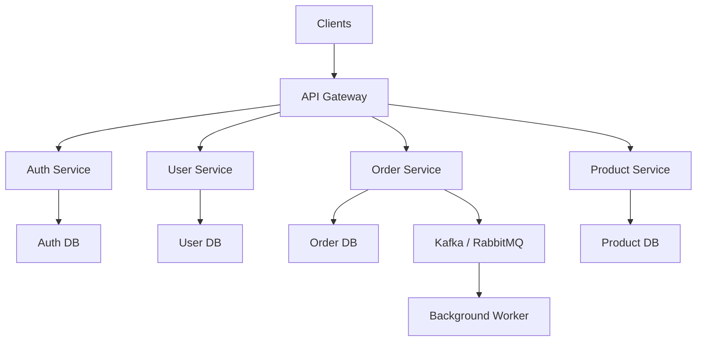
```mermaid
graph TB
    Client["Clients"] --> GW["API Gateway"]
    GW --> Auth["Auth Service"]
    GW --> User["User Service"]
    GW --> Order["Order Service"]
    GW --> Product["Product Service"]

    Auth --> AuthDB["Auth DB"]
    User --> UserDB["User DB"]
    Order --> OrderDB["Order DB"]
    Product --> ProductDB["Product DB"]

    Order --> MQ["Kafka / RabbitMQ"]
    MQ --> Worker["Background Worker"]
```

Best for:
- Large teams
- Independent deployments
- High-scale services

Trade-offs:
- More complexity
- More operational cost
- Challenging debugging and observability

### 3) Serverless Architecture

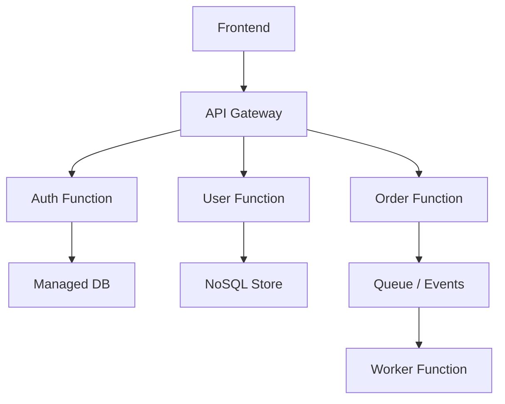
```mermaid
graph TB
    Frontend["Frontend"] --> API["API Gateway"]
    API --> AuthFn["Auth Function"]
    API --> UserFn["User Function"]
    API --> OrderFn["Order Function"]

    AuthFn --> RDS["Managed DB"]
    UserFn --> Dynamo["NoSQL Store"]
    OrderFn --> Queue["Queue / Events"]
    Queue --> WorkerFn["Worker Function"]
```

Best for:
- Event-driven workloads
- Burst traffic apps
- Lower operational burden

Trade-offs:
- Cold starts
- Vendor lock-in
- Operational abstraction limits

### 4) Event-Driven Architecture

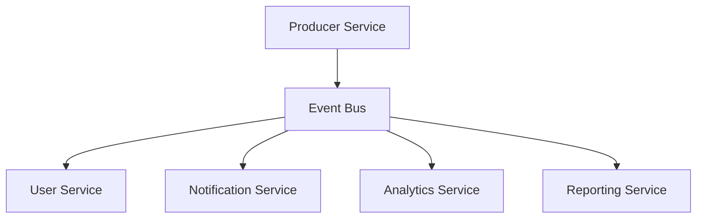
```mermaid
graph TB
    Producer["Producer Service"] --> Bus["Event Bus"]
    Bus --> Consumer1["User Service"]
    Bus --> Consumer2["Notification Service"]
    Bus --> Consumer3["Analytics Service"]
    Bus --> Consumer4["Reporting Service"]
```

Best for:
- Real-time reactions
- Distributed integrations
- Independent consumers

Trade-offs:
- Eventual consistency
- Debugging complexity
- Duplicate handling

---

## 🔐 Security Architecture

Security is not a single feature; it is a layered defense model.

### Security Layers

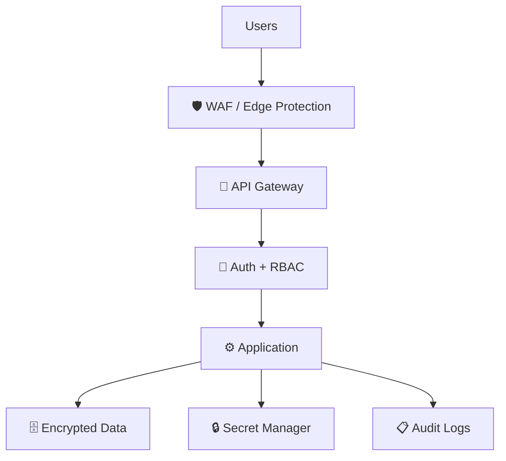
```mermaid
graph TB
    Users["Users"] --> WAF["🛡️ WAF / Edge Protection"]
    WAF --> Gateway["🔑 API Gateway"]
    Gateway --> Policy["🧾 Auth + RBAC"]
    Policy --> App["⚙️ Application"]
    App --> DB["🗄️ Encrypted Data"]
    App --> Secrets["🔒 Secret Manager"]
    App --> Logs["📋 Audit Logs"]
```

### Recommended Controls

- TLS everywhere
- WAF and rate limiting
- MFA for admin access
- Short-lived credentials
- Least-privilege IAM
- Secrets manager for keys and certificates
- Encryption at rest and in transit
- Dependency and container scanning
- Audit logging and anomaly detection

### Threat Model Areas

- External attacks: DDoS, bot traffic, credential stuffing
- App attacks: XSS, CSRF, SSRF, SQL injection
- Identity attacks: token theft, privilege escalation
- Data attacks: exfiltration, unauthorized reads
- Supply chain attacks: compromised dependencies

---

## 📈 Scalability Architecture

### Horizontal Scaling

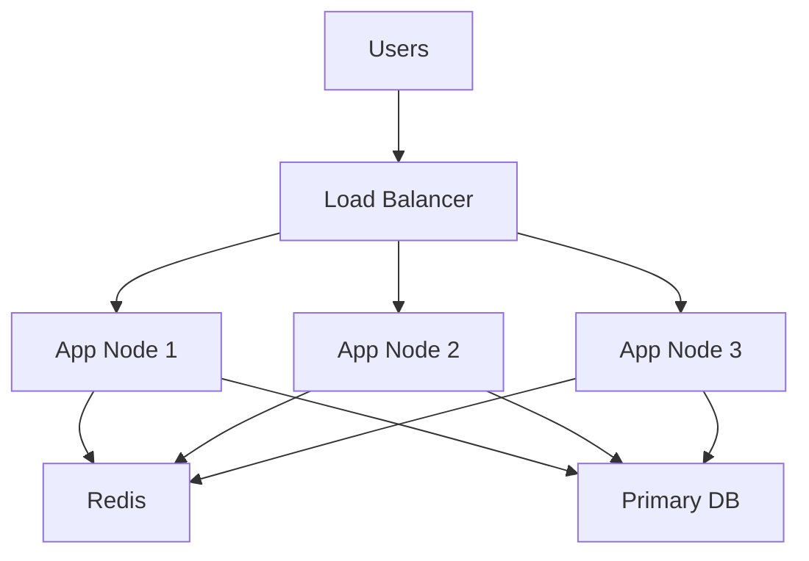
```mermaid
graph TB
    Users["Users"] --> LB["Load Balancer"]
    LB --> App1["App Node 1"]
    LB --> App2["App Node 2"]
    LB --> App3["App Node 3"]
    App1 --> Cache["Redis"]
    App2 --> Cache
    App3 --> Cache
    App1 --> DB["Primary DB"]
    App2 --> DB
    App3 --> DB
```

### Vertical Scaling

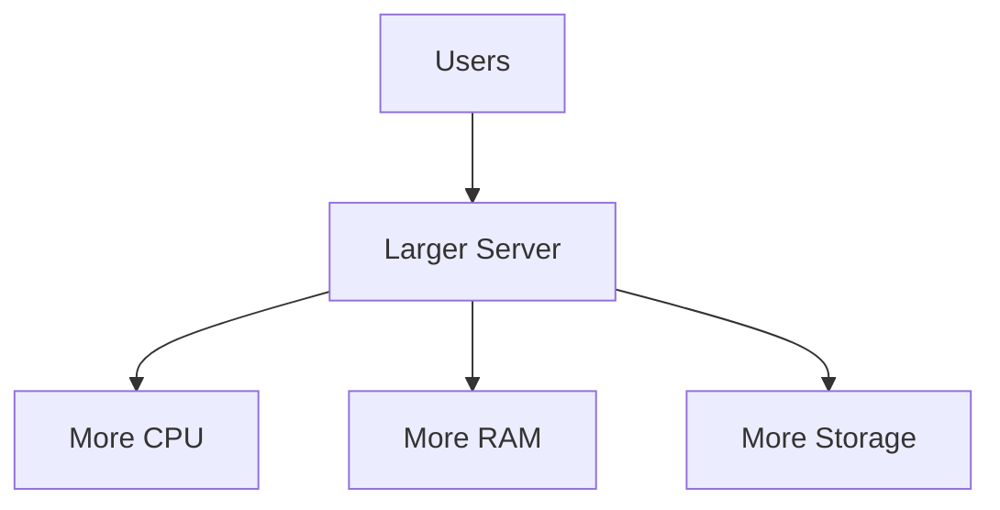
```mermaid
graph TB
    Users["Users"] --> Server["Larger Server"]
    Server --> CPU["More CPU"]
    Server --> RAM["More RAM"]
    Server --> Storage["More Storage"]
```

### Read Replicas and Sharding

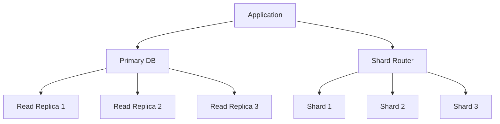
```mermaid
graph TB
    App["Application"] --> Primary["Primary DB"]
    Primary --> R1["Read Replica 1"]
    Primary --> R2["Read Replica 2"]
    Primary --> R3["Read Replica 3"]

    App --> Router["Shard Router"]
    Router --> S1["Shard 1"]
    Router --> S2["Shard 2"]
    Router --> S3["Shard 3"]
```

### Scaling Patterns Summary

| Pattern | Ideal For | Advantages | Trade-offs |
|---|---|---|---|
| Horizontal | APIs, stateless services | Scales easily | Shared bottlenecks |
| Vertical | Small systems, monoliths | Simpler | Hardware ceiling |
| Read replicas | Read-heavy workloads | Faster reads | Replication lag |
| Sharding | Very large datasets | High scale | More complexity |
| Caching | Repeated reads | Fast response | Cache invalidation |
| Queue-driven | Background jobs | Better resilience | Async behavior |

---

## 📊 Observability Architecture

### Observability Stack

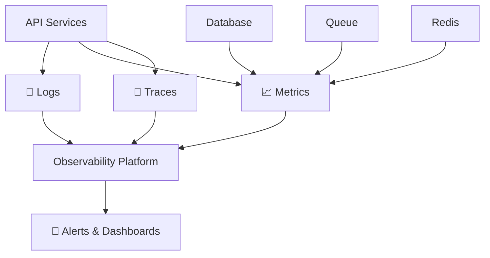
```mermaid
graph TB
    API["API Services"] --> Logs["📜 Logs"]
    API --> Metrics["📈 Metrics"]
    API --> Traces["🧭 Traces"]

    DB["Database"] --> Metrics
    Queue["Queue"] --> Metrics
    Cache["Redis"] --> Metrics

    Logs --> OTel["Observability Platform"]
    Metrics --> OTel
    Traces --> OTel
    OTel --> Alerts["🚨 Alerts & Dashboards"]
```

### Signals to Track

- Request latency and throughput
- Error rate and saturation
- Database response time
- Queue depth and retry counts
- CPU, memory, and network utilization
- Business KPIs and user-facing availability

### Best Practices

- Define SLOs and SLIs
- Use trace IDs and request IDs
- Centralize telemetry collection
- Alert only on high-signal conditions
- Practice blameless incident reviews

---

## 🧱 Hosting and Server Architecture

### Shared Hosting

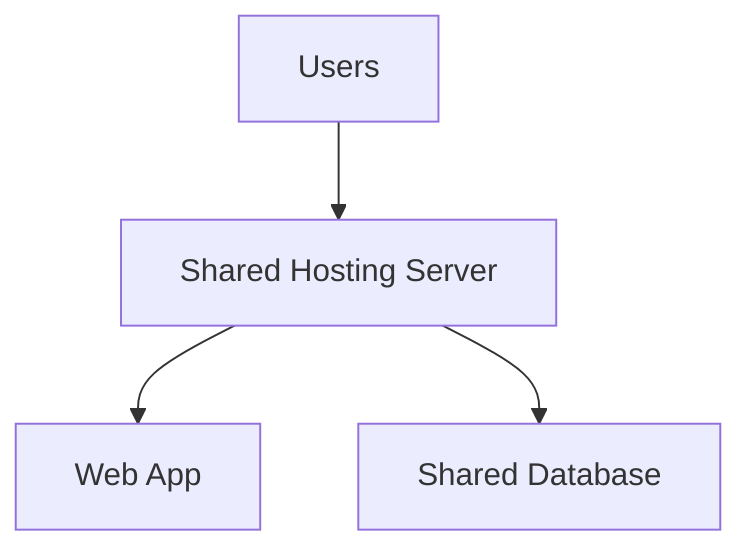
```mermaid
graph TB
    Users["Users"] --> Shared["Shared Hosting Server"]
    Shared --> App["Web App"]
    Shared --> DB["Shared Database"]
```

### VPS / VM Hosting

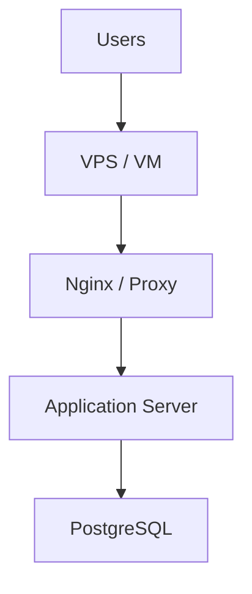
```mermaid
graph TB
    Users["Users"] --> VPS["VPS / VM"]
    VPS --> Nginx["Nginx / Proxy"]
    Nginx --> App["Application Server"]
    App --> DB["PostgreSQL"]
```

### Container Hosting

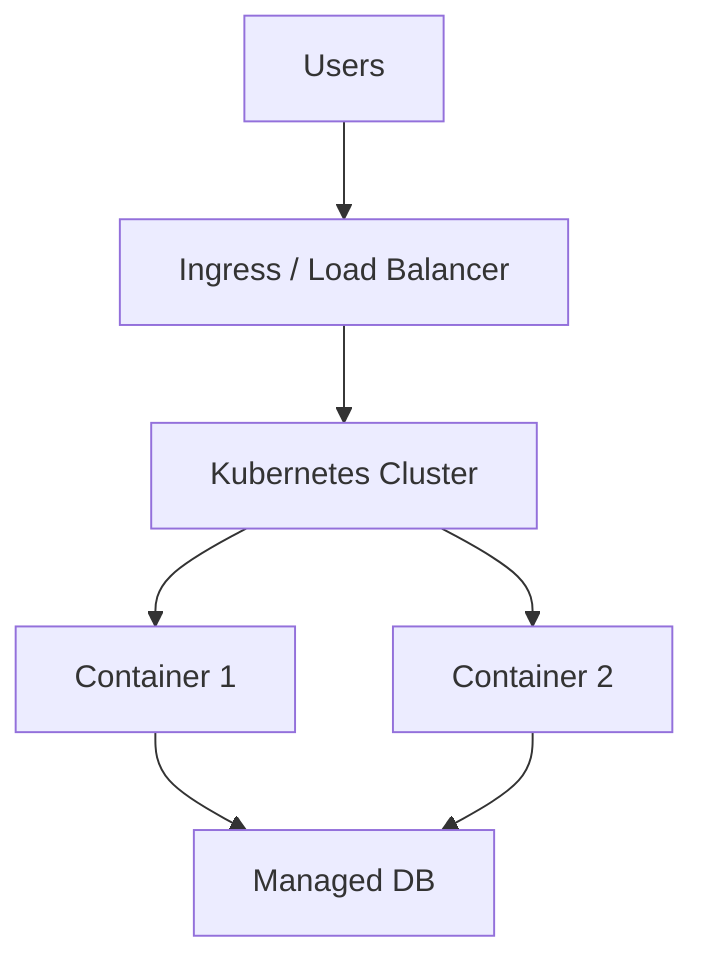
```mermaid
graph TB
    Users["Users"] --> Ingress["Ingress / Load Balancer"]
    Ingress --> K8s["Kubernetes Cluster"]
    K8s --> Pod1["Container 1"]
    K8s --> Pod2["Container 2"]
    Pod1 --> DB["Managed DB"]
    Pod2 --> DB
```

### Serverless Hosting

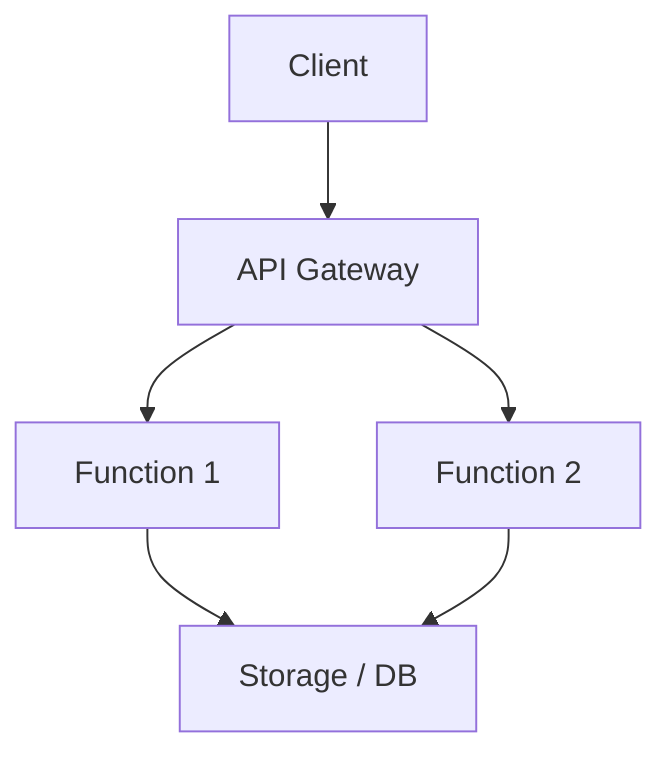
```mermaid
graph TB
    Client["Client"] --> Gateway["API Gateway"]
    Gateway --> Fn1["Function 1"]
    Gateway --> Fn2["Function 2"]
    Fn1 --> Data["Storage / DB"]
    Fn2 --> Data
```

### Hosting Model Summary

| Model | Best For | Pros | Cons |
|---|---|---|---|
| Shared Hosting | Small sites | Cheap and simple | Low flexibility |
| VPS | Custom apps | More control | More ops burden |
| Dedicated Server | Enterprise workloads | Strong isolation | Expensive |
| Cloud Hosting | Most modern apps | Elastic and flexible | Complex cost model |
| Containers | Microservices | Portability and scaling | More orchestration | 
| Serverless | Event-driven apps | Minimal ops | Cold starts |

---

## 🚀 Deployment Strategies

### Blue-Green Deployment

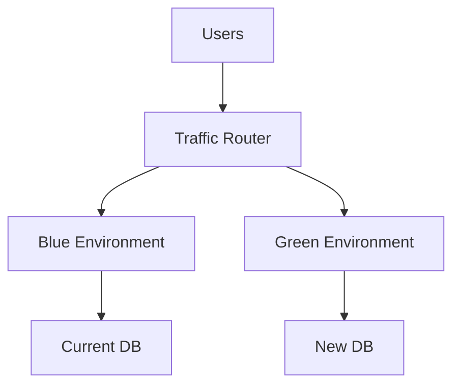
```mermaid
graph TB
    Users["Users"] --> LB["Traffic Router"]
    LB --> Blue["Blue Environment"]
    LB --> Green["Green Environment"]
    Blue --> DB1["Current DB"]
    Green --> DB2["New DB"]
```

### Canary Deployment

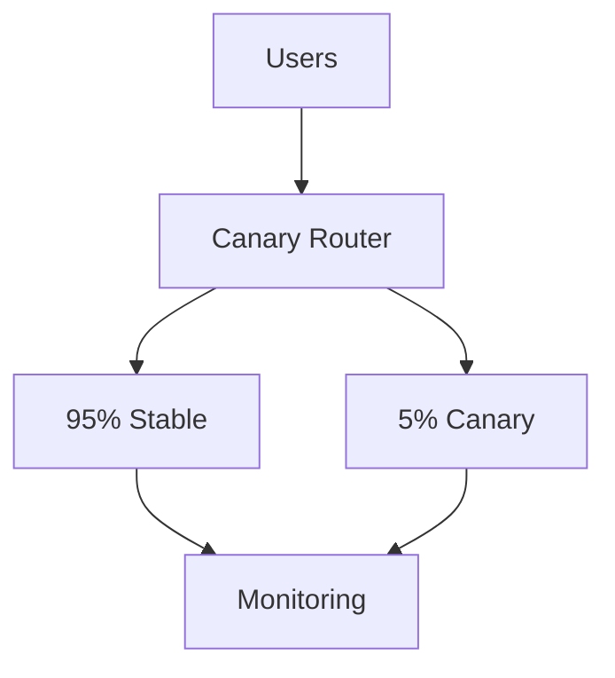
```mermaid
graph TB
    Users["Users"] --> Router["Canary Router"]
    Router --> Stable["95% Stable"]
    Router --> Canary["5% Canary"]
    Stable --> Monitor["Monitoring"]
    Canary --> Monitor
```

### Rolling Deployment

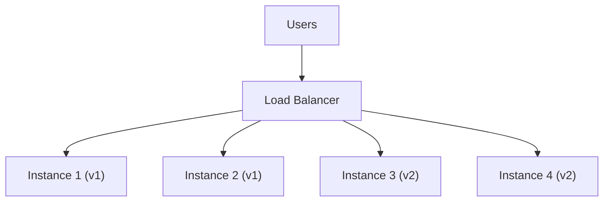
```mermaid
graph TB
    Users["Users"] --> LB["Load Balancer"]
    LB --> V1["Instance 1 (v1)"]
    LB --> V2["Instance 2 (v1)"]
    LB --> V3["Instance 3 (v2)"]
    LB --> V4["Instance 4 (v2)"]
```

### Shadow Deployment

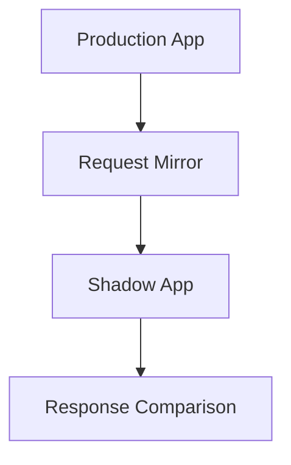
```mermaid
graph TB
    Prod["Production App"] --> Mirror["Request Mirror"]
    Mirror --> Shadow["Shadow App"]
    Shadow --> Compare["Response Comparison"]
```

---

## ♻️ Disaster Recovery and High Availability

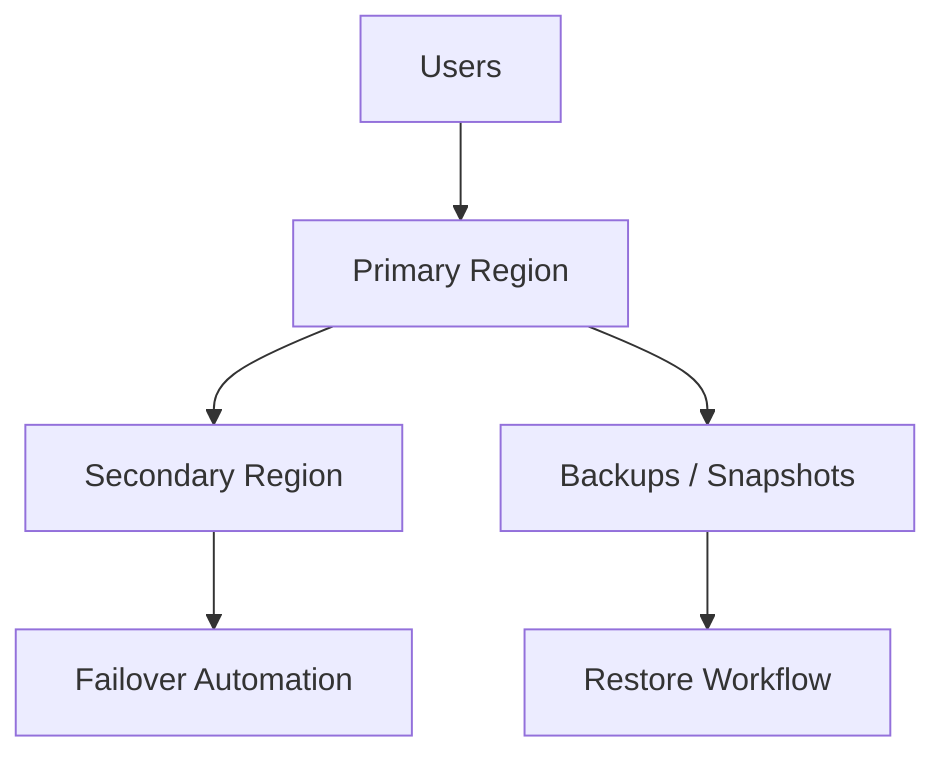
```mermaid
graph TB
    Users["Users"] --> Primary["Primary Region"]
    Primary --> Replica["Secondary Region"]
    Primary --> Backup["Backups / Snapshots"]
    Replica --> Failover["Failover Automation"]
    Backup --> Restore["Restore Workflow"]
```

Typical objectives:
- RTO: time to restore service
- RPO: acceptable amount of data loss

Recommended controls:
- Cross-region replication
- Automated backups
- Failover readiness testing
- Incident runbooks
- Validated restore drills

---

## 🛠️ CI/CD Pipeline Overview

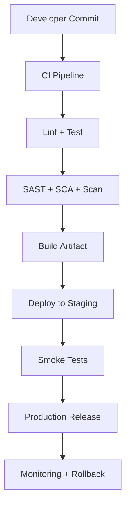
```mermaid
graph TB
    Dev["Developer Commit"] --> CI["CI Pipeline"]
    CI --> Lint["Lint + Test"]
    Lint --> Secure["SAST + SCA + Scan"]
    Secure --> Build["Build Artifact"]
    Build --> Staging["Deploy to Staging"]
    Staging --> Smoke["Smoke Tests"]
    Smoke --> Prod["Production Release"]
    Prod --> Monitor["Monitoring + Rollback"]
```

Best practices:
- Validate code quality and test coverage
- Scan dependencies and containers
- Promote immutable artifacts
- Roll out gradually with automatic rollback
- Keep deployment runbooks versioned and tested

---

## 🔄 Data Flow Architecture

### Request Flow

```mermaid
graph LR
    Client["Client"] --> Edge["Edge / Gateway"]
    Edge --> Auth["Auth"]
    Auth --> App["Application"]
    App --> Validate["Validation"]
    Validate --> DB["Database"]
    DB --> Response["Response"]
```

### Event Processing Flow

```mermaid
graph LR
    Producer["Producer"] --> Queue["Message Queue"]
    Queue --> Worker["Worker"]
    Worker --> Transform["Transform / Enrich"]
    Transform --> Store["Store / Notify"]
```

Typical governance rules:
- Validate all inputs
- Treat retries as idempotent operations
- Use correlation IDs for tracing
- Keep data flow explicit and observable

---

## ☁️ Cloud-Specific Deployments

### AWS Pattern

```mermaid
graph TB
    Users["Users"] --> CloudFront["CloudFront"]
    CloudFront --> ALB["Application Load Balancer"]
    ALB --> App["EC2 / ECS / Lambda"]
    App --> RDS["RDS / Aurora"]
    App --> Redis["ElastiCache"]
    App --> SQS["SQS / EventBridge"]
    SQS --> Worker["Workers"]
```

### Azure Pattern

```mermaid
graph TB
    Users["Users"] --> FrontDoor["Azure Front Door"]
    FrontDoor --> App["App Service / AKS"]
    App --> SQL["Azure SQL"]
    App --> Redis["Azure Cache"]
    App --> Bus["Service Bus"]
    Bus --> Worker["Functions / Apps"]
```

### GCP Pattern

```mermaid
graph TB
    Users["Users"] --> LB["Cloud Load Balancer"]
    LB --> App["Cloud Run / GKE"]
    App --> SQL["Cloud SQL"]
    App --> Redis["Memorystore"]
    App --> Pub["Pub/Sub"]
    Pub --> Worker["Cloud Functions / Jobs"]
```

---

## ✅ Final Architecture Blueprint

```mermaid
graph TB
    Users["Users"] --> Edge["CDN / WAF"]
    Edge --> LB["Load Balancer"]
    LB --> API["API Gateway"]
    API --> App1["App Service"]
    API --> App2["App Service"]
    App1 --> DB["Managed Database"]
    App2 --> DB
    App1 --> Cache["Redis"]
    App2 --> Cache
    App1 --> MQ["Message Queue"]
    App2 --> MQ
    MQ --> Worker["Background Workers"]
    App1 --> OTel["Logs / Metrics / Traces"]
    App2 --> OTel
```

This is the most practical production-ready model for many modern applications:
- a secure edge layer
- balanced app services
- managed data systems
- background processing
- observability and alerts
- safe deployments and recovery planning

## 💡 Recommendation

Choose the simplest architecture that satisfies your workload, team size, and reliability needs. Start lean, measure demand, and evolve when real bottlenecks appear.

A strong system design usually balances four goals:
- Speed of delivery
- Reliability under load
- Security by default
- Cost efficiency over time

---

*Last updated: 2026-09-29*
