# System Architecture Overview

This document provides a comprehensive architecture reference covering application patterns, deployment strategy, scaling models, security, observability, disaster recovery, CI/CD, data flow, cloud deployments, hosting models, and server architecture.

## 1. Application Architecture Overview

### 1.1 Monolithic Architecture

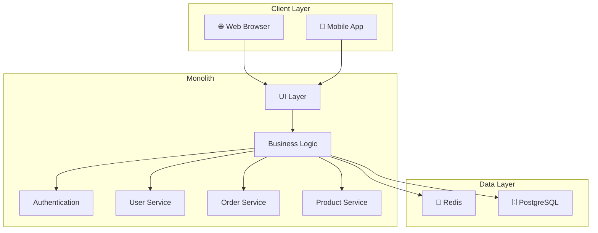

### 1.2 Microservices Architecture

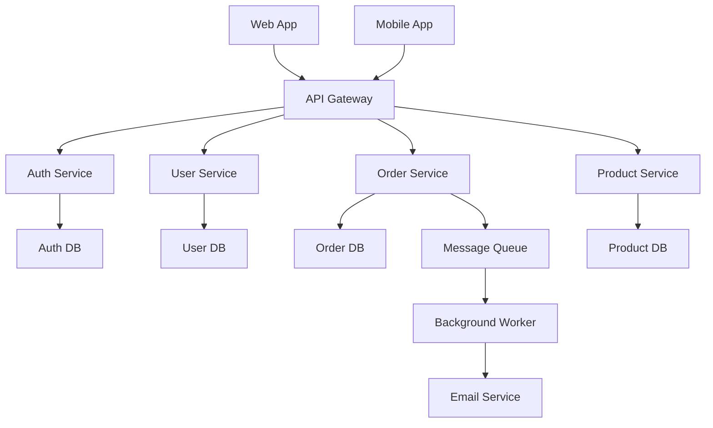

### 1.3 Event-Driven Architecture

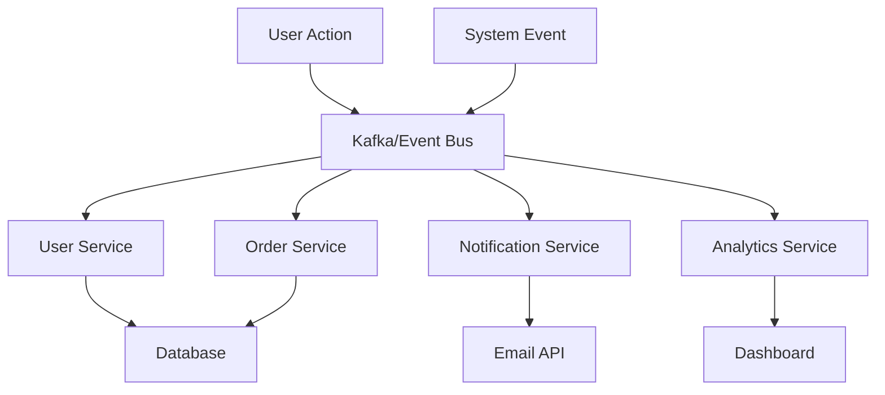

### 1.4 Serverless Architecture

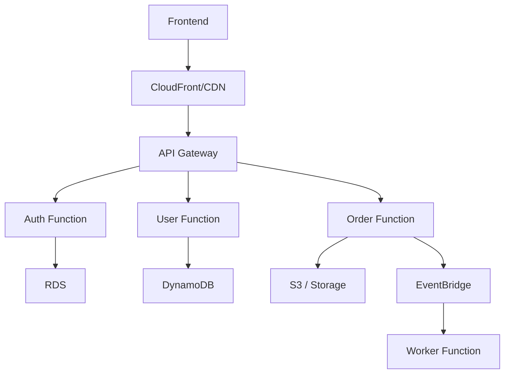

---

## 2. Security Architecture

Security should be treated as a core design concern, not an afterthought. A well-designed system uses layers of protection across identity, access, network, infrastructure, and data handling.

### 2.1 Identity and Access Security

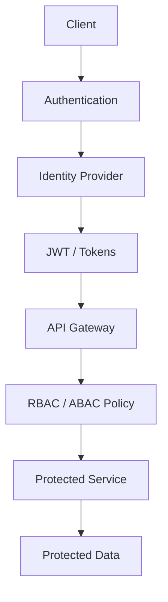

### 2.2 Security Layered Model

- Identity and Access Management
  - OAuth 2.0 / OIDC
  - SSO and MFA
  - RBAC / ABAC
- Network Security
  - Private subnets
  - WAF and API gateway protections
  - TLS everywhere
  - IP allow lists and VPC isolation
- Application Security
  - Input validation
  - Parameterized queries
  - CSRF and XSS protection
  - Rate limiting and request signing
- Data Security
  - Encryption at rest and in transit
  - Secret management
  - Key rotation
  - Data masking and tokenization
- Operations Security
  - Least privilege IAM policies
  - Security scanning in CI/CD
  - Patch management
  - Audit logs and detection rules

### 2.3 Recommended Security Controls

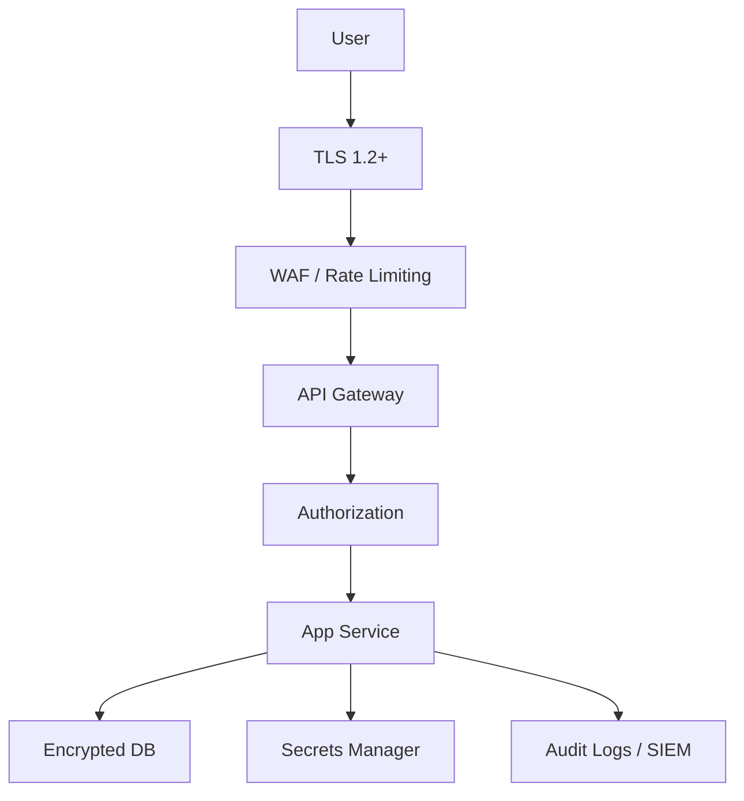

### 2.4 Key Security Best Practices

- Use short-lived tokens and refresh tokens
- Apply least-privilege IAM roles
- Enable MFA for administration and privileged users
- Keep secrets out of source control
- Run dependency and container vulnerability scans
- Use network segmentation between tiers
- Protect secrets with KMS/HSM-backed services
- Monitor failed auth attempts and privilege escalations

---

## 3. Observability Architecture

Observability is the ability to understand system health, behavior, and root cause from metrics, logs, traces, and events.

### 3.1 Observability Stack

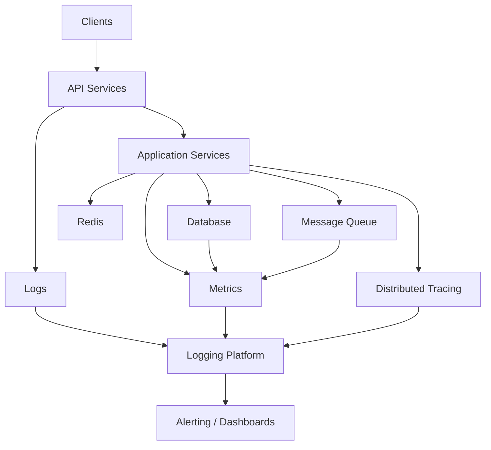

### 3.2 Signals to Collect

- Metrics
  - CPU, memory, request latency, error rate, throughput
  - Saturation metrics and SLO/SLI tracking
- Logs
  - Structured logs from application, infrastructure, and network
  - Trace correlation IDs
- Traces
  - End-to-end request path across services
  - Database queries and downstream calls
- Events
  - Deployment events, autoscaling, config changes, security events

### 3.3 Recommended Observability Model

- Define service-level objectives (SLOs) and service-level indicators (SLIs)
- Instrument every service with logs and traces
- Sample traces intelligently to balance cost and coverage
- Correlate logs with request IDs and trace IDs
- Centralize telemetry in a monitoring backend
- Alert only on high-signal conditions

### 3.4 Dashboard Examples

- Request success rate
- P95/P99 latency
- Error budget burn
- Database latency
- Queue backlog and processing lag
- Cloud resource saturation
- Auth failures and suspicious traffic

---

## 4. Disaster Recovery and Business Continuity

Disaster recovery ensures the system remains available or can be restored quickly after failures, outages, or incidents.

### 4.1 DR Patterns

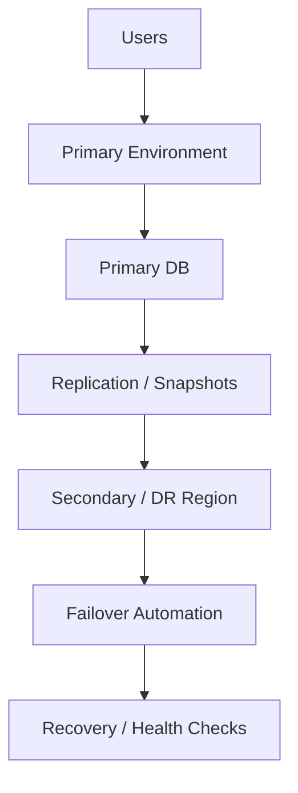

### 4.2 DR Strategies

- Backup-only
  - Restore from backup when needed
  - Suitable for low-criticality workloads
- Warm standby
  - Secondary environment runs in reduced capacity
  - Fast activation with minimal data loss
- Hot standby
  - Live replica serving traffic or ready to take over immediately
- Multi-region active-active
  - Traffic is distributed across regions
  - Highest availability, highest complexity

### 4.3 Recovery Objectives

- RTO (Recovery Time Objective): How fast the system must recover
- RPO (Recovery Point Objective): How much data loss is acceptable

Examples:
- RTO < 15 minutes, RPO < 5 minutes for critical workloads
- RTO < 4 hours, RPO < 24 hours for non-critical workloads

### 4.4 Key DR Controls

- Automated backups with retention policies
- Cross-region replication
- Database failover orchestration
- Infrastructure-as-code for recovery automation
- Periodic tabletop disaster drills
- Dependency inventory and recovery runbooks

### 4.5 Example Recovery Workflow

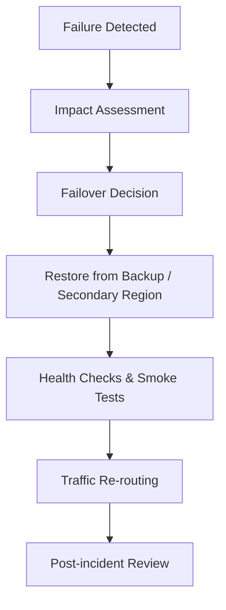

---

## 5. CI/CD Pipelines

A healthy CI/CD pipeline reduces manual work and improves reliability. It should support quality checks, automation, and deployment safety.

### 5.1 CI/CD Flow

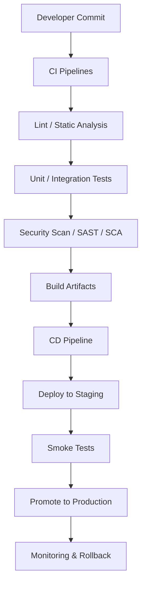

### 5.2 CI Best Practices

- Run on every pull request and merge
- Enforce code quality checks
- Use deterministic builds and versioning
- Run tests in isolated environments
- Scan container images and dependencies
- Cache dependencies to keep pipelines fast

### 5.3 CD Best Practices

- Deploy through environments: dev → test → staging → prod
- Use immutable artifacts and versioned releases
- Add canary or blue-green deployment gates
- Validate service health before full rollout
- Automate rollback on failure
- Keep deployment runbooks in version control

### 5.4 Common Pipeline Gates

- Code quality gate
- Unit test gate
- Integration and contract test gate
- Security scan gate
- Performance regression gate
- Manual approval gate for production rollout

---

## 6. Data Flow Diagrams

This section shows how data moves through a typical system and where transformations or checks occur.

### 6.1 Request Flow

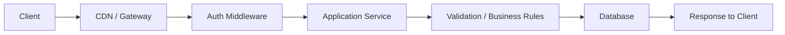

### 6.2 Event Processing Flow

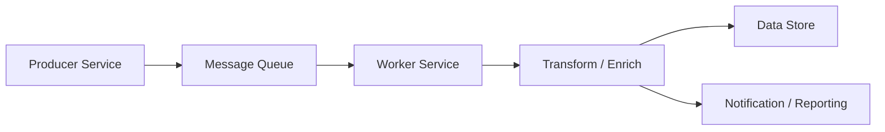

### 6.3 Payment Processing Flow

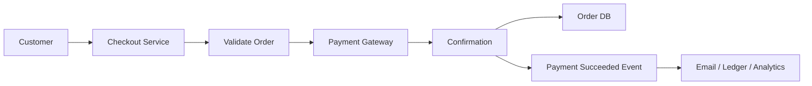

### 6.4 Data Flow Best Practices

- Minimize data retention and scope of permissions
- Validate and sanitize data before persistence
- Encrypt sensitive data in transit and at rest
- Add request IDs and correlation IDs to trace flow
- Ensure idempotency for message-driven systems
- Log schema or protocol changes explicitly

---

## 7. Cloud-Specific Deployment Patterns

Different cloud providers offer similar core services but with provider-specific naming and implementation details.

### 7.1 AWS Architecture Pattern

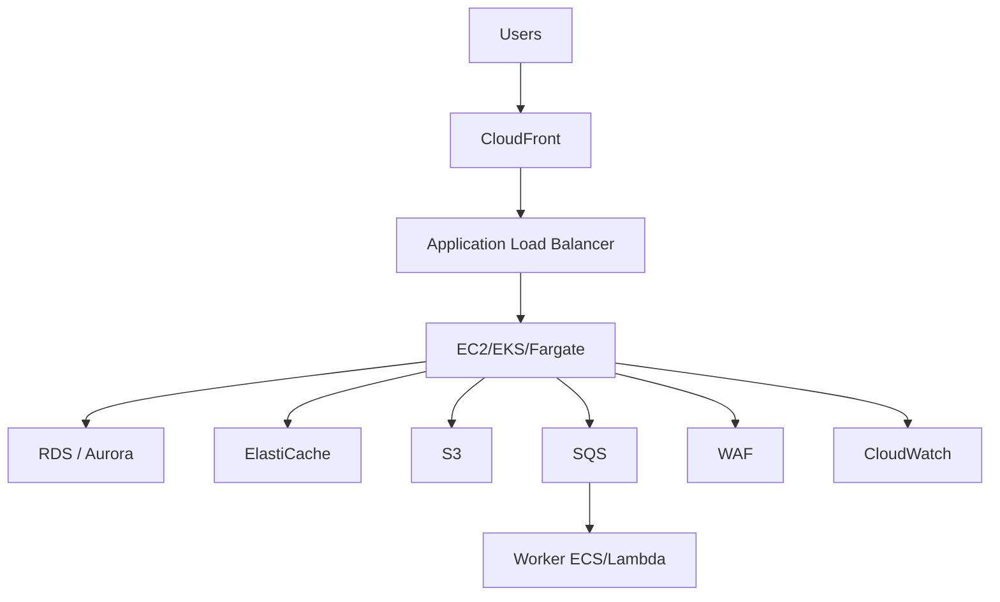

### 7.2 Azure Architecture Pattern

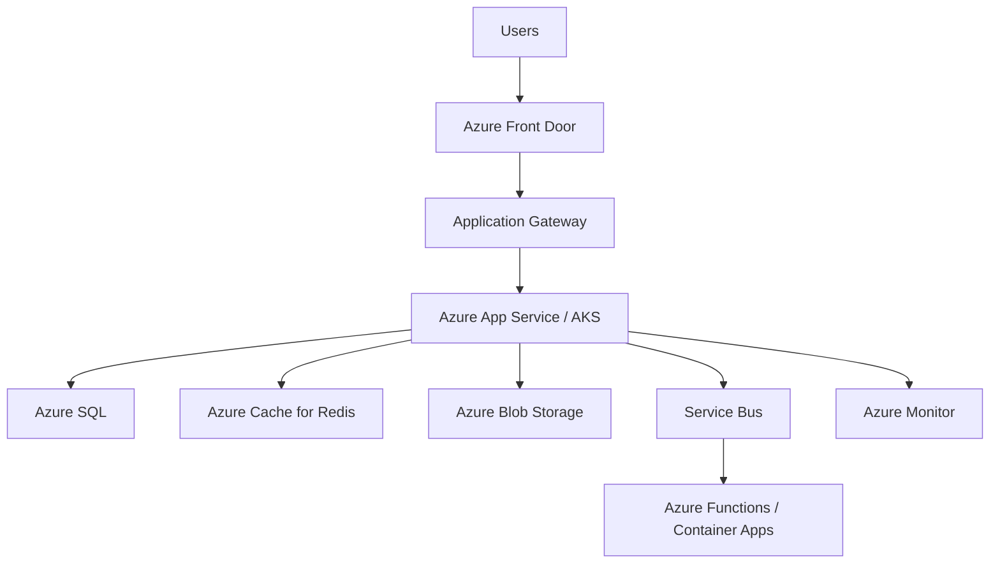

### 7.3 GCP Architecture Pattern

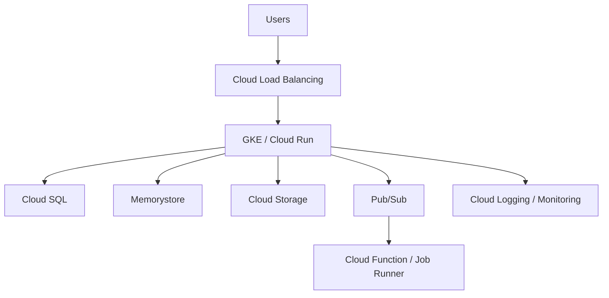

### 7.4 Cloud Deployment Recommendations

- Prefer managed services for databases, caches, queues, and monitoring
- Use autoscaling groups or managed Kubernetes for stateless workloads
- Use regional redundancy for critical workloads
- Use private networking for internal communication
- Separate ingress, application, data, and worker layers
- Keep infrastructure as code for repeatable environments

---

## 8. Hosting Models and Server Architecture

Hosting and server architecture determine where the application lives, how it is provisioned, and how it is operated. Different hosting models trade cost, flexibility, operational load, and scalability.

### 8.1 Shared Hosting

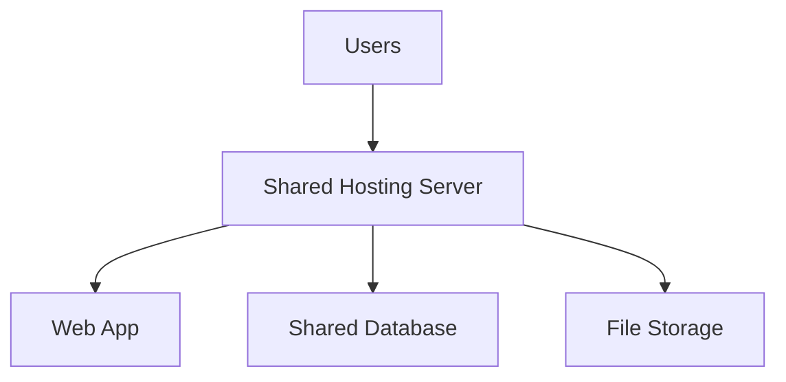

**Use cases:**
- Small static sites
- Simple WordPress sites
- Low-traffic internal websites

**Pros:**
- Low cost
- Minimal setup complexity
- Managed by provider

**Cons:**
- Limited resources
- Shared performance impact
- Less control and isolation

---

### 8.2 VPS Hosting

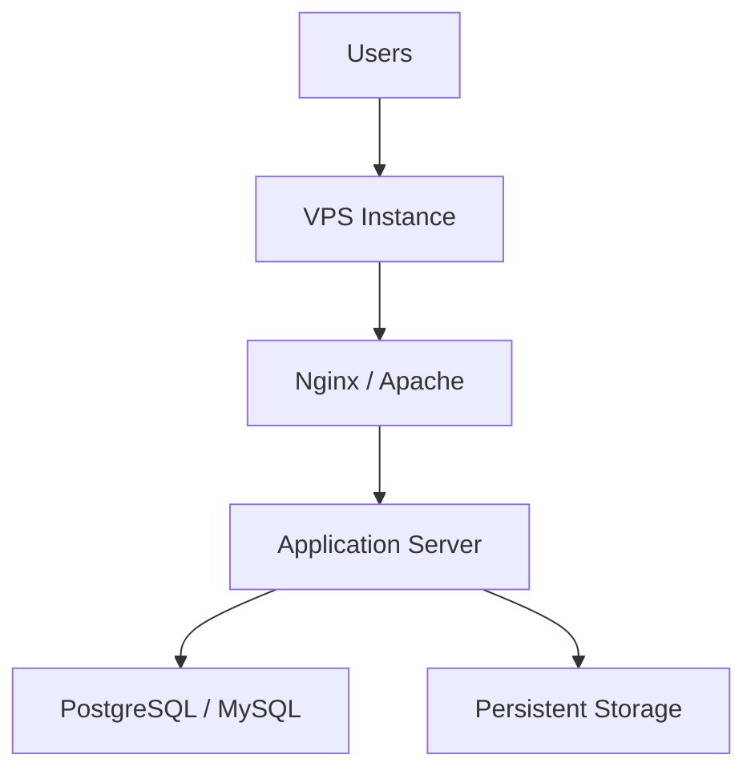

**Use cases:**
- Small business applications
- Custom deployments
- Cost-effective control without full bare metal

**Pros:**
- Better control than shared hosting
- Moderate scalability
- Easier custom configuration

**Cons:**
- Requires OS and patch management
- You manage runtime dependencies
- Limited to single server unless clustered

---

### 8.3 Dedicated Servers

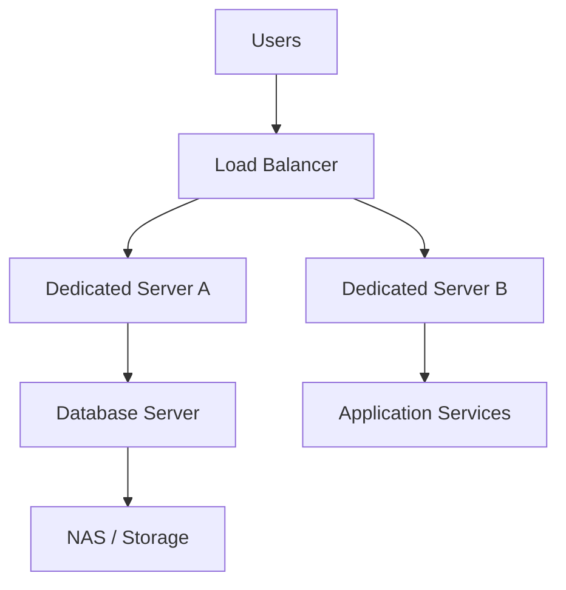

**Use cases:**
- High-performance workloads
- Enterprise infrastructure
- Regulated or custom environments

**Pros:**
- Maximum resource control
- Better performance predictability
- Strong isolation

**Cons:**
- Higher cost
- More hardware maintenance
- Requires in-house ops or managed hosting

---

### 8.4 Cloud Hosting

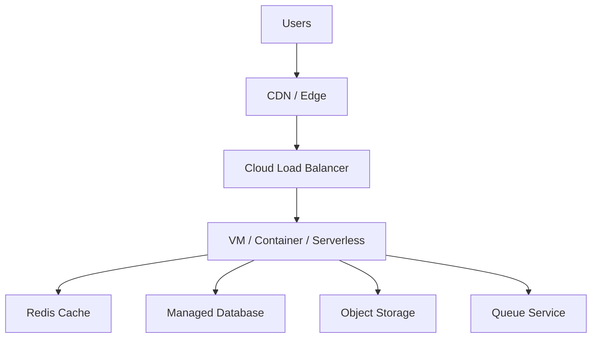

**Use cases:**
- Scalable web apps
- Modern SaaS platforms
- Multi-region systems and microservices

**Pros:**
- Elastic scaling
- Pay-as-you-go
- Managed infrastructure services
- Multi-region availability

**Cons:**
- Cloud cost complexity
- Vendor lock-in risk
- Requires architecture planning

---

### 8.5 Container Hosting

```mermaid
graph TB
    Users["Users"] --> Ingress["Ingress Controller"]
    Ingress --> Kube["Kubernetes Cluster"]
    Kube --> Pod1["App Container 1"]
    Kube --> Pod2["App Container 2"]
    Kube --> Pod3["App Container 3"]
    Pod1 --> DB["Managed DB"]
    Pod2 --> DB
    Pod3 --> DB
    Kube --> Storage["Persistent Volume"]
```

**Use cases:**
- Microservices deployment
- Portability across environments
- Modern application delivery pipelines

**Pros:**
- Efficient resource usage
- Consistent runtimes
- Easier orchestration and scaling

**Cons:**
- More orchestration complexity
- Requires cluster and networking knowledge
- Security and image validation are critical

---

### 8.6 Serverless Hosting

```mermaid
graph TB
    User["User"] --> Gateway["API Gateway"]
    Gateway --> Fn1["Function 1"]
    Gateway --> Fn2["Function 2"]
    Fn1 --> Data["Database / Storage"]
    Fn2 --> Data
    Fn1 --> Logs["Cloud Logs / Metrics"]
    Fn2 --> Logs
```

**Use cases:**
- Event-driven processing
- APIs with intermittent traffic
- High automation workloads

**Pros:**
- No server maintenance
- High elasticity
- Cost-effective for bursty workloads

**Cons:**
- Cold starts
- Limited runtime lifetime
- Debugging and observability can be harder

---

## 9. Server Types and Responsibilities

A server architecture usually includes multiple roles depending on workload and scale.

### 9.1 Web Server

- Handles HTTP requests
- Serves static files or proxies to app servers
- Examples: NGINX, Apache, Envoy

### 9.2 Application Server

- Runs business logic
- Connects to databases and downstream APIs
- Examples: Node.js, Java Spring Boot, Python Django, Go, ASP.NET

### 9.3 Database Server

- Persists transactional data
- Supports query execution and indexing
- Examples: PostgreSQL, MySQL, SQL Server, MongoDB, Redis

### 9.4 Cache Server

- Stores frequently accessed data in memory
- Reduces repeated database hits
- Examples: Redis, Memcached

### 9.5 Queue / Event Server

- Decouples producer and consumer systems
- Handles async workloads
- Examples: RabbitMQ, Kafka, SQS, Azure Service Bus

### 9.6 Search / Index Server

- Provides search and document indexing
- Examples: Elasticsearch, OpenSearch, Algolia

### 9.7 Monitoring / Observability Server

- Collects metrics, logs, traces, and alerts
- Examples: Prometheus, Grafana, Datadog, OpenTelemetry, New Relic

---

## 10. Typical Production Server Layout

```mermaid
graph TB
    Users["Users"] --> Edge["Edge / CDN / WAF"]
    Edge --> LB["Load Balancer"]
    LB --> Web1["Web Server 1"]
    LB --> Web2["Web Server 2"]
    Web1 --> App1["App Server 1"]
    Web2 --> App2["App Server 2"]
    App1 --> DB["Primary Database"]
    App2 --> DB
    App1 --> Cache["Redis Cluster"]
    App2 --> Cache
    App1 --> Queue["Message Queue"]
    App2 --> Queue
    Queue --> Worker["Background Workers"]
    App1 --> Monitor["Observability Platform"]
    App2 --> Monitor
```

### Typical responsibilities by layer

- Edge: TLS termination, WAF, caching, DDoS protection
- Load balancer: health checks, request distribution, sticky sessions if needed
- Web servers: static assets, reverse proxying, basic request validation
- Application servers: business logic and API execution
- Data servers: DB, cache, message queue, search engine
- Background workers: async email, file processing, import/export
- Observability layer: metrics, traces, dashboards, alerts

---

## 11. Hosting and Infrastructure Decision Guide

### Choose Shared Hosting when:
- The app is small and traffic is low
- Budget is limited
- No custom server configuration is needed

### Choose VPS when:
- You need more control than shared hosting
- You want a single dedicated environment
- The workload is moderate and predictable

### Choose Dedicated Hosts when:
- You need stronger isolation or resource guarantees
- You run high-performance enterprise workloads
- Custom hardware or compliance requirements exist

### Choose Cloud Hosting when:
- You need autoscaling, resilience, and global availability
- The application is growing or has variable traffic
- You want a managed service model

### Choose Containers/Kubernetes when:
- You need portable deployments
- Multiple services must be orchestrated together
- You want repeatable deployments across environments

### Choose Serverless when:
- You want minimal operations overhead
- Workloads are event-driven or bursty
- Fine-grained autoscaling is more valuable than fixed infrastructure

---

## 12. Security, Operations, and Reliability by Hosting Model

| Hosting Model | Security Responsibility | Ops Burden | Scalability | Best For |
|---|---|---|---|---|
| Shared Hosting | Provider managed | Low | Low | Static sites |
| VPS | Moderate | Medium | Medium | Small custom apps |
| Dedicated Server | High | High | Medium | Enterprise and custom workloads |
| Cloud Managed | Shared + customer | Medium | High | Modern SaaS apps |
| Containers | Shared + customer | Medium-High | High | Microservices |
| Serverless | Shared + customer | Low | Very High | Event-driven workloads |

---

## 13. Final Architecture Recommendation

A modern production system often combines hosting and architecture decisions thoughtfully:

- Use a cloud-managed or containerized hosting model for flexibility and scaling
- Put applications behind a load balancer and API gateway
- Use managed databases and caches to reduce operational work
- Protect the system with WAF, TLS, RBAC, and secret managers
- Add observability with logs, metrics, tracing, and alerts
- Prepare for failure with backups and DR procedures
- Use CI/CD pipelines with safe deployment strategies
- Add background workers for asynchronous tasks and queue-based scaling

The best architecture is not the most complex one. It is the architecture that meets the business requirements with the right amount of performance, reliability, security, and operational cost.

---

*Last updated: 2026-09-29*
