# System Architecture Overview

This document provides interactive visual overviews of multiple system architectures, deployment strategies, and scaling patterns using Mermaid diagrams.

## 1. Monolithic Architecture

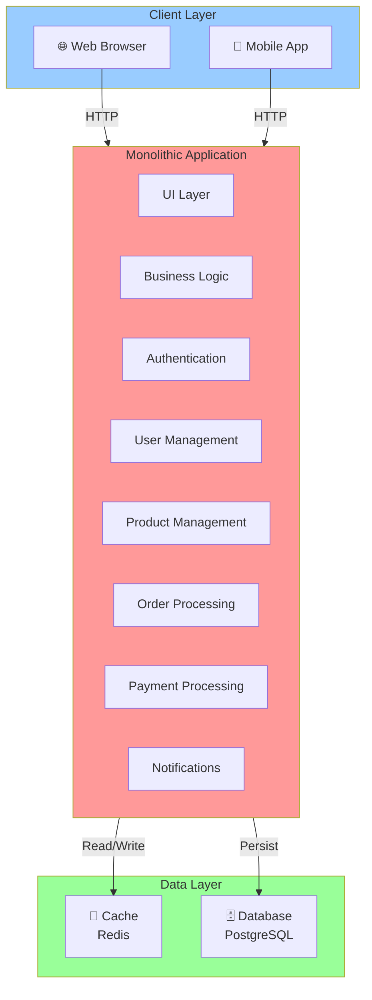
```mermaid
graph TB
    subgraph Client["Client Layer"]
        Web["🌐 Web Browser"]
        Mobile["📱 Mobile App"]
    end

    subgraph Monolith["Monolithic Application"]
        UI["UI Layer"]
        BL["Business Logic"]
        Auth["Authentication"]
        User["User Management"]
        Product["Product Management"]
        Order["Order Processing"]
        Payment["Payment Processing"]
        Notification["Notifications"]
    end

    subgraph Data["Data Layer"]
        Cache["🔄 Cache<br/>Redis"]
        Database["🗄️ Database<br/>PostgreSQL"]
    end

    Web -->|HTTP| Monolith
    Mobile -->|HTTP| Monolith
    
    Monolith -->|Read/Write| Cache
    Monolith -->|Persist| Database
    
    style Monolith fill:#ff9999
    style Client fill:#99ccff
    style Data fill:#99ff99
```

---

## 2. Microservices Architecture

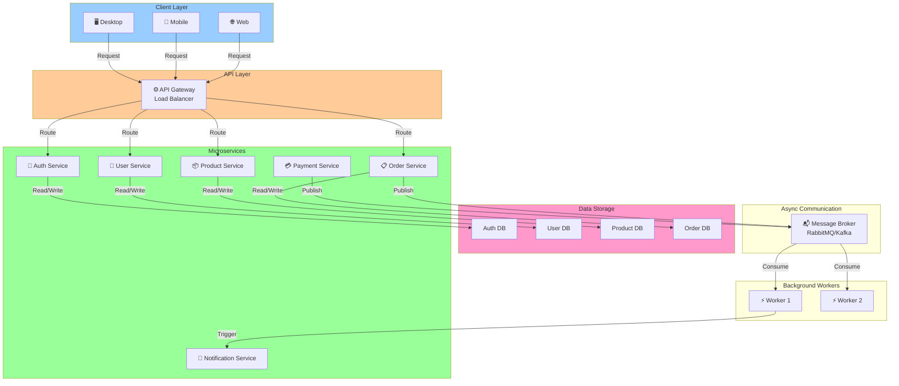
```mermaid
graph TB
    subgraph Client["Client Layer"]
        Web["🌐 Web"]
        Mobile["📱 Mobile"]
        Desktop["🖥️ Desktop"]
    end

    subgraph Gateway["API Layer"]
        APIGateway["⚙️ API Gateway<br/>Load Balancer"]
    end

    subgraph Services["Microservices"]
        AuthSvc["🔐 Auth Service"]
        UserSvc["👤 User Service"]
        ProductSvc["📦 Product Service"]
        OrderSvc["📋 Order Service"]
        PaymentSvc["💳 Payment Service"]
        NotifSvc["📧 Notification Service"]
    end

    subgraph Data["Data Storage"]
        AuthDB["Auth DB"]
        UserDB["User DB"]
        ProductDB["Product DB"]
        OrderDB["Order DB"]
    end

    subgraph MessageQueue["Async Communication"]
        MQ["📬 Message Broker<br/>RabbitMQ/Kafka"]
    end

    subgraph Workers["Background Workers"]
        Worker1["⚡ Worker 1"]
        Worker2["⚡ Worker 2"]
    end

    Web -->|Request| APIGateway
    Mobile -->|Request| APIGateway
    Desktop -->|Request| APIGateway
    
    APIGateway -->|Route| AuthSvc
    APIGateway -->|Route| UserSvc
    APIGateway -->|Route| ProductSvc
    APIGateway -->|Route| OrderSvc
    
    AuthSvc -->|Read/Write| AuthDB
    UserSvc -->|Read/Write| UserDB
    ProductSvc -->|Read/Write| ProductDB
    OrderSvc -->|Read/Write| OrderDB
    
    OrderSvc -->|Publish| MQ
    PaymentSvc -->|Publish| MQ
    
    MQ -->|Consume| Worker1
    MQ -->|Consume| Worker2
    Worker1 -->|Trigger| NotifSvc
    
    style Services fill:#99ff99
    style Client fill:#99ccff
    style Gateway fill:#ffcc99
    style Data fill:#ff99cc
```

---

## 3. Serverless Architecture

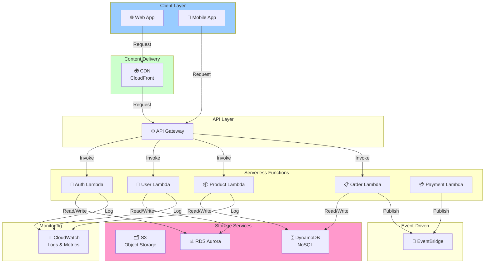
```mermaid
graph TB
    subgraph Client["Client Layer"]
        Web["🌐 Web App"]
        Mobile["📱 Mobile App"]
    end

    subgraph CDN["Content Delivery"]
        CDNNode["🌍 CDN<br/>CloudFront"]
    end

    subgraph APILayer["API Layer"]
        APIGateway["⚙️ API Gateway"]
    end

    subgraph Serverless["Serverless Functions"]
        AuthFunc["🔐 Auth Lambda"]
        UserFunc["👤 User Lambda"]
        ProductFunc["📦 Product Lambda"]
        OrderFunc["📋 Order Lambda"]
        PaymentFunc["💳 Payment Lambda"]
    end

    subgraph Storage["Storage Services"]
        S3["🗂️ S3<br/>Object Storage"]
        DynamoDB["🗄️ DynamoDB<br/>NoSQL"]
        RDS["📊 RDS Aurora"]
    end

    subgraph Events["Event-Driven"]
        EventBridge["📡 EventBridge"]
    end

    subgraph Monitoring["Monitoring"]
        CloudWatch["📊 CloudWatch<br/>Logs & Metrics"]
    end

    Web -->|Request| CDNNode
    Mobile -->|Request| APIGateway
    CDNNode -->|Request| APIGateway
    
    APIGateway -->|Invoke| AuthFunc
    APIGateway -->|Invoke| UserFunc
    APIGateway -->|Invoke| ProductFunc
    APIGateway -->|Invoke| OrderFunc
    
    AuthFunc -->|Read/Write| RDS
    UserFunc -->|Read/Write| RDS
    ProductFunc -->|Read/Write| DynamoDB
    OrderFunc -->|Read/Write| DynamoDB
    
    OrderFunc -->|Publish| EventBridge
    PaymentFunc -->|Publish| EventBridge
    
    AuthFunc -->|Log| CloudWatch
    UserFunc -->|Log| CloudWatch
    ProductFunc -->|Log| CloudWatch
    
    style Serverless fill:#ffffcc
    style Client fill:#99ccff
    style CDN fill:#ccffcc
    style Storage fill:#ff99cc
```

---

## 4. Hybrid Architecture (On-Premise + Cloud)

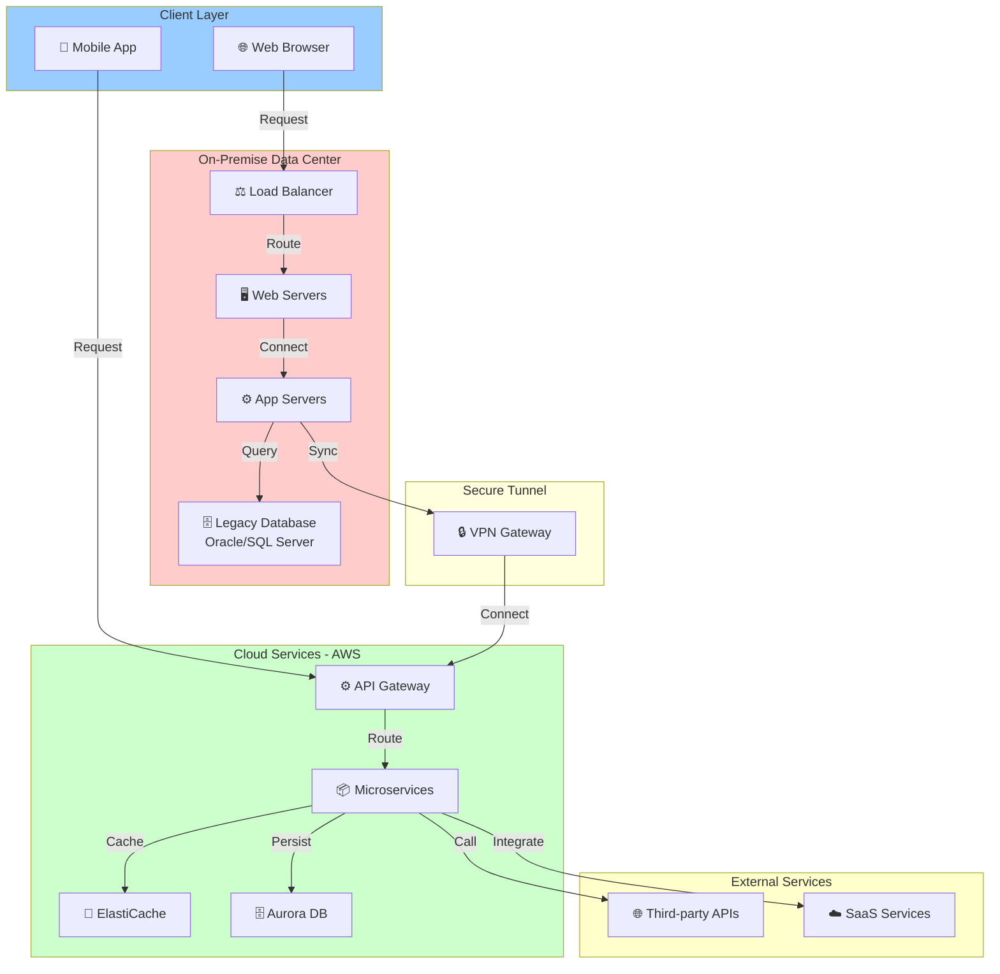
```mermaid
graph TB
    subgraph Client["Client Layer"]
        Web["🌐 Web Browser"]
        Mobile["📱 Mobile App"]
    end

    subgraph OnPrem["On-Premise Data Center"]
        LB["⚖️ Load Balancer"]
        WebServer["🖥️ Web Servers"]
        AppServer["⚙️ App Servers"]
        LegacyDB["🗄️ Legacy Database<br/>Oracle/SQL Server"]
    end

    subgraph VPN["Secure Tunnel"]
        VPNGateway["🔒 VPN Gateway"]
    end

    subgraph Cloud["Cloud Services - AWS"]
        APIGateway["⚙️ API Gateway"]
        Microservices["📦 Microservices"]
        Cache["🔄 ElastiCache"]
        CloudDB["🗄️ Aurora DB"]
    end

    subgraph External["External Services"]
        ThirdParty["🌐 Third-party APIs"]
        SaaS["☁️ SaaS Services"]
    end

    Web -->|Request| LB
    Mobile -->|Request| APIGateway
    
    LB -->|Route| WebServer
    WebServer -->|Connect| AppServer
    AppServer -->|Query| LegacyDB
    
    AppServer -->|Sync| VPNGateway
    VPNGateway -->|Connect| APIGateway
    
    APIGateway -->|Route| Microservices
    Microservices -->|Cache| Cache
    Microservices -->|Persist| CloudDB
    
    Microservices -->|Call| ThirdParty
    Microservices -->|Integrate| SaaS
    
    style OnPrem fill:#ffcccc
    style Cloud fill:#ccffcc
    style Client fill:#99ccff
    style External fill:#ffffcc
```

---

## 5. Event-Driven Architecture

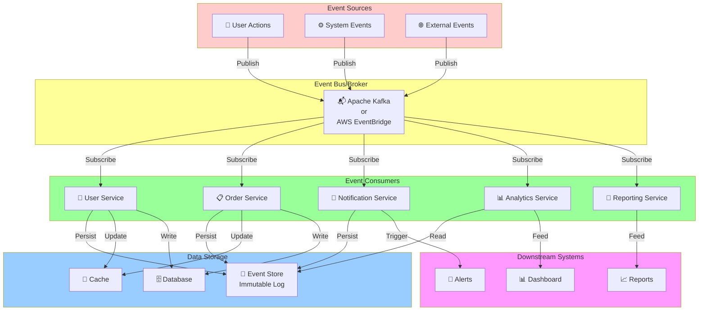
```mermaid
graph TB
    subgraph Sources["Event Sources"]
        UserAction["👤 User Actions"]
        SystemEvent["⚙️ System Events"]
        ExternalEvent["🌐 External Events"]
    end

    subgraph EventBus["Event Bus/Broker"]
        Kafka["📬 Apache Kafka<br/>or<br/>AWS EventBridge"]
    end

    subgraph Consumers["Event Consumers"]
        UserService["👤 User Service"]
        OrderService["📋 Order Service"]
        NotificationService["📧 Notification Service"]
        AnalyticsService["📊 Analytics Service"]
        ReportingService["📝 Reporting Service"]
    end

    subgraph Storage["Data Storage"]
        EventStore["📝 Event Store<br/>Immutable Log"]
        Cache["🔄 Cache"]
        Database["🗄️ Database"]
    end

    subgraph Downstream["Downstream Systems"]
        Dashboard["📊 Dashboard"]
        Reports["📈 Reports"]
        Alerts["🚨 Alerts"]
    end

    UserAction -->|Publish| Kafka
    SystemEvent -->|Publish| Kafka
    ExternalEvent -->|Publish| Kafka
    
    Kafka -->|Subscribe| UserService
    Kafka -->|Subscribe| OrderService
    Kafka -->|Subscribe| NotificationService
    Kafka -->|Subscribe| AnalyticsService
    Kafka -->|Subscribe| ReportingService
    
    UserService -->|Persist| EventStore
    OrderService -->|Persist| EventStore
    NotificationService -->|Persist| EventStore
    AnalyticsService -->|Read| EventStore
    
    UserService -->|Update| Cache
    OrderService -->|Update| Cache
    UserService -->|Write| Database
    OrderService -->|Write| Database
    
    AnalyticsService -->|Feed| Dashboard
    ReportingService -->|Feed| Reports
    NotificationService -->|Trigger| Alerts
    
    style Sources fill:#ffcccc
    style EventBus fill:#ffff99
    style Consumers fill:#99ff99
    style Storage fill:#99ccff
    style Downstream fill:#ff99ff
```

---

## 6. CQRS (Command Query Responsibility Segregation) Architecture

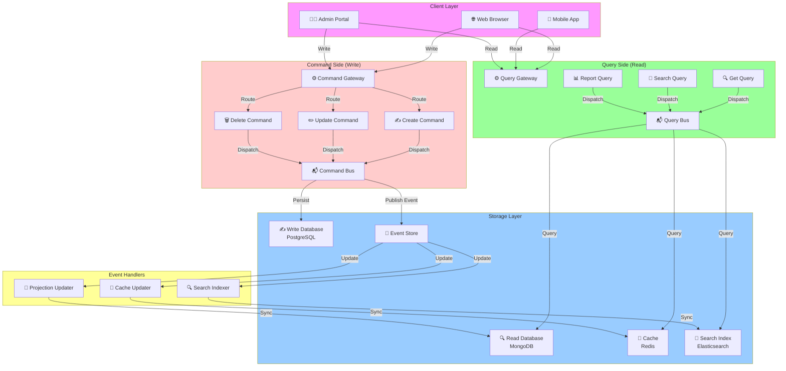
```mermaid
graph TB
    subgraph Client["Client Layer"]
        Web["🌐 Web Browser"]
        Mobile["📱 Mobile App"]
        Admin["👨‍💼 Admin Portal"]
    end

    subgraph CommandSide["Command Side (Write)"]
        CommandGateway["⚙️ Command Gateway"]
        CreateCmd["✍️ Create Command"]
        UpdateCmd["✏️ Update Command"]
        DeleteCmd["🗑️ Delete Command"]
        CommandBus["📬 Command Bus"]
    end

    subgraph QuerySide["Query Side (Read)"]
        QueryGateway["⚙️ Query Gateway"]
        GetQuery["🔍 Get Query"]
        SearchQuery["🔎 Search Query"]
        ReportQuery["📊 Report Query"]
        QueryBus["📬 Query Bus"]
    end

    subgraph EventHandlers["Event Handlers"]
        ProjectionUpdater["🔄 Projection Updater"]
        CacheUpdater["💾 Cache Updater"]
        SearchIndexer["🔍 Search Indexer"]
    end

    subgraph Storage["Storage Layer"]
        WriteDB["✍️ Write Database<br/>PostgreSQL"]
        ReadDB["🔍 Read Database<br/>MongoDB"]
        Cache["🔄 Cache<br/>Redis"]
        SearchIndex["🔎 Search Index<br/>Elasticsearch"]
        EventStore["📝 Event Store"]
    end

    Web -->|Write| CommandGateway
    Admin -->|Write| CommandGateway
    
    Web -->|Read| QueryGateway
    Mobile -->|Read| QueryGateway
    Admin -->|Read| QueryGateway
    
    CommandGateway -->|Route| CreateCmd
    CommandGateway -->|Route| UpdateCmd
    CommandGateway -->|Route| DeleteCmd
    
    CreateCmd -->|Dispatch| CommandBus
    UpdateCmd -->|Dispatch| CommandBus
    DeleteCmd -->|Dispatch| CommandBus
    
    CommandBus -->|Publish Event| EventStore
    CommandBus -->|Persist| WriteDB
    
    GetQuery -->|Dispatch| QueryBus
    SearchQuery -->|Dispatch| QueryBus
    ReportQuery -->|Dispatch| QueryBus
    
    QueryBus -->|Query| ReadDB
    QueryBus -->|Query| Cache
    QueryBus -->|Query| SearchIndex
    
    EventStore -->|Update| ProjectionUpdater
    ProjectionUpdater -->|Sync| ReadDB
    
    EventStore -->|Update| CacheUpdater
    CacheUpdater -->|Sync| Cache
    
    EventStore -->|Update| SearchIndexer
    SearchIndexer -->|Sync| SearchIndex
    
    style CommandSide fill:#ffcccc
    style QuerySide fill:#99ff99
    style EventHandlers fill:#ffff99
    style Storage fill:#99ccff
    style Client fill:#ff99ff
```

---

## 7. Deployment Strategies

### 7.1 Blue-Green Deployment

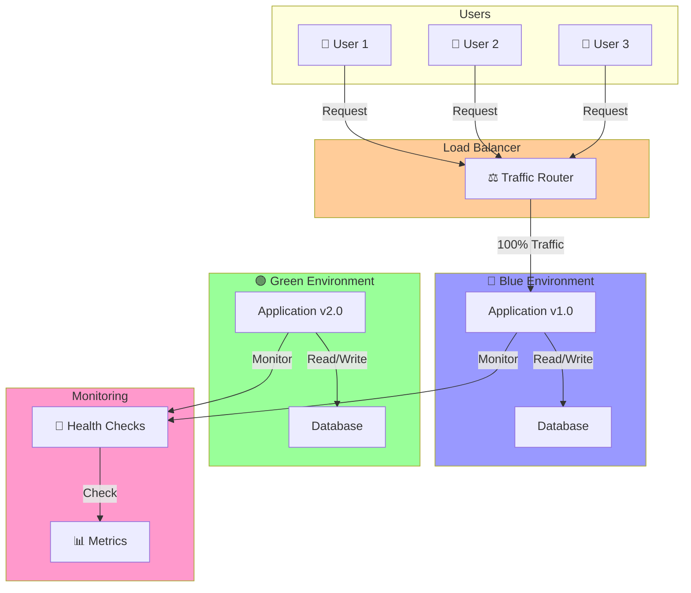
```mermaid
graph TB
    subgraph Users["Users"]
        User1["👤 User 1"]
        User2["👤 User 2"]
        User3["👤 User 3"]
    end

    subgraph LoadBalancer["Load Balancer"]
        LB["⚖️ Traffic Router"]
    end

    subgraph BlueEnv["🔵 Blue Environment<br/>(Current - v1.0)"]
        BlueApp["Application v1.0"]
        BlueDB["Database"]
    end

    subgraph GreenEnv["🟢 Green Environment<br/>(New - v2.0)"]
        GreenApp["Application v2.0"]
        GreenDB["Database"]
    end

    subgraph Monitor["Monitoring"]
        Health["🏥 Health Checks"]
        Metrics["📊 Metrics"]
    end

    User1 -->|Request| LB
    User2 -->|Request| LB
    User3 -->|Request| LB
    
    LB -->|100% Traffic| BlueApp
    
    BlueApp -->|Read/Write| BlueDB
    GreenApp -->|Read/Write| GreenDB
    
    BlueApp -->|Monitor| Health
    GreenApp -->|Monitor| Health
    Health -->|Check| Metrics
    
    style BlueEnv fill:#9999ff
    style GreenEnv fill:#99ff99
    style LoadBalancer fill:#ffcc99
    style Monitor fill:#ff99cc
```

**Benefits:**
- ✅ Zero downtime deployments
- ✅ Easy rollback
- ✅ Full testing in production-like environment
- ❌ Requires double infrastructure
- ❌ Database migration challenges

---

### 7.2 Canary Deployment

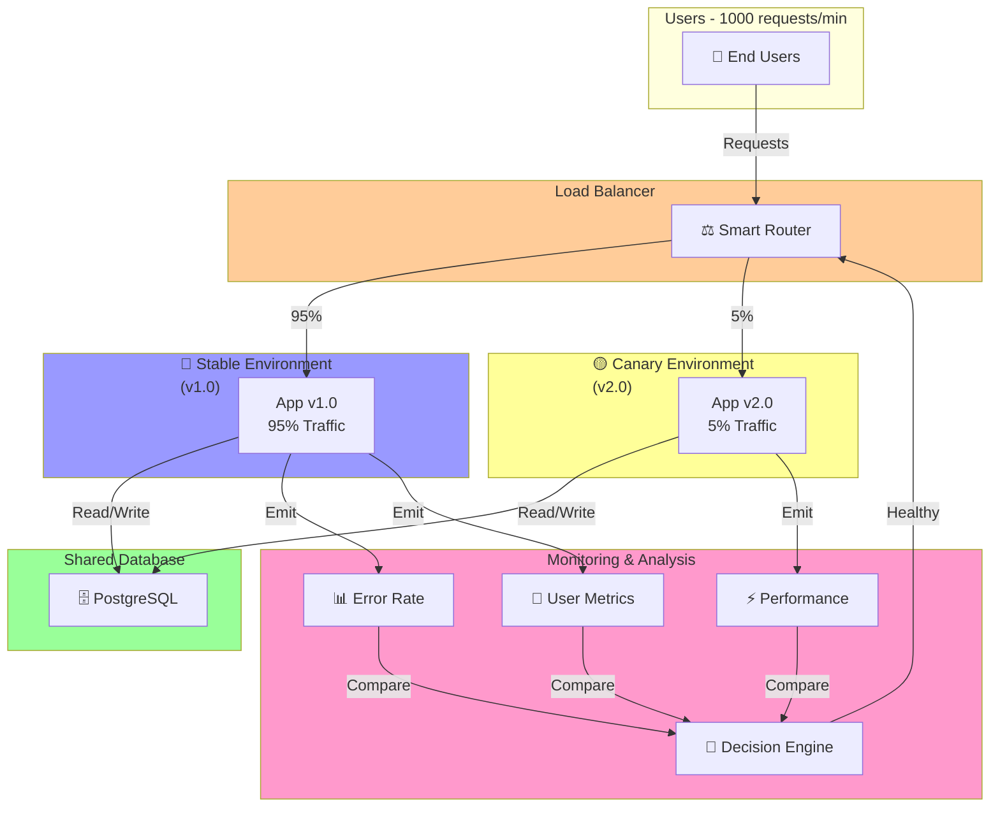
```mermaid
graph TB
    subgraph Users["Users - 1000 requests/min"]
        User["👥 End Users"]
    end

    subgraph LoadBalancer["Load Balancer"]
        LB["⚖️ Smart Router"]
    end

    subgraph StableEnv["🔵 Stable Environment<br/>(v1.0)"]
        StableApp["App v1.0<br/>95% Traffic"]
    end

    subgraph CanaryEnv["🟡 Canary Environment<br/>(v2.0)"]
        CanaryApp["App v2.0<br/>5% Traffic"]
    end

    subgraph Monitor["Monitoring & Analysis"]
        ErrorRate["📊 Error Rate"]
        Performance["⚡ Performance"]
        UserMetrics["👥 User Metrics"]
        Decision["🤖 Decision Engine"]
    end

    subgraph Database["Shared Database"]
        DB["🗄️ PostgreSQL"]
    end

    User -->|Requests| LB
    
    LB -->|95%| StableApp
    LB -->|5%| CanaryApp
    
    StableApp -->|Read/Write| DB
    CanaryApp -->|Read/Write| DB
    
    StableApp -->|Emit| ErrorRate
    CanaryApp -->|Emit| Performance
    StableApp -->|Emit| UserMetrics
    
    ErrorRate -->|Compare| Decision
    Performance -->|Compare| Decision
    UserMetrics -->|Compare| Decision
    
    Decision -->|Healthy| LB
    
    style StableEnv fill:#9999ff
    style CanaryEnv fill:#ffff99
    style LoadBalancer fill:#ffcc99
    style Monitor fill:#ff99cc
    style Database fill:#99ff99
```

**Benefits:**
- ✅ Gradual rollout (5% → 25% → 50% → 100%)
- ✅ Early error detection
- ✅ Minimal blast radius
- ✅ Metrics-driven decisions
- ❌ Complex monitoring required
- ❌ Longer deployment time

---

### 7.3 Rolling Deployment

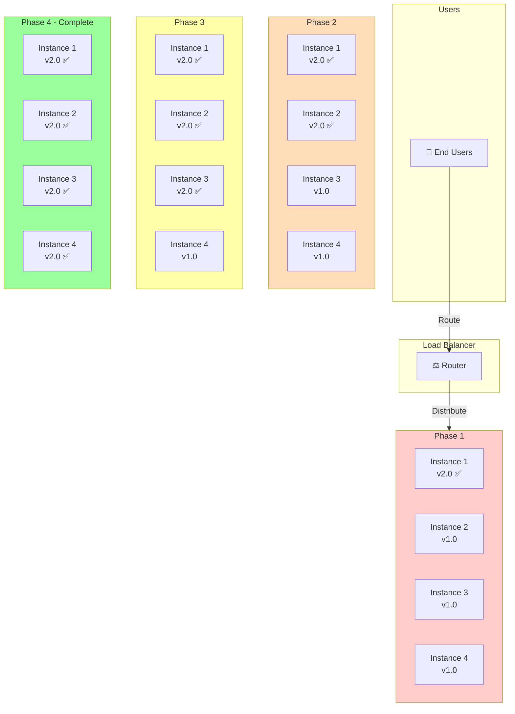
```mermaid
graph TB
    subgraph Users["Users"]
        User["👥 End Users"]
    end

    subgraph LoadBalancer["Load Balancer"]
        LB["⚖️ Router"]
    end

    subgraph Phase1["Phase 1"]
        Instance1["Instance 1<br/>v2.0 ✅"]
        Instance2["Instance 2<br/>v1.0"]
        Instance3["Instance 3<br/>v1.0"]
        Instance4["Instance 4<br/>v1.0"]
    end

    subgraph Phase2["Phase 2"]
        Instance1_2["Instance 1<br/>v2.0 ✅"]
        Instance2_2["Instance 2<br/>v2.0 ✅"]
        Instance3_2["Instance 3<br/>v1.0"]
        Instance4_2["Instance 4<br/>v1.0"]
    end

    subgraph Phase3["Phase 3"]
        Instance1_3["Instance 1<br/>v2.0 ✅"]
        Instance2_3["Instance 2<br/>v2.0 ✅"]
        Instance3_3["Instance 3<br/>v2.0 ✅"]
        Instance4_3["Instance 4<br/>v1.0"]
    end

    subgraph Phase4["Phase 4 - Complete"]
        Instance1_4["Instance 1<br/>v2.0 ✅"]
        Instance2_4["Instance 2<br/>v2.0 ✅"]
        Instance3_4["Instance 3<br/>v2.0 ✅"]
        Instance4_4["Instance 4<br/>v2.0 ✅"]
    end

    User -->|Route| LB
    LB -->|Distribute| Phase1
    
    style Phase1 fill:#ffcccc
    style Phase2 fill:#ffddbb
    style Phase3 fill:#ffffaa
    style Phase4 fill:#99ff99
```

**Benefits:**
- ✅ Minimal infrastructure overhead
- ✅ Progressive deployment
- ✅ Easy rollback (restart old version)
- ❌ Complex health checks needed
- ❌ Database compatibility required
- ❌ Longer deployment window

---

### 7.4 Shadow Deployment

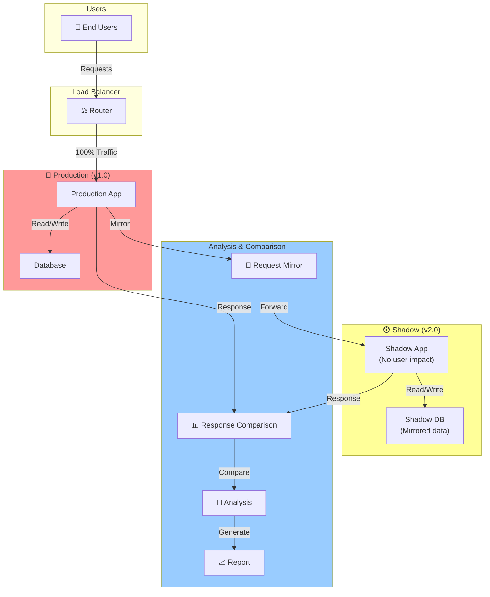
```mermaid
graph TB
    subgraph Users["Users"]
        User["👥 End Users"]
    end

    subgraph LoadBalancer["Load Balancer"]
        LB["⚖️ Router"]
    end

    subgraph Production["🔴 Production (v1.0)"]
        ProdApp["Production App"]
        ProdDB["Database"]
    end

    subgraph Shadow["🟡 Shadow (v2.0)"]
        ShadowApp["Shadow App<br/>(No user impact)"]
        ShadowDB["Shadow DB<br/>(Mirrored data)"]
    end

    subgraph Analysis["Analysis & Comparison"]
        RequestMirror["🔄 Request Mirror"]
        Comparison["📊 Response Comparison"]
        Analysis_["🔎 Analysis"]
        Report["📈 Report"]
    end

    User -->|Requests| LB
    LB -->|100% Traffic| ProdApp
    ProdApp -->|Read/Write| ProdDB
    
    ProdApp -->|Mirror| RequestMirror
    RequestMirror -->|Forward| ShadowApp
    ShadowApp -->|Read/Write| ShadowDB
    
    ProdApp -->|Response| Comparison
    ShadowApp -->|Response| Comparison
    Comparison -->|Compare| Analysis_
    Analysis_ -->|Generate| Report
    
    style Production fill:#ff9999
    style Shadow fill:#ffff99
    style Analysis fill:#99ccff
```

**Benefits:**
- ✅ Zero user impact
- ✅ Real production traffic testing
- ✅ Performance comparison
- ✅ Confidence in new version
- ❌ Additional infrastructure needed
- ❌ Data consistency complexity

---

## 8. Scaling Patterns

### 8.1 Horizontal Scaling (Scale-Out)

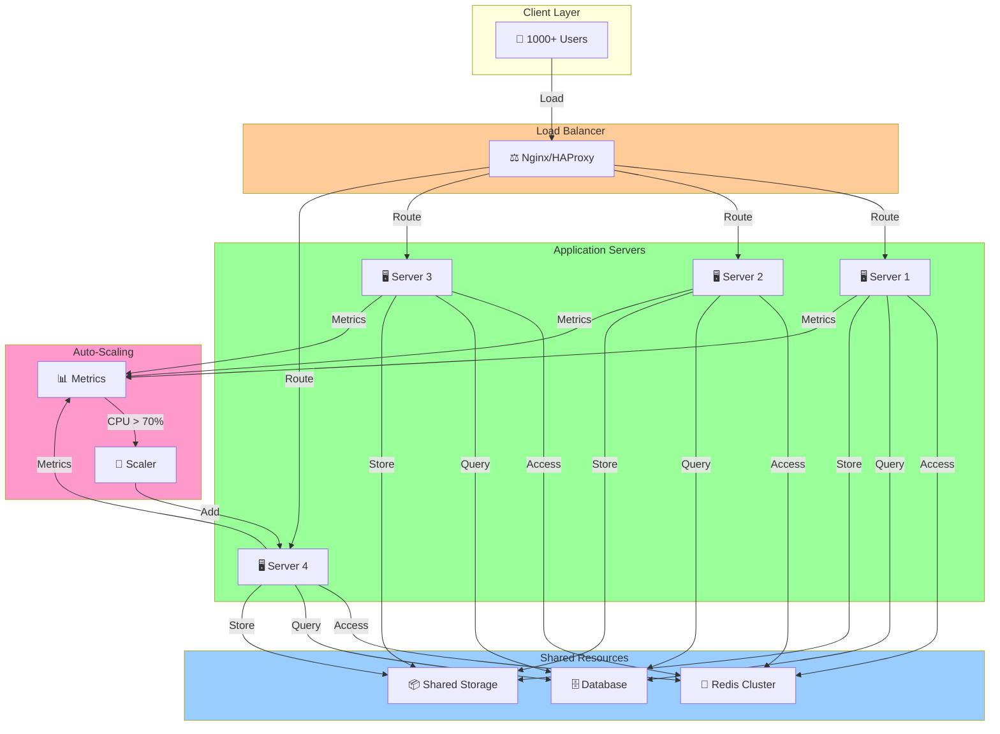
```mermaid
graph TB
    subgraph Client["Client Layer"]
        Users["👥 1000+ Users"]
    end

    subgraph LoadBalancer["Load Balancer"]
        LB["⚖️ Nginx/HAProxy"]
    end

    subgraph Servers["Application Servers"]
        Server1["🖥️ Server 1"]
        Server2["🖥️ Server 2"]
        Server3["🖥️ Server 3"]
        Server4["🖥️ Server 4"]
    end

    subgraph SharedResources["Shared Resources"]
        Cache["🔄 Redis Cluster"]
        Database["🗄️ Database"]
        Storage["📦 Shared Storage"]
    end

    subgraph Monitoring["Auto-Scaling"]
        Metrics["📊 Metrics"]
        Scaler["🤖 Scaler"]
    end

    Users -->|Load| LB
    
    LB -->|Route| Server1
    LB -->|Route| Server2
    LB -->|Route| Server3
    LB -->|Route| Server4
    
    Server1 -->|Access| Cache
    Server2 -->|Access| Cache
    Server3 -->|Access| Cache
    Server4 -->|Access| Cache
    
    Server1 -->|Query| Database
    Server2 -->|Query| Database
    Server3 -->|Query| Database
    Server4 -->|Query| Database
    
    Server1 -->|Store| Storage
    Server2 -->|Store| Storage
    Server3 -->|Store| Storage
    Server4 -->|Store| Storage
    
    Server1 -->|Metrics| Metrics
    Server2 -->|Metrics| Metrics
    Server3 -->|Metrics| Metrics
    Server4 -->|Metrics| Metrics
    
    Metrics -->|CPU > 70%| Scaler
    Scaler -->|Add| Server4
    
    style LoadBalancer fill:#ffcc99
    style Servers fill:#99ff99
    style SharedResources fill:#99ccff
    style Monitoring fill:#ff99cc
```

**Best For:**
- ✅ Stateless applications
- ✅ Web servers, APIs
- ✅ Handling increased traffic
- ✅ Cost-effective
- ❌ Shared resources become bottleneck

---

### 8.2 Vertical Scaling (Scale-Up)

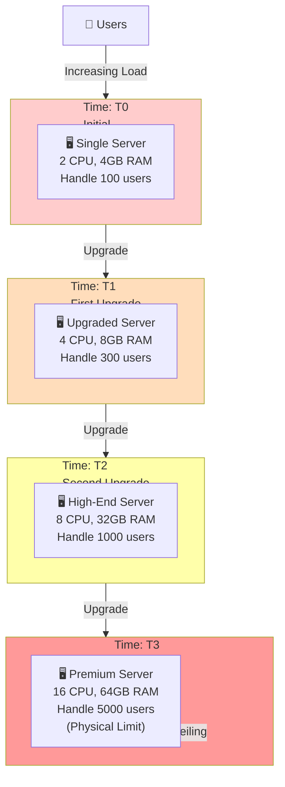
```mermaid
graph TB
    subgraph Time1["Time: T0<br/>Initial"]
        Machine1["🖥️ Single Server<br/>2 CPU, 4GB RAM<br/>Handle 100 users"]
    end

    subgraph Time2["Time: T1<br/>First Upgrade"]
        Machine2["🖥️ Upgraded Server<br/>4 CPU, 8GB RAM<br/>Handle 300 users"]
    end

    subgraph Time3["Time: T2<br/>Second Upgrade"]
        Machine3["🖥️ High-End Server<br/>8 CPU, 32GB RAM<br/>Handle 1000 users"]
    end

    subgraph Time4["Time: T3<br/>Maximum"]
        Machine4["🖥️ Premium Server<br/>16 CPU, 64GB RAM<br/>Handle 5000 users<br/>(Physical Limit)"]
    end

    Users["👥 Users"]

    Users -->|Increasing Load| Time1
    Time1 -->|Upgrade| Time2
    Time2 -->|Upgrade| Time3
    Time3 -->|Upgrade| Time4
    Time4 -->|Hit Ceiling| Machine4
    
    style Time1 fill:#ffcccc
    style Time2 fill:#ffddbb
    style Time3 fill:#ffffaa
    style Time4 fill:#ff9999
```

**Best For:**
- ✅ Monolithic applications
- ✅ Databases
- ✅ Simpler deployment
- ✅ No distributed system complexity
- ❌ Eventual hardware limit
- ❌ Downtime during upgrade

---

### 8.3 Database Scaling - Read Replicas

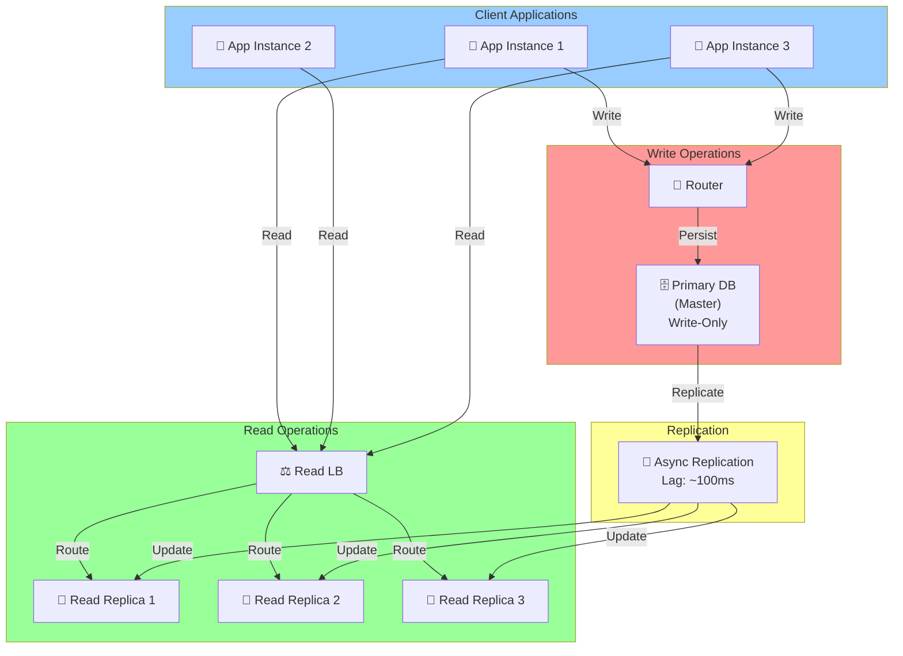
```mermaid
graph TB
    subgraph Clients["Client Applications"]
        App1["📱 App Instance 1"]
        App2["📱 App Instance 2"]
        App3["📱 App Instance 3"]
    end

    subgraph WriteLayer["Write Operations"]
        Router["🔀 Router"]
        PrimaryDB["🗄️ Primary DB<br/>(Master)<br/>Write-Only"]
    end

    subgraph ReadLayer["Read Operations"]
        LB["⚖️ Read LB"]
        ReadReplica1["📖 Read Replica 1"]
        ReadReplica2["📖 Read Replica 2"]
        ReadReplica3["📖 Read Replica 3"]
    end

    subgraph Replication["Replication"]
        Sync["🔄 Async Replication<br/>Lag: ~100ms"]
    end

    App1 -->|Write| Router
    App1 -->|Read| LB
    App2 -->|Read| LB
    App3 -->|Write| Router
    App3 -->|Read| LB
    
    Router -->|Persist| PrimaryDB
    
    LB -->|Route| ReadReplica1
    LB -->|Route| ReadReplica2
    LB -->|Route| ReadReplica3
    
    PrimaryDB -->|Replicate| Sync
    Sync -->|Update| ReadReplica1
    Sync -->|Update| ReadReplica2
    Sync -->|Update| ReadReplica3
    
    style WriteLayer fill:#ff9999
    style ReadLayer fill:#99ff99
    style Replication fill:#ffff99
    style Clients fill:#99ccff
```

**Benefits:**
- ✅ Read-heavy workloads supported
- ✅ Improved read performance
- ✅ Data redundancy
- ❌ Eventual consistency
- ❌ Write bottleneck remains

---

### 8.4 Database Scaling - Sharding

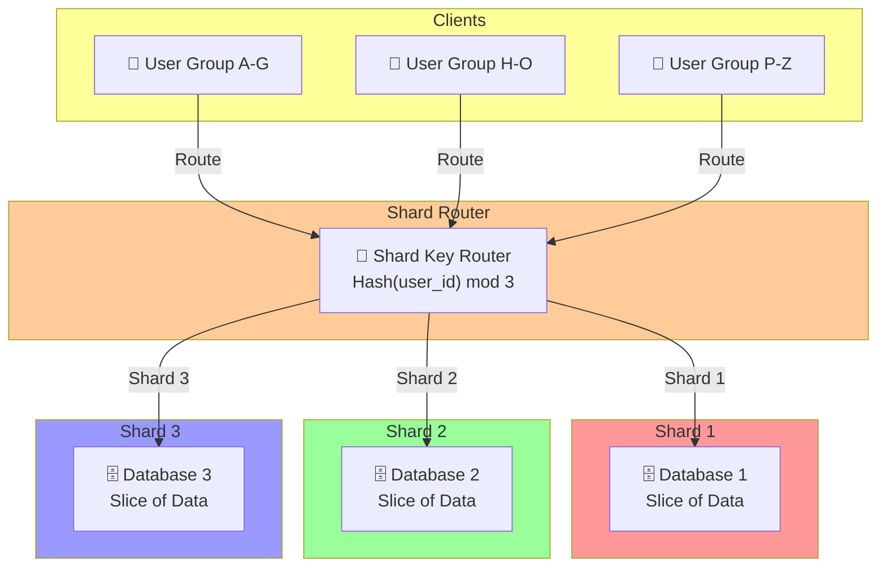
```mermaid
graph TB
    subgraph Clients["Clients"]
        Client1["👤 User Group A-G"]
        Client2["👤 User Group H-O"]
        Client3["👤 User Group P-Z"]
    end

    subgraph Router["Shard Router"]
        ShardRouter["🔀 Shard Key Router<br/>Hash(user_id) mod 3"]
    end

    subgraph Shard1["Shard 1<br/>Users A-G"]
        DB1["🗄️ Database 1<br/>Slice of Data"]
    end

    subgraph Shard2["Shard 2<br/>Users H-O"]
        DB2["🗄️ Database 2<br/>Slice of Data"]
    end

    subgraph Shard3["Shard 3<br/>Users P-Z"]
        DB3["🗄️ Database 3<br/>Slice of Data"]
    end

    Client1 -->|Route| ShardRouter
    Client2 -->|Route| ShardRouter
    Client3 -->|Route| ShardRouter
    
    ShardRouter -->|Shard 1| DB1
    ShardRouter -->|Shard 2| DB2
    ShardRouter -->|Shard 3| DB3
    
    style Shard1 fill:#ff9999
    style Shard2 fill:#99ff99
    style Shard3 fill:#9999ff
    style Router fill:#ffcc99
    style Clients fill:#ffff99
```

**Benefits:**
- ✅ Distributes data across servers
- ✅ Parallel query processing
- ✅ Linear scalability
- ❌ Complex application logic
- ❌ Cross-shard queries are expensive
- ❌ Rebalancing is difficult

---

### 8.5 Caching Strategy - Multi-Level Cache

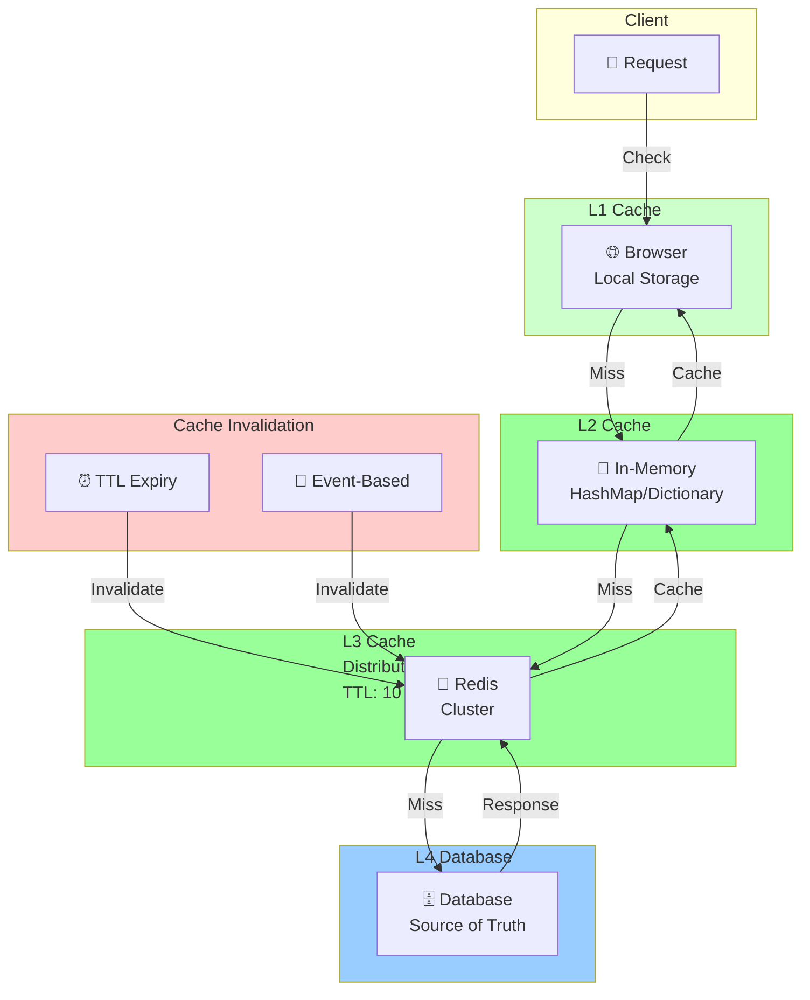
```mermaid
graph TB
    subgraph Client["Client"]
        Request["👤 Request"]
    end

    subgraph Level1["L1 Cache<br/>Browser Cache<br/>TTL: 1 hour"]
        Browser["🌐 Browser<br/>Local Storage"]
    end

    subgraph Level2["L2 Cache<br/>Application Cache<br/>TTL: 5 minutes"]
        AppCache["💾 In-Memory<br/>HashMap/Dictionary"]
    end

    subgraph Level3["L3 Cache<br/>Distributed Cache<br/>TTL: 10 minutes"]
        Redis["🔄 Redis<br/>Cluster"]
    end

    subgraph Level4["L4 Database<br/>Primary Store"]
        DB["🗄️ Database<br/>Source of Truth"]
    end

    subgraph Invalidation["Cache Invalidation"]
        Expire["⏰ TTL Expiry"]
        Event["📡 Event-Based"]
    end

    Request -->|Check| Browser
    Browser -->|Miss| AppCache
    AppCache -->|Miss| Redis
    Redis -->|Miss| DB
    
    DB -->|Response| Redis
    Redis -->|Cache| AppCache
    AppCache -->|Cache| Browser
    
    Expire -->|Invalidate| Redis
    Event -->|Invalidate| Redis
    
    style Level1 fill:#ccffcc
    style Level2 fill:#99ff99
    style Level3 fill:#99ff99
    style Level4 fill:#99ccff
    style Invalidation fill:#ffcccc
```

**Cache Hierarchy:**
1. **Browser Cache** - Client-side caching (HTML5 localStorage)
2. **Application Cache** - In-memory caching (HashMap, local objects)
3. **Distributed Cache** - Redis/Memcached across servers
4. **Database** - Persistent storage

---

### 8.6 Queue-Based Scaling

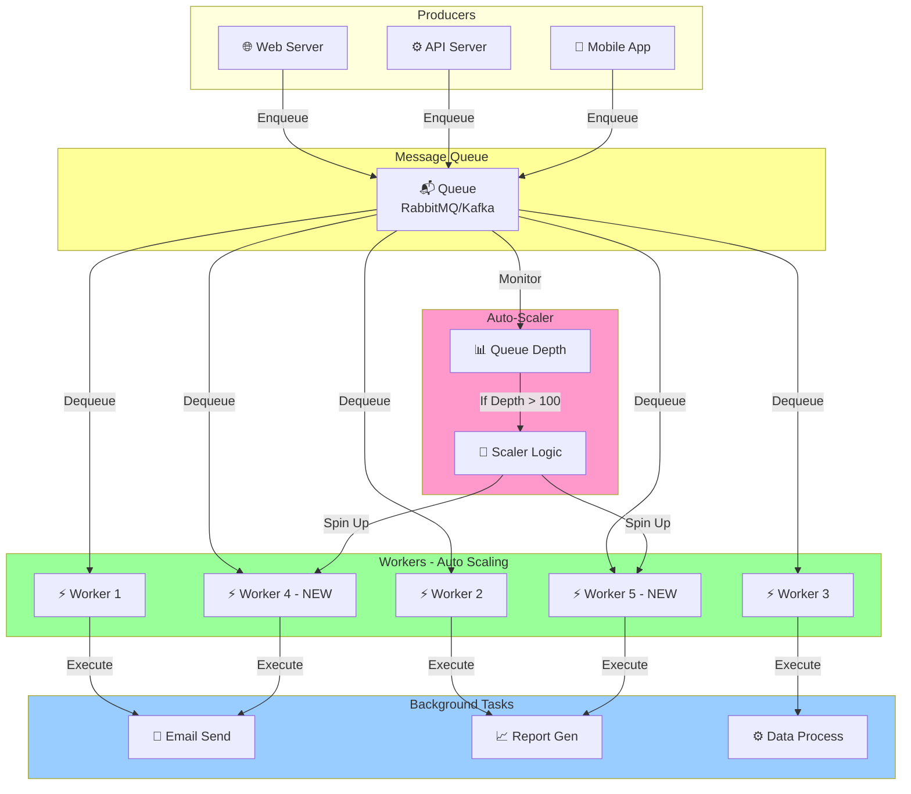
```mermaid
graph TB
    subgraph Producers["Producers"]
        Web["🌐 Web Server"]
        API["⚙️ API Server"]
        Mobile["📱 Mobile App"]
    end

    subgraph Queue["Message Queue"]
        Q["📬 Queue<br/>RabbitMQ/Kafka"]
    end

    subgraph Consumers["Workers - Auto Scaling"]
        Worker1["⚡ Worker 1"]
        Worker2["⚡ Worker 2"]
        Worker3["⚡ Worker 3"]
        Worker4["⚡ Worker 4 - NEW"]
        Worker5["⚡ Worker 5 - NEW"]
    end

    subgraph Monitor["Auto-Scaler"]
        QueueDepth["📊 Queue Depth"]
        Scaler["🤖 Scaler Logic"]
    end

    subgraph BackgroundTasks["Background Tasks"]
        Email["📧 Email Send"]
        Report["📈 Report Gen"]
        Process["⚙️ Data Process"]
    end

    Web -->|Enqueue| Q
    API -->|Enqueue| Q
    Mobile -->|Enqueue| Q
    
    Q -->|Dequeue| Worker1
    Q -->|Dequeue| Worker2
    Q -->|Dequeue| Worker3
    Q -->|Dequeue| Worker4
    Q -->|Dequeue| Worker5
    
    Worker1 -->|Execute| Email
    Worker2 -->|Execute| Report
    Worker3 -->|Execute| Process
    Worker4 -->|Execute| Email
    Worker5 -->|Execute| Report
    
    Q -->|Monitor| QueueDepth
    QueueDepth -->|If Depth > 100| Scaler
    Scaler -->|Spin Up| Worker4
    Scaler -->|Spin Up| Worker5
    
    style Queue fill:#ffff99
    style Consumers fill:#99ff99
    style Monitor fill:#ff99cc
    style BackgroundTasks fill:#99ccff
```

**Benefits:**
- ✅ Decouples producers and consumers
- ✅ Handles traffic spikes
- ✅ Independent scaling of workers
- ✅ Fault tolerance
- ❌ Additional infrastructure
- ❌ Message ordering complexity

---

## Architecture Comparison Table

| Architecture | Scalability | Complexity | Maintainability | Best For |
|---|---|---|---|---|
| **Monolithic** | Low | Low | High | Small teams, MVP |
| **Microservices** | High | High | Medium | Large systems, teams |
| **Serverless** | Very High | Medium | Medium | Sporadic workloads |
| **Hybrid** | High | Very High | Low | Legacy + New systems |
| **Event-Driven** | Very High | High | Medium | Real-time systems |
| **CQRS** | High | Very High | Medium | Complex domains |

---

## Deployment Strategies Comparison

| Strategy | Downtime | Rollback Time | Risk Level | Best For |
|---|---|---|---|---|
| **Blue-Green** | None | Seconds | Low | Critical systems |
| **Canary** | None | Minutes | Low | Data-sensitive apps |
| **Rolling** | None | Minutes | Medium | Web applications |
| **Shadow** | None | N/A (no users) | Minimal | New versions |

---

## Scaling Patterns Comparison

| Pattern | Scalability | Complexity | Cost | Best For |
|---|---|---|---|---|
| **Horizontal** | Unlimited | Medium | Moderate | APIs, Web servers |
| **Vertical** | Limited | Low | High | Databases, Monoliths |
| **Read Replicas** | Good | Medium | Moderate | Read-heavy apps |
| **Sharding** | Excellent | High | Moderate | Large datasets |
| **Caching** | High | Low | Low | Frequent reads |
| **Queue-Based** | Excellent | Medium | Low | Background jobs |

---

## Best Practices Summary

### Deployment
- ✅ **Always test in production-like environment** (Blue-Green, Shadow)
- ✅ **Monitor metrics during rollout** (Canary)
- ✅ **Have instant rollback plan**
- ✅ **Automate deployment process**
- ✅ **Use feature flags** for gradual rollouts

### Scaling
- ✅ **Start with horizontal scaling** for stateless services
- ✅ **Use caching** to reduce database load
- ✅ **Implement queue-based processing** for async tasks
- ✅ **Monitor metrics** continuously (CPU, Memory, Latency)
- ✅ **Set auto-scaling thresholds** appropriately
- ✅ **Plan for data consistency** in distributed systems

---

*Last updated: 2026-09-29*
