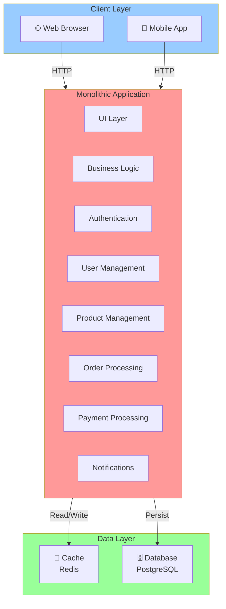
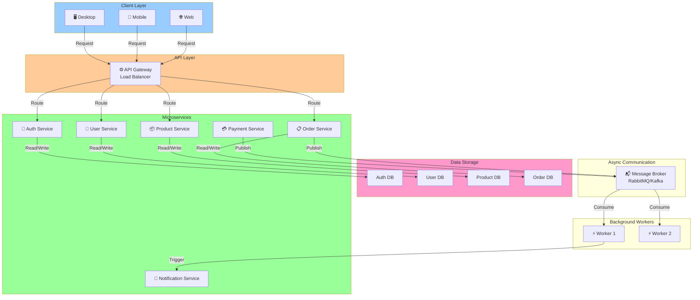
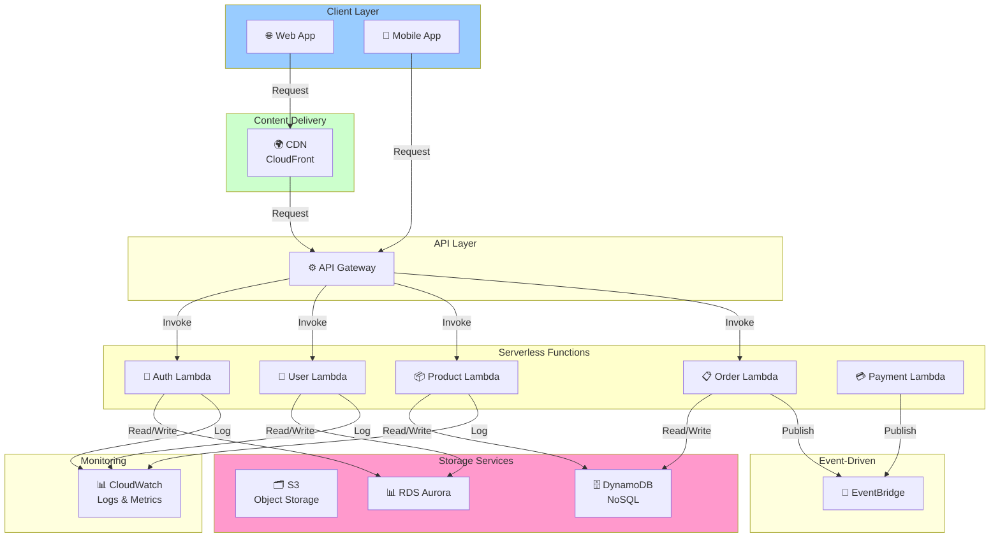
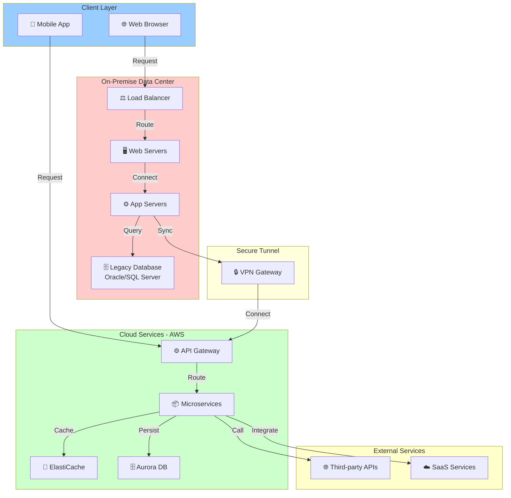
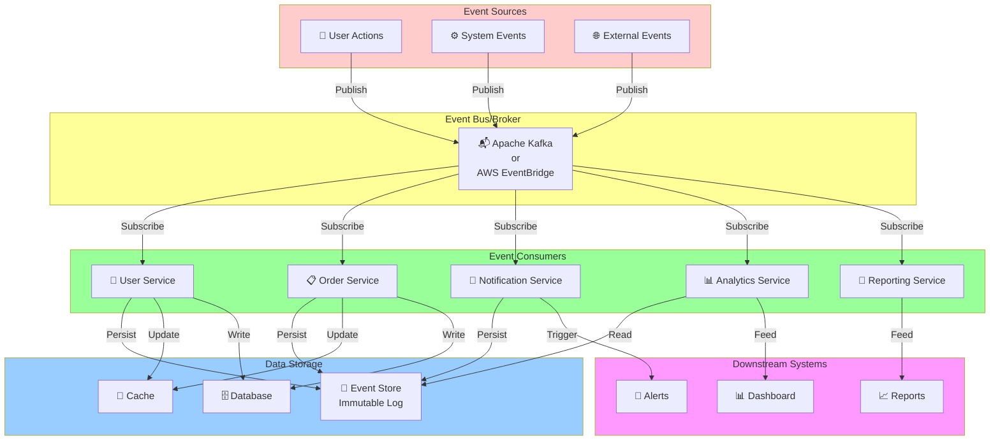
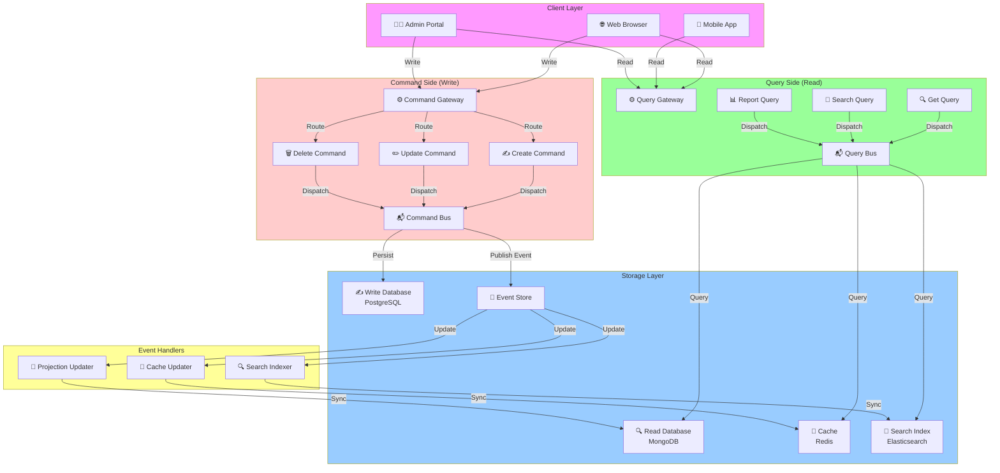

# System Architecture Overview

This document provides interactive visual overviews of multiple system architectures using Mermaid diagrams.

## 1. Monolithic Architecture

---

## 2. Microservices Architecture

---

## 3. Serverless Architecture

---

## 4. Hybrid Architecture (On-Premise + Cloud)

---

## 5. Event-Driven Architecture

---

## 6. CQRS (Command Query Responsibility Segregation) Architecture

---

## Architecture Comparison Table

| Architecture | Scalability | Complexity | Maintainability | Best For |
|---|---|---|---|---|
| **Monolithic** | Low | Low | High | Small teams, MVP |
| **Microservices** | High | High | Medium | Large systems, teams |
| **Serverless** | Very High | Medium | Medium | Sporadic workloads |
| **Hybrid** | High | Very High | Low | Legacy + New systems |
| **Event-Driven** | Very High | High | Medium | Real-time systems |
| **CQRS** | High | Very High | Medium | Complex domains |

---

## Interactive Guide

### Choose Your Architecture:

**📌 Monolithic** - Single deployable unit
- ✅ Simpler to understand
- ✅ Easier to test end-to-end
- ❌ Difficult to scale individual components
- ❌ Tight coupling between features

**📌 Microservices** - Independent deployable services
- ✅ Independent scaling
- ✅ Technology diversity
- ✅ Fault isolation
- ❌ Distributed system complexity
- ❌ Network latency

**📌 Serverless** - Function-as-a-Service
- ✅ No infrastructure management
- ✅ Auto-scaling
- ✅ Pay-per-use pricing
- ❌ Vendor lock-in
- ❌ Cold start latency

**📌 Hybrid** - Mix on-premise and cloud
- ✅ Gradual migration
- ✅ Legacy system support
- ✅ Data sovereignty
- ❌ Operational complexity
- ❌ Network latency between systems

**📌 Event-Driven** - Asynchronous event processing
- ✅ Loose coupling
- ✅ Scalability
- ✅ Real-time capabilities
- ❌ Debugging complexity
- ❌ Eventual consistency challenges

**📌 CQRS** - Separate read and write models
- ✅ Optimized read/write paths
- ✅ Independent scaling
- ✅ Flexibility
- ❌ Eventual consistency
- ❌ Operational complexity

---

## Key Design Patterns by Architecture

### Monolithic
- Layered architecture
- MVC pattern
- Service locator

### Microservices
- API Gateway
- Circuit Breaker
- Saga pattern
- Database per service

### Serverless
- Choreography
- Function composition
- Strangler pattern

### Hybrid
- Adapter pattern
- Facade pattern
- Proxy pattern

### Event-Driven
- Event sourcing
- CQRS
- Saga pattern
- Choreography vs Orchestration

### CQRS
- Event sourcing
- Eventual consistency
- Read model projection
- Snapshotting

---

*Last updated: 2026-09-29*
