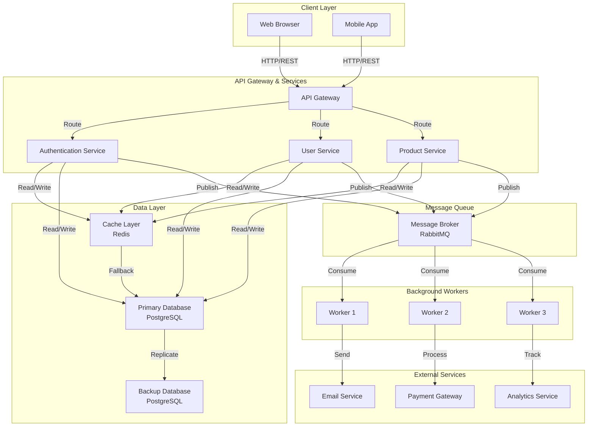

# System Architecture Overview

This document provides a visual overview of the system architecture using a Mermaid diagram.

## Architecture Diagram

## Component Descriptions

### Client Layer
- **Web Browser**: User-facing web application
- **Mobile App**: Native mobile application

### API Gateway & Services
- **API Gateway**: Single entry point for all client requests
- **Authentication Service**: Handles user authentication and authorization
- **User Service**: Manages user profiles and accounts
- **Product Service**: Manages product catalog and information

### Data Layer
- **Cache Layer (Redis)**: High-speed caching for frequently accessed data
- **Primary Database (PostgreSQL)**: Main relational database
- **Backup Database (PostgreSQL)**: Replicated database for disaster recovery

### Message Queue
- **Message Broker (RabbitMQ)**: Asynchronous message processing

### Background Workers
- **Worker 1-3**: Process async tasks from the message queue

### External Services
- **Email Service**: Sends transactional emails
- **Payment Gateway**: Processes payments
- **Analytics Service**: Tracks user behavior and metrics

## Data Flow

1. Client requests are routed through the API Gateway
2. Services handle business logic and cache frequently accessed data
3. Persistent data is stored in the primary database with backup replication
4. Asynchronous tasks are published to the message queue
5. Background workers consume messages and trigger external service integrations
