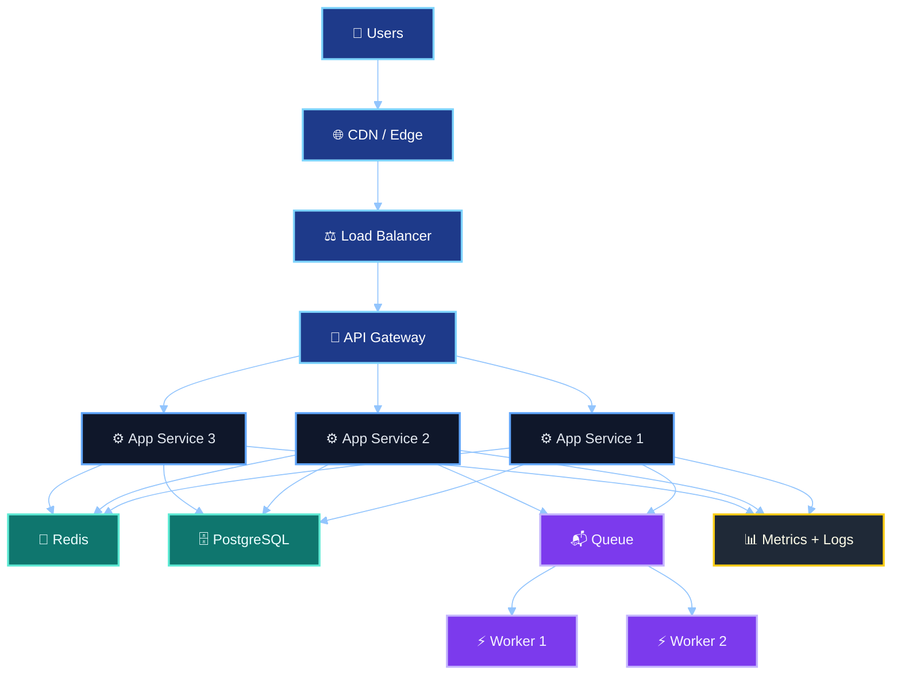
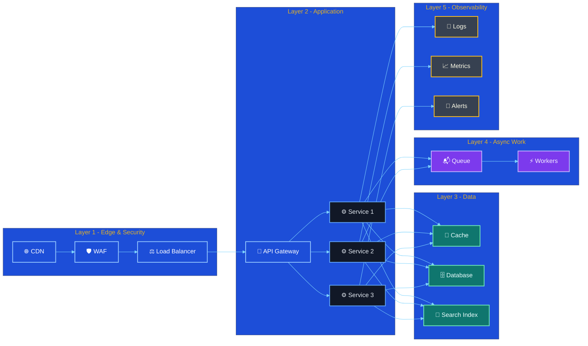
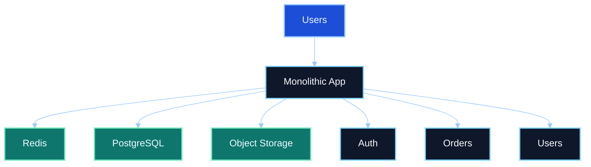
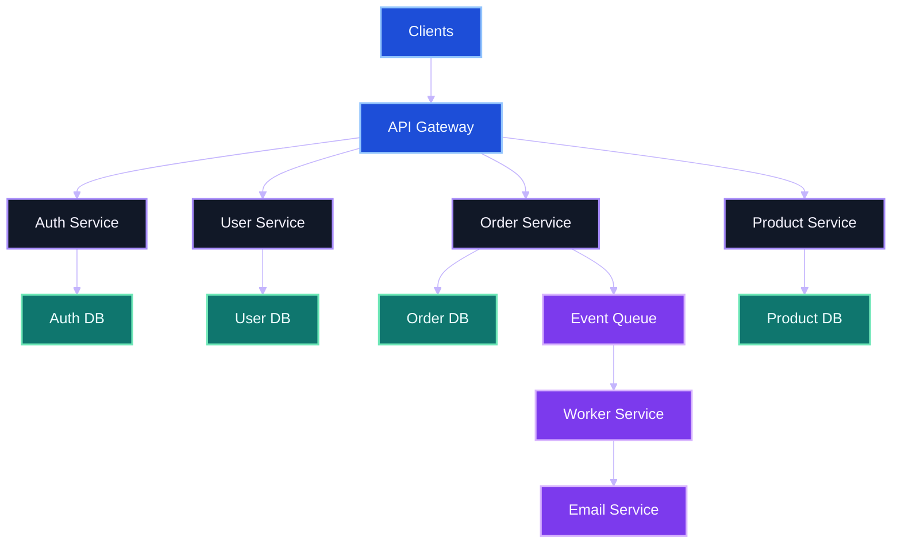
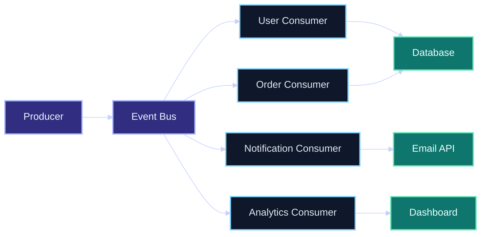
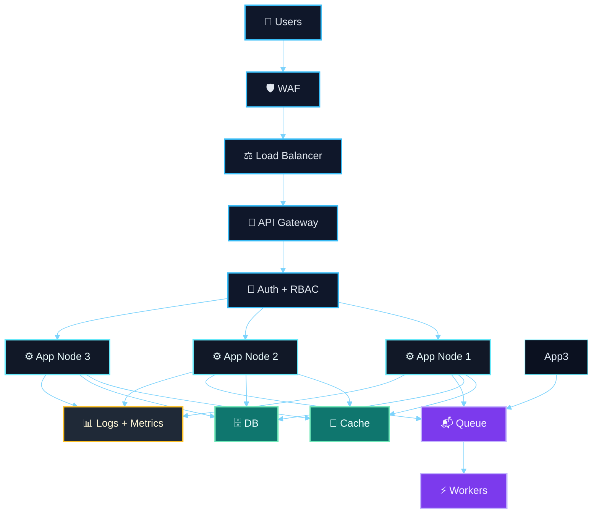
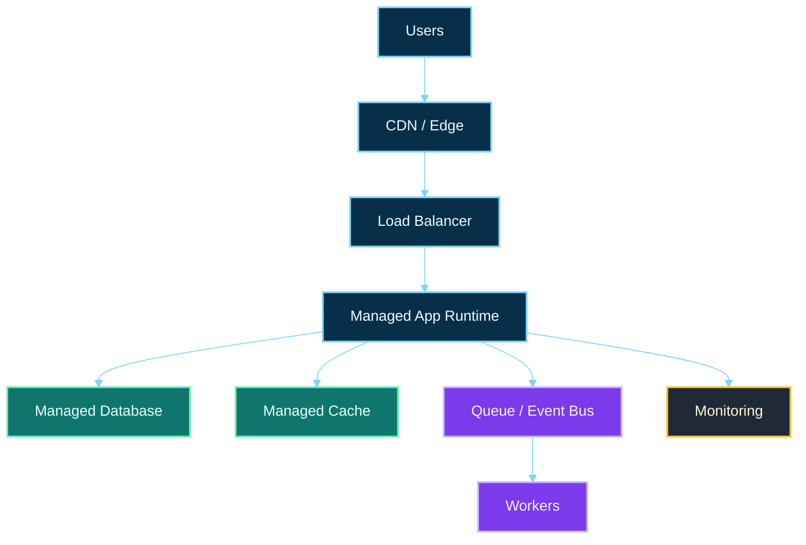
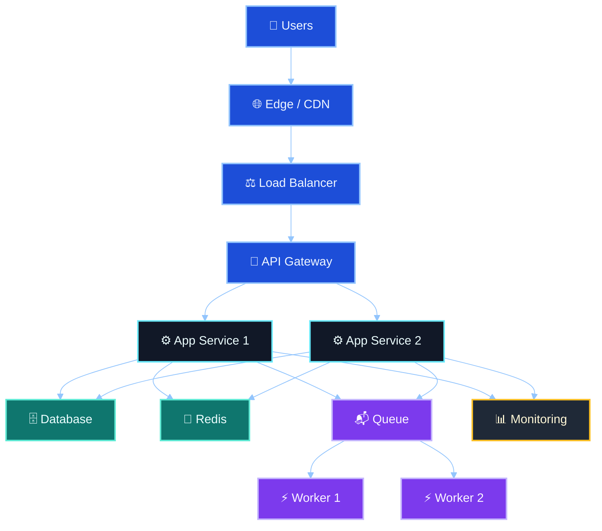

# 🚀 3D-Style Modern System Architecture Blueprint

This version gives the architecture a more polished, layered, and visually elevated look using Mermaid styling that simulates a 3D/glassmorphism effect in GitHub Markdown.

> Note: GitHub Mermaid cannot render true 3D geometry, but it can emulate a depth-like look using layered colors, gradients, shadows, and stronger visual separation.

## 🧭 Executive Overview

Most modern systems combine a few core layers:

- Edge and security layer
- API and application layer
- Data and cache layer
- Async processing layer
- Monitoring and operations layer

---

## 🏗️ Core Architecture Layers

---

## 🧩 Architecture Styles

### 1) Monolithic Architecture

### 2) Microservices Architecture

### 3) Event-Driven Architecture

---

## 🔐 Security + Scalability Blueprint

This pattern gives you:
- secure ingress
- scalable compute layer
- asynchronous processing
- data persistence and caching
- observability and alerting

---

## ☁️ Cloud Deployment Pattern

---

## 🚀 Recommended Production Blueprint

This is the most practical production model for many SaaS and web applications:

- secure edge layer
- load balanced request routing
- scalable application services
- data and cache tier
- async workers for heavy tasks
- monitoring and reliability controls

---

## ✅ Best Practice Summary

A healthy architecture usually balances:

- Security by default
- Horizontal scaling
- Resilient data handling
- Async background processing
- Observability and alerting
- Safe deployment automation
- Recovery plans for outages

The real goal is not to build the most complex system; it is to build the simplest architecture that can scale, survive failure, and stay secure without becoming unmaintainable.

---

*Updated for a more 3D-inspired visual design.*
