# System Architecture Overview

This document provides a comprehensive architecture reference covering application patterns, deployment strategy, scaling models, security, observability, disaster recovery, CI/CD, data flow, cloud deployments, hosting models, server architecture, and production resiliency.

## 1. Application Architecture Overview

### 1.1 Monolithic Architecture

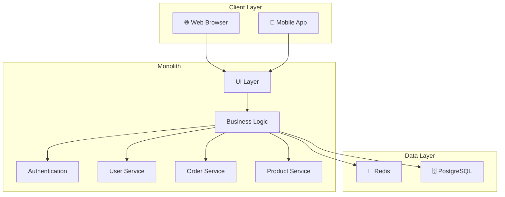
```mermaid
graph TB
    subgraph Client["Client Layer"]
        Web["🌐 Web Browser"]
        Mobile["📱 Mobile App"]
    end

    subgraph App["Monolith"]
        UI["UI Layer"]
        Business["Business Logic"]
        Auth["Authentication"]
        Users["User Service"]
        Orders["Order Service"]
        Products["Product Service"]
    end

    subgraph Data["Data Layer"]
        Cache["🔄 Redis"]
        DB["🗄️ PostgreSQL"]
    end

    Web --> UI
    Mobile --> UI
    UI --> Business
    Business --> Auth
    Business --> Users
    Business --> Orders
    Business --> Products
    Business --> Cache
    Business --> DB
```

### 1.2 Microservices Architecture

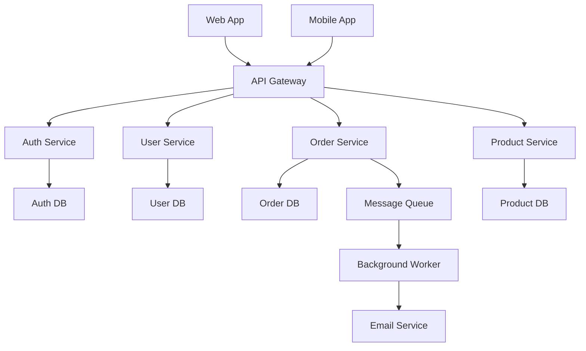
```mermaid
graph TB
    Web["Web App"] --> Gateway["API Gateway"]
    Mobile["Mobile App"] --> Gateway
    Gateway --> Auth["Auth Service"]
    Gateway --> User["User Service"]
    Gateway --> Order["Order Service"]
    Gateway --> Product["Product Service"]

    Auth --> AuthDB["Auth DB"]
    User --> UserDB["User DB"]
    Order --> OrderDB["Order DB"]
    Product --> ProductDB["Product DB"]

    Order --> MQ["Message Queue"]
    MQ --> Worker["Background Worker"]
    Worker --> Email["Email Service"]
```

### 1.3 Event-Driven Architecture

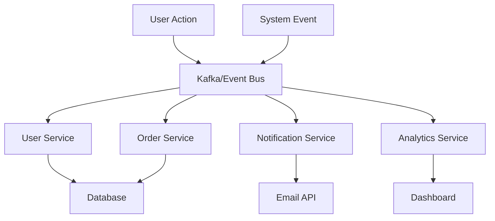
```mermaid
graph TB
    UserAction["User Action"] --> Kafka["Kafka/Event Bus"]
    SystemEvent["System Event"] --> Kafka
    Kafka --> UserSvc["User Service"]
    Kafka --> OrderSvc["Order Service"]
    Kafka --> Notify["Notification Service"]
    Kafka --> Analytics["Analytics Service"]
    UserSvc --> DB["Database"]
    OrderSvc --> DB
    Notify --> Email["Email API"]
    Analytics --> Dash["Dashboard"]
```

### 1.4 Serverless Architecture

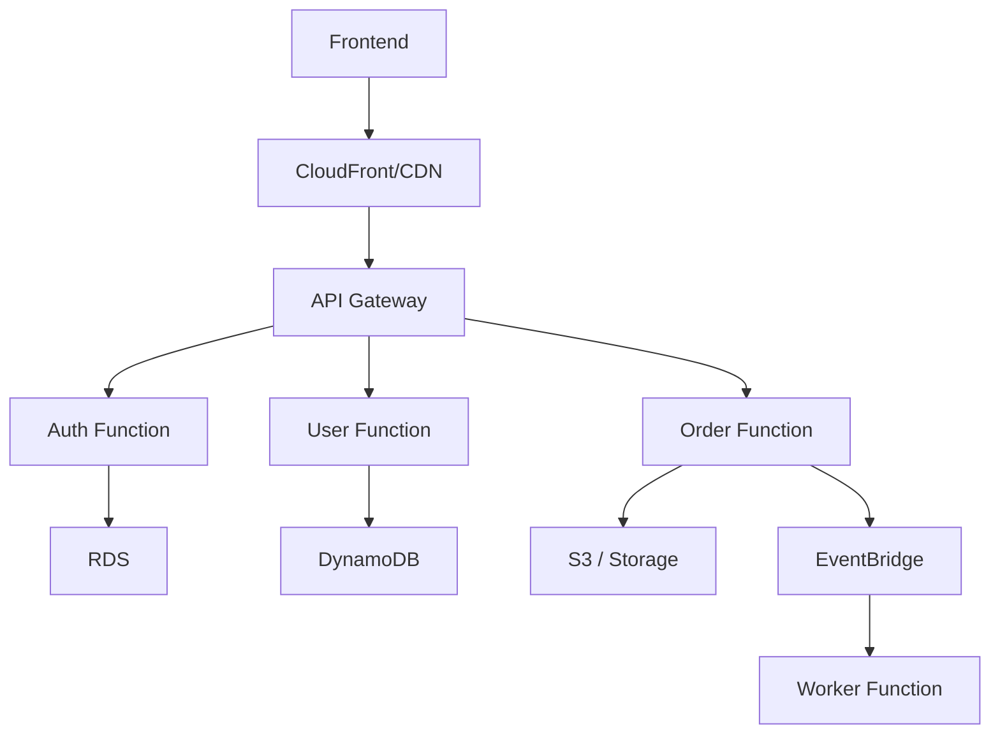
```mermaid
graph TB
    Web["Frontend"] --> Edge["CloudFront/CDN"]
    Edge --> API["API Gateway"]
    API --> AuthF["Auth Function"]
    API --> UserF["User Function"]
    API --> OrderF["Order Function"]

    AuthF --> RDS["RDS"]
    UserF --> Dynamo["DynamoDB"]
    OrderF --> S3["S3 / Storage"]
    OrderF --> EventBridge["EventBridge"]
    EventBridge --> Worker["Worker Function"]
```

---

## 2. Security Architecture

Security must be designed in layers, not added at the end. A robust system protects identity, access, network traffic, data, and operational systems.

### 2.1 Security Layers

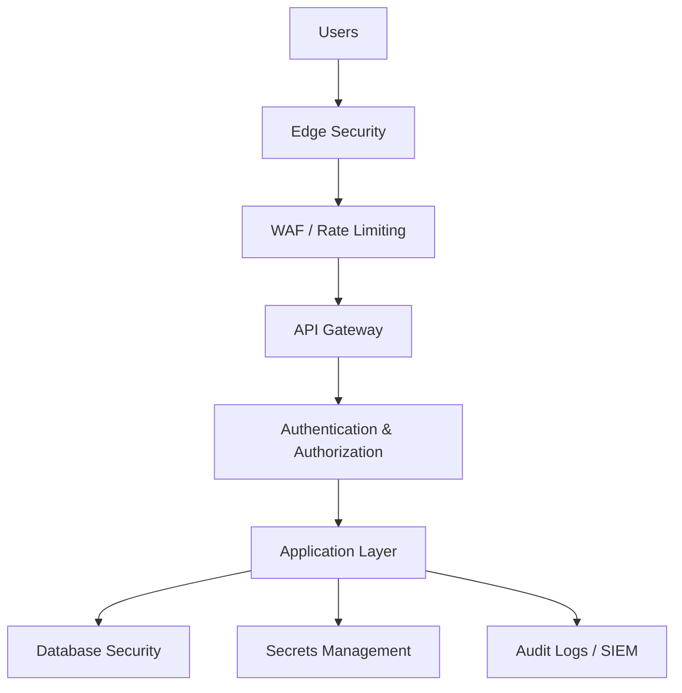
```mermaid
graph TB
    Users["Users"] --> Edge["Edge Security"]
    Edge --> WAF["WAF / Rate Limiting"]
    WAF --> Gateway["API Gateway"]
    Gateway --> Auth["Authentication & Authorization"]
    Auth --> App["Application Layer"]
    App --> DB["Database Security"]
    App --> Secrets["Secrets Management"]
    App --> Logs["Audit Logs / SIEM"]
```

### 2.2 Core Security Controls

- Identity and Access Management
  - OAuth 2.0 / OIDC
  - RBAC / ABAC
  - MFA for admins
  - Short-lived JWTs
- Network Security
  - TLS everywhere
  - Private networking / VPC / subnet isolation
  - WAF and DDoS protection
  - Firewall and IP restrictions
- Application Security
  - Input validation
  - Output encoding
  - CSRF and XSS mitigation
  - SQL injection protection
  - Rate limiting and bot protections
- Data Security
  - Encryption at rest and in transit
  - KMS / HSM backing
  - Secret rotation
  - Tokenization and masking for sensitive values
- Operations Security
  - Least-privilege IAM policies
  - Automated vulnerability scanning
  - Patch management
  - Security events and anomaly detection

### 2.3 Threat Model Areas

- External attacks: network probing, brute force, bot traffic, DDoS
- Application attacks: SQL injection, SSRF, XSS, CSRF, deserialization issues
- Identity attacks: token theft, session hijacking, privilege escalation
- Data attacks: exfiltration, unauthorized access, accidental disclosure
- Supply chain attacks: compromised dependencies, untrusted packages, malicious containers

### 2.4 Security Best Practices

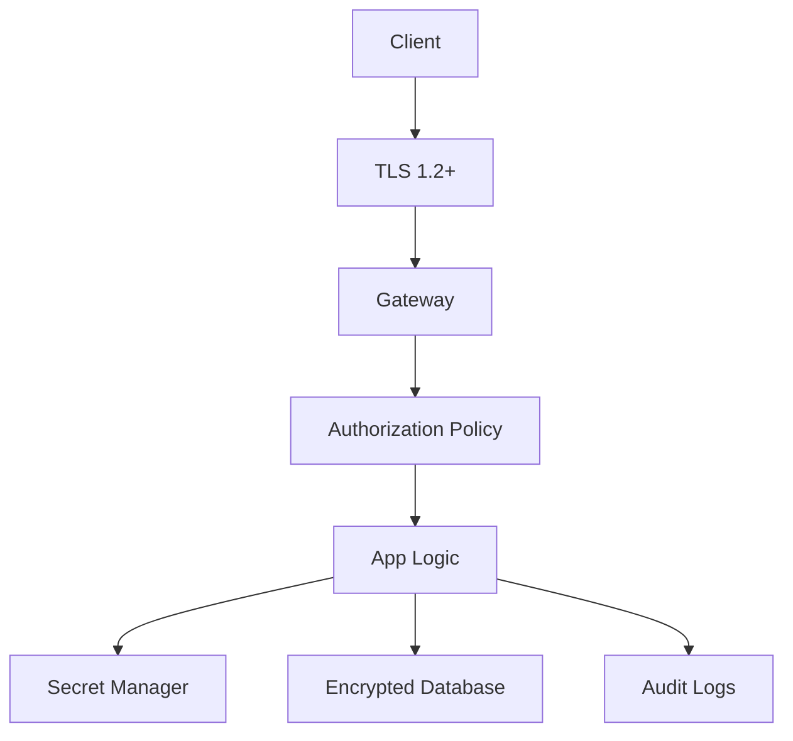
```mermaid
graph TB
    Client["Client"] --> TLS["TLS 1.2+"]
    TLS --> Gateway["Gateway"]
    Gateway --> Policy["Authorization Policy"]
    Policy --> App["App Logic"]
    App --> Secrets["Secret Manager"]
    App --> DB["Encrypted Database"]
    App --> Logs["Audit Logs"]
```

- Use secret managers for API keys, certificates, and database credentials
- Review and rotate tokens regularly
- Validate all request inputs and schema contracts
- Log security-relevant events consistently
- Scan dependencies, containers, and IaC before deployment
- Limit and monitor admin access aggressively
- Keep systems patched and hardened

---

## 3. Scalability Architecture

Scalability is the system’s ability to handle increased load without unacceptable latency, failure, or complexity. There are several patterns to choose from.

### 3.1 Horizontal Scaling Pattern

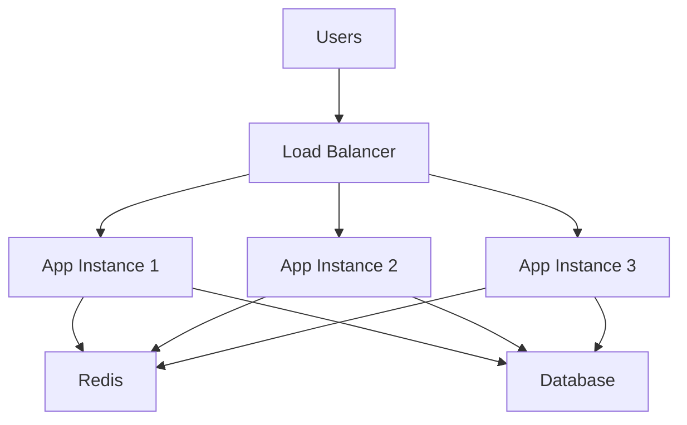
```mermaid
graph TB
    Users["Users"] --> LB["Load Balancer"]
    LB --> App1["App Instance 1"]
    LB --> App2["App Instance 2"]
    LB --> App3["App Instance 3"]
    App1 --> Cache["Redis"]
    App2 --> Cache
    App3 --> Cache
    App1 --> DB["Database"]
    App2 --> DB
    App3 --> DB
```

**Best for:**
- Stateless web services
- APIs and microservices
- Burst traffic patterns

**Pros:**
- Simple scale-out model
- High resilience
- Low cost for stateless workloads

**Cons:**
- Shared services can become bottlenecks
- Requires session management strategy if stateful

### 3.2 Vertical Scaling Pattern

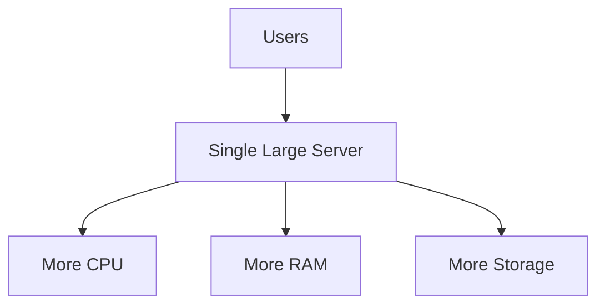
```mermaid
graph TB
    Users["Users"] --> Server["Single Large Server"]
    Server --> CPU["More CPU"]
    Server --> RAM["More RAM"]
    Server --> Disk["More Storage"]
```

**Best for:**
- Small systems
- Database nodes
- Monolithic applications

**Pros:**
- Simpler to manage
- No distributed coordination needed

**Cons:**
- Hardware ceiling
- More downtime during upgrades
- Less fault isolation

### 3.3 Read Replicas and Database Scaling

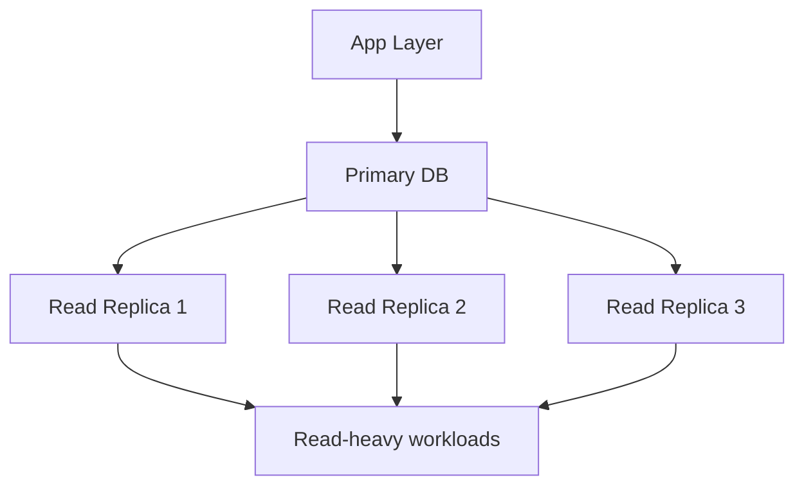
```mermaid
graph TB
    App["App Layer"] --> Primary["Primary DB"]
    Primary --> Replica1["Read Replica 1"]
    Primary --> Replica2["Read Replica 2"]
    Primary --> Replica3["Read Replica 3"]
    Replica1 --> Read["Read-heavy workloads"]
    Replica2 --> Read
    Replica3 --> Read
```

**Best for:**
- Read-heavy applications
- Reporting dashboards
- Search-heavy workloads

**Pros:**
- Improves read performance
- Offloads primary database
- Easier to scale reads independently

**Cons:**
- Replication lag
- Eventual consistency
- Not for all write-heavy systems

### 3.4 Sharding

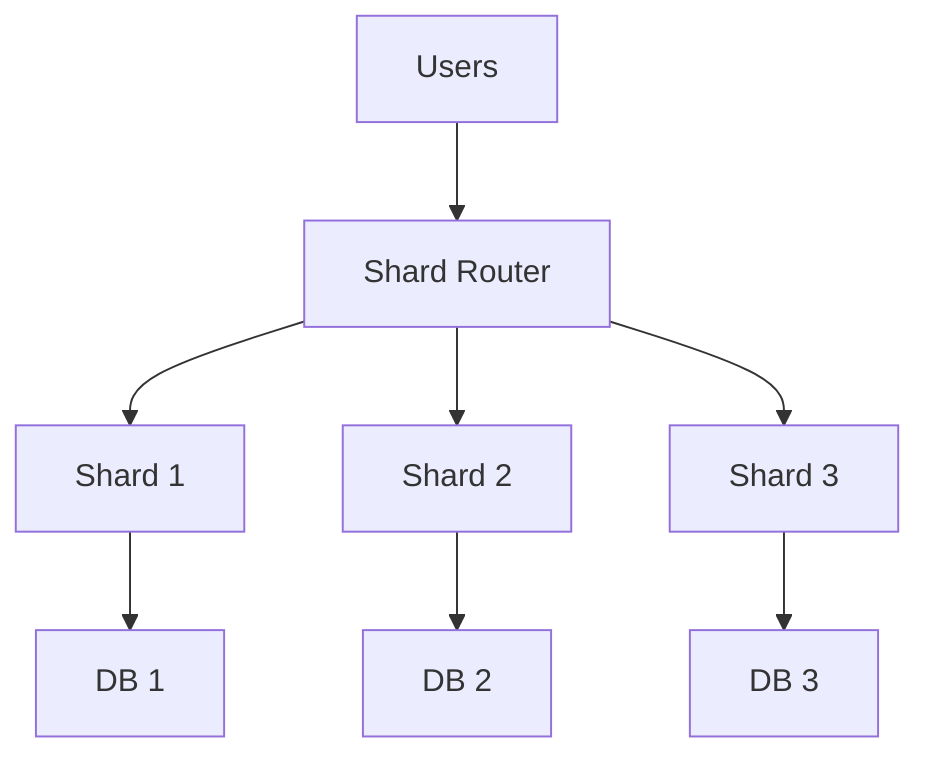
```mermaid
graph TB
    Users["Users"] --> Router["Shard Router"]
    Router --> Shard1["Shard 1"]
    Router --> Shard2["Shard 2"]
    Router --> Shard3["Shard 3"]
    Shard1 --> DB1["DB 1"]
    Shard2 --> DB2["DB 2"]
    Shard3 --> DB3["DB 3"]
```

**Best for:**
- Very large datasets
- Partition-by-tenant or user grouping
- Large-scale systems with data distribution

**Pros:**
- High scale-out for data
- Better distribution of I/O

**Cons:**
- More application complexity
- Cross-shard queries are expensive
- Rebalancing can be hard

### 3.5 Caching Strategy

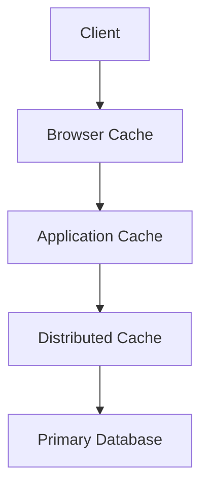
```mermaid
graph TB
    Client["Client"] --> Browser["Browser Cache"]
    Browser --> App["Application Cache"]
    App --> Redis["Distributed Cache"]
    Redis --> DB["Primary Database"]
```

**Best for:**
- Frequently repeated reads
- Expensive compute or database lookups
- High-traffic API endpoints

**Pros:**
- Lower latency
- Less database pressure
- Better throughput

**Cons:**
- Cache invalidation complexity
- Stale data risk
- More memory overhead

### 3.6 Queue-Based Scaling

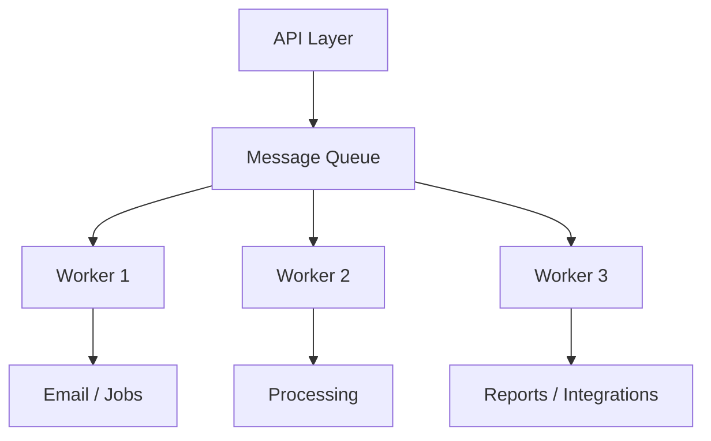
```mermaid
graph TB
    API["API Layer"] --> MQ["Message Queue"]
    MQ --> Worker1["Worker 1"]
    MQ --> Worker2["Worker 2"]
    MQ --> Worker3["Worker 3"]
    Worker1 --> Task1["Email / Jobs"]
    Worker2 --> Task2["Processing"]
    Worker3 --> Task3["Reports / Integrations"]
```

**Best for:**
- Background jobs
- Heavy processing tasks
- Decoupled systems

**Pros:**
- Better resilience under spikes
- Worker autoscaling
- Producers and consumers are decoupled

**Cons:**
- More operational complexity
- Event ordering challenges
- Need retry and dead-letter handling

### 3.7 Scalability Rules of Thumb

- Scale out stateless services, not databases first
- Use caching for repeated reads
- Offload long-running work into workers and queues
- Keep database transactions small and focused
- Use observability to identify exact bottlenecks
- Test with realistic load patterns before production rollout

---

## 4. Observability Architecture

Observability is the ability to understand system health and failures from data.

### 4.1 Observability Stack

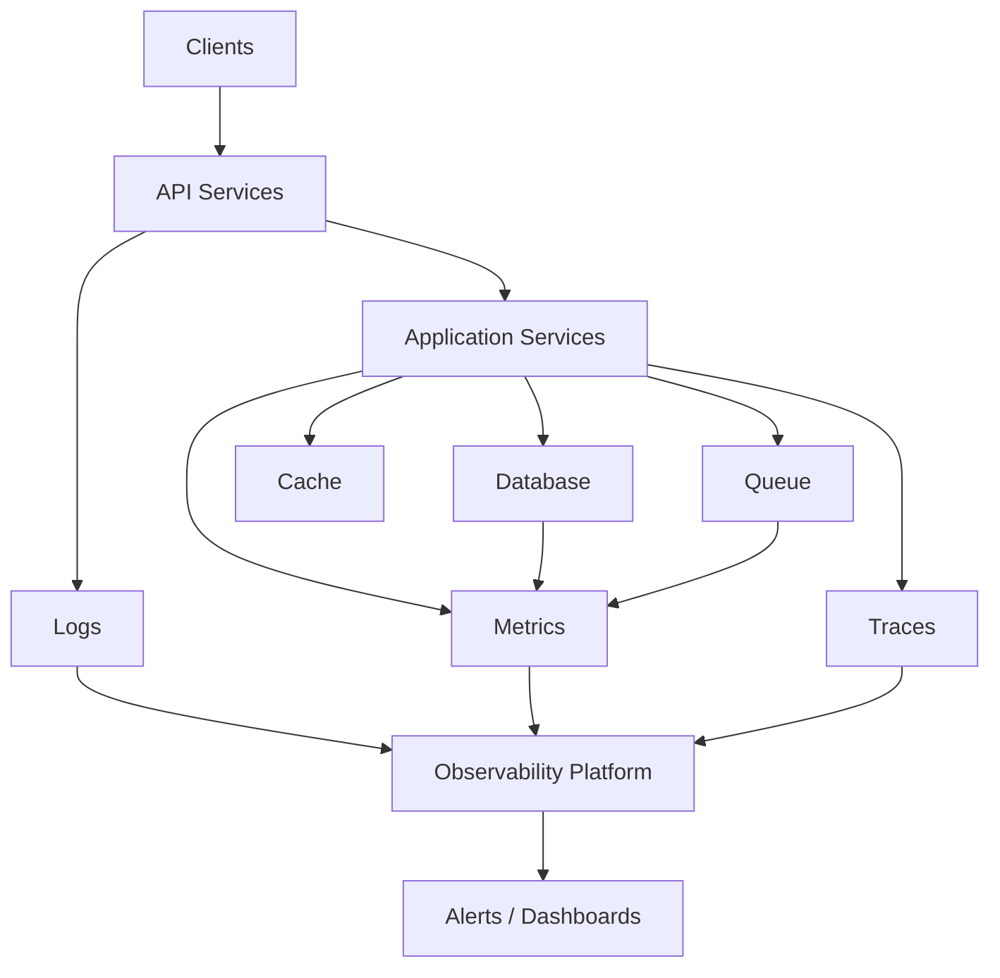
```mermaid
graph TB
    Clients["Clients"] --> API["API Services"]
    API --> App["Application Services"]
    App --> DB["Database"]
    App --> Queue["Queue"]
    App --> Cache["Cache"]

    API --> Logs["Logs"]
    App --> Metrics["Metrics"]
    App --> Traces["Traces"]
    DB --> Metrics
    Queue --> Metrics

    Logs --> OTel["Observability Platform"]
    Metrics --> OTel
    Traces --> OTel
    OTel --> Alerts["Alerts / Dashboards"]
```

### 4.2 What to Measure

- Latency
- Error rate
- Throughput
- CPU and memory usage
- Database response time
- Disk and network saturation
- Queue backlog
- User-facing SLOs

### 4.3 Observability Best Practices

- Add correlation IDs to requests
- Centralize logs in a searchable platform
- Use OpenTelemetry for consistent tracing and metrics
- Set alerts on actionable thresholds, not noise
- Define SLOs and error budgets

---

## 5. Disaster Recovery and High Availability

### 5.1 DR Model

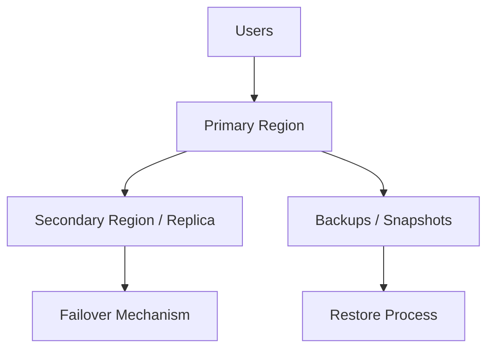
```mermaid
graph TB
    Users["Users"] --> Prod["Primary Region"]
    Prod --> Replica["Secondary Region / Replica"]
    Prod --> Backup["Backups / Snapshots"]
    Backup --> Restore["Restore Process"]
    Replica --> Failover["Failover Mechanism"]
```

### 5.2 DR Strategies

- Backup-only
- Warm standby
- Hot standby
- Multi-region active-active

### 5.3 Key Metrics

- RTO: restoration time target
- RPO: acceptable data loss window
- SLA: uptime expectations
- MTTR: mean time to recover

---

## 6. CI/CD and Deployment Safety

### 6.1 CI/CD Flow

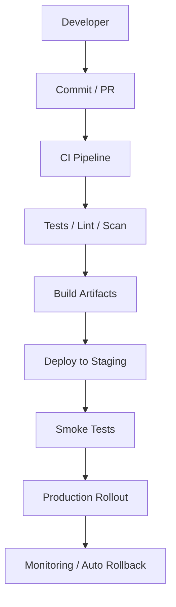
```mermaid
graph TB
    Dev["Developer"] --> Commit["Commit / PR"]
    Commit --> CI["CI Pipeline"]
    CI --> Test["Tests / Lint / Scan"]
    Test --> Build["Build Artifacts"]
    Build --> Deploy["Deploy to Staging"]
    Deploy --> Smoke["Smoke Tests"]
    Smoke --> Prod["Production Rollout"]
    Prod --> Monitor["Monitoring / Auto Rollback"]
```

### 6.2 Safe Deployment Options

- Blue/Green deployment
- Canary release
- Rolling deployment
- Shadow deployment

### 6.3 Deployment Best Practices

- Separate environments by stage
- Use immutable artifacts
- Make rollback automatic
- Gate production on health checks
- Run smoke tests before exposing users to new versions

---

## 7. Data Flow and System Interaction

### 7.1 Example Data Flow

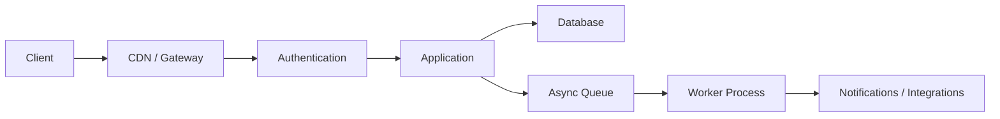
```mermaid
graph LR
    Client["Client"] --> Edge["CDN / Gateway"]
    Edge --> Auth["Authentication"]
    Auth --> App["Application"]
    App --> DB["Database"]
    App --> Queue["Async Queue"]
    Queue --> Worker["Worker Process"]
    Worker --> Notify["Notifications / Integrations"]
```

### 7.2 System Interactions Best Practices

- Validate data at boundaries
- Keep data flows explicit and observable
- Use async patterns for non-critical work
- Ensure idempotency for retries and message reprocessing

---

## 8. Cloud Hosting Patterns

### 8.1 AWS Pattern

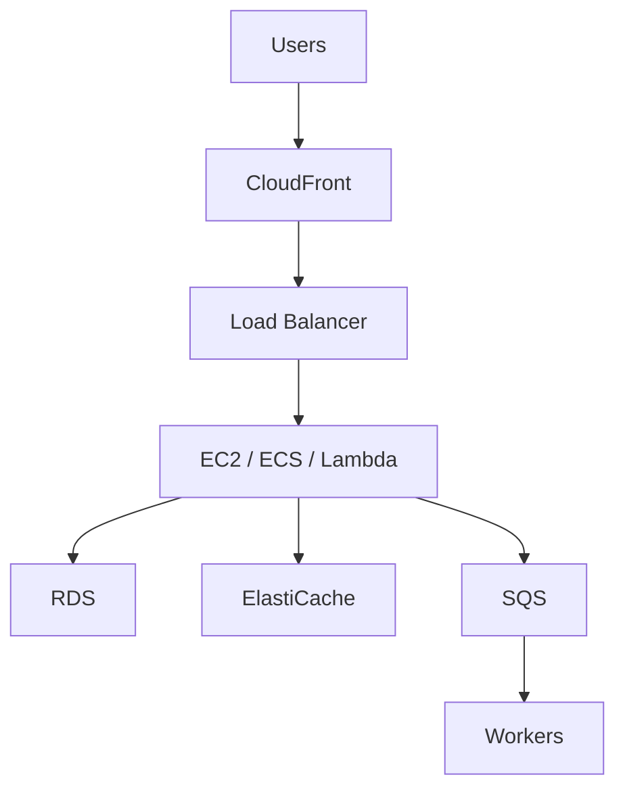
```mermaid
graph TB
    Users["Users"] --> CF["CloudFront"]
    CF --> ALB["Load Balancer"]
    ALB --> App["EC2 / ECS / Lambda"]
    App --> RDS["RDS"]
    App --> Redis["ElastiCache"]
    App --> SQS["SQS"]
    SQS --> Worker["Workers"]
```

### 8.2 Azure Pattern

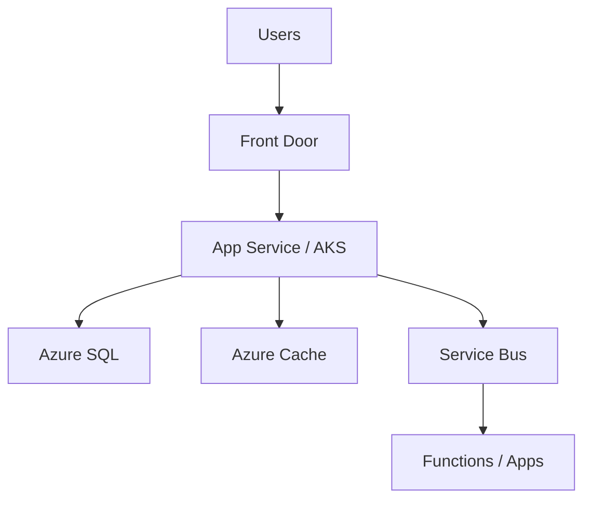
```mermaid
graph TB
    Users["Users"] --> FrontDoor["Front Door"]
    FrontDoor --> App["App Service / AKS"]
    App --> SQL["Azure SQL"]
    App --> Redis["Azure Cache"]
    App --> SB["Service Bus"]
    SB --> Worker["Functions / Apps"]
```

### 8.3 GCP Pattern

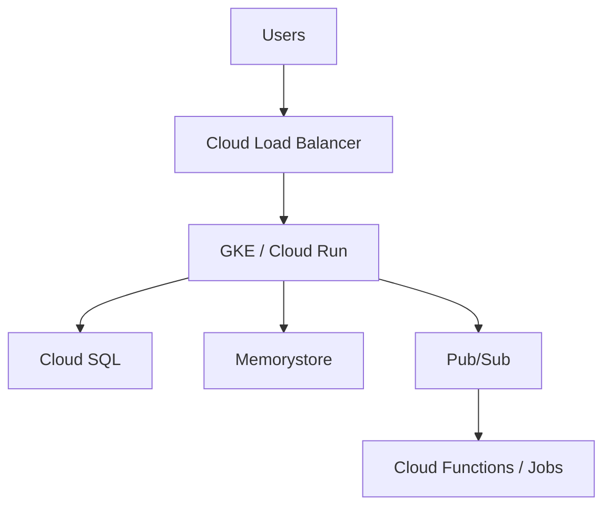
```mermaid
graph TB
    Users["Users"] --> LB["Cloud Load Balancer"]
    LB --> App["GKE / Cloud Run"]
    App --> SQL["Cloud SQL"]
    App --> Redis["Memorystore"]
    App --> PubSub["Pub/Sub"]
    PubSub --> Worker["Cloud Functions / Jobs"]
```

---

## 9. Hosting and Server Model

### 9.1 Shared Hosting

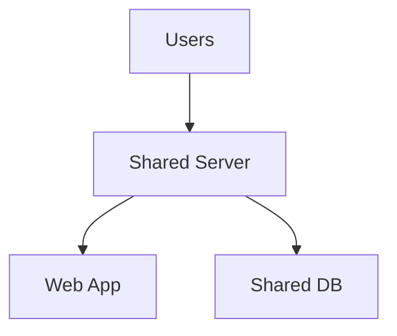
```mermaid
graph TB
    Users["Users"] --> Server["Shared Server"]
    Server --> App["Web App"]
    Server --> DB["Shared DB"]
```

### 9.2 VPS

```mermaid
graph TB
    Users["Users"] --> VPS["VPS Instance"]
    VPS --> Nginx["Nginx"]
    Nginx --> App["App Server"]
    App --> DB["Database"]
```

### 9.3 Cloud Hosting

```mermaid
graph TB
    Users["Users"] --> LB["Load Balancer"]
    LB --> App1["Server 1"]
    LB --> App2["Server 2"]
    App1 --> Cache["Cache"]
    App2 --> Cache
    App1 --> DB["Managed DB"]
    App2 --> DB
```

### 9.4 Container Hosting

```mermaid
graph TB
    Users["Users"] --> Ingress["Ingress"]
    Ingress --> K8s["Kubernetes Cluster"]
    K8s --> Pod1["Container 1"]
    K8s --> Pod2["Container 2"]
    Pod1 --> DB["Database"]
    Pod2 --> DB
```

### 9.5 Serverless Hosting

```mermaid
graph TB
    Users["Users"] --> API["API Gateway"]
    API --> Fn1["Function 1"]
    API --> Fn2["Function 2"]
    Fn1 --> Storage["Storage / DB"]
    Fn2 --> Storage
```

---

## 10. Production Infrastructure Recommendations

- Put TLS termination and WAF at the edge
- Use load balancing and health checks in front of app nodes
- Run stateless services behind a load balancer
- Keep state in managed data stores
- Externalize async work to queues and workers
- Keep security policies centralized
- Monitor core latency, saturation, and error budgets
- Test both scale-out and failure modes before production

---

## 11. Security + Scalability Combined Blueprint

```mermaid
graph TB
    Users["Users"] --> WAF["WAF / Edge Protection"]
    WAF --> LB["Load Balancer"]
    LB --> API["API Gateway"]
    API --> Auth["Auth & Policy"]
    Auth --> App1["App Instance 1"]
    Auth --> App2["App Instance 2"]
    Auth --> App3["App Instance 3"]
    App1 --> Cache["Redis"]
    App2 --> Cache
    App3 --> Cache
    App1 --> DB["Primary DB"]
    App2 --> DB
    App3 --> DB
    App1 --> MQ["Queue"]
    App2 --> MQ
    App3 --> MQ
    MQ --> Worker["Workers"]
    App1 --> OTel["Observability"]
    App2 --> OTel
    App3 --> OTel
```

This combined pattern provides:
- Secure ingress and request handling
- Horizontal scaling for application compute
- Decoupled async processing
- Observability and operational insights
- A stable path to production growth

---

## 12. Final Recommendation

The most resilient systems typically combine:

- Secure edge and identity layers
- Horizontal scaling for stateless services
- Managed databases, caches, and queues
- Async processing for heavy work
- Observability for latency and errors
- Automated deployment with rollback safety
- Cloud-native or containerized hosting for elasticity

The goal is to reach the lowest-complexity design that still meets performance, security, and reliability targets.

---

*Last updated: 2026-09-29*
