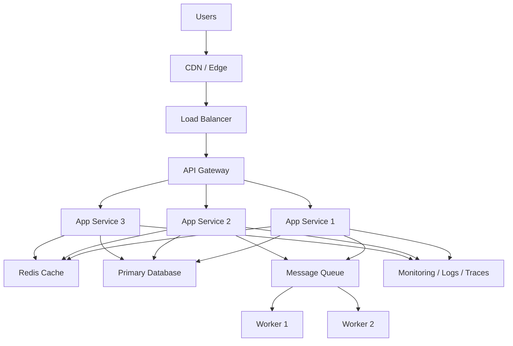

# Technical Architecture Overview

## 1. Purpose

This document describes the system architecture for a scalable, secure, and resilient application platform. The design is intended to support increasing traffic, evolving business logic, and operational reliability while keeping the platform maintainable and easy to evolve.

## 2. Architecture Goals

The architecture is designed around the following goals:

- Secure access and controlled traffic entry
- Horizontal scalability for application services
- High availability and recovery capability
- Clear separation of responsibilities across layers
- Reduced latency for frequently accessed data
- Support for asynchronous background processing
- Full observability across services and infrastructure

## 3. High-Level Architecture

## 4. Layered Design

### 4.1 Edge Layer
The edge layer provides the first contact point for all incoming traffic. It handles TLS termination, request routing, traffic filtering, static asset delivery, and perimeter protection.

Responsibilities:
- request admission
- SSL/TLS handling
- HTTP traffic management
- rate limiting and filtering
- static asset serving

### 4.2 Application Layer
The application layer contains the system's business logic and exposes APIs to clients. Services are designed to be stateless and horizontally scalable.

Responsibilities:
- API handlers
- business process execution
- middleware and validation
- authorization checks
- transaction orchestration

### 4.3 Data Layer
The data layer stores system state and supports persistence, lookups, and data access patterns.

Typical components:
- relational database
- cache layer
- object storage
- search or analytics systems

### 4.4 Async Processing Layer
Work that is not time-critical is offloaded to asynchronous workers using a queue system. This keeps the user-facing request path fast and reduces coupling between request handling and background execution.

Typical workloads:
- email delivery
- report generation
- job orchestration
- integrations with external systems

### 4.5 Observability Layer
Observability is required for production readiness. It provides insight into system behavior, health, latency, and failure modes.

Included signals:
- application logs
- metrics
- tracing
- alerting and dashboards
- uptime and health monitoring

## 5. Security Architecture

Security is implemented using a defense-in-depth model.

### 5.1 Key Controls
- TLS encryption for all client and service communication
- API gateway enforcement
- authentication and authorization
- least-privilege access policies
- secret management
- data encryption at rest and in transit
- rate limiting and request validation
- vulnerability scanning for code and dependencies

### 5.2 Security Principles
- never trust client input blindly
- separate identity from business logic
- limit privilege to specific workloads and users
- centralize and rotate secrets
- log and monitor security-relevant events

## 6. Scalability and Performance

### 6.1 Horizontal Scaling
Application services are designed to be stateless so that multiple instances can run behind a load balancer. This provides redundancy and supports increased traffic.

### 6.2 Caching
Caching reduces repeated database reads and improves response time for latency-sensitive operations.

### 6.3 Queue-Based Decoupling
Background processing is decoupled from the user request path through queue-based worker systems, reducing operational bottlenecks.

## 7. Reliability and Fault Tolerance

The system is designed for recovery under failure conditions.

Key reliability measures:
- health checks
- failover support
- backup and restore processes
- database replication where required
- graceful degradation of non-critical features
- deployment rollback mechanisms
- targeted monitoring and alerting

## 8. Deployment Model

The deployment model should follow a controlled release pipeline.

Recommended flow:
1. source commit
2. automated build and validation
3. static analysis and security checks
4. test execution
5. staging deployment
6. smoke testing
7. production deployment
8. monitoring and rollback if needed

Preferred release patterns:
- canary deployment
- blue/green deployment
- rolling deployment

## 9. Non-Functional Requirements

The system should satisfy the following operational expectations:

- high availability for critical services
- predictable latency under load
- secure access control
- low mean time to recover
- resilience against transient failures
- maintainability and traceability of changes

## 10. Recommended Technology Stack

### 10.1 Backend
Recommended: Go

Why:
- strong concurrency model
- efficient runtime
- stable and scalable for API services and workers
- low operational overhead compared with heavier runtimes

Use cases:
- REST APIs
- background workers
- internal service logic
- event-driven processing

Alternative:
- Node.js for teams with strong JavaScript expertise
- .NET for enterprise environments with existing Microsoft tooling

### 10.2 Database
Recommended: PostgreSQL

Why:
- robust relational model
- strong transaction support
- excellent tooling and ecosystem
- suitable for operational and reporting workloads

Use cases:
- user and account data
- transaction processing
- configuration and business records
- analytics-friendly structured datasets

### 10.3 Cache
Recommended: Redis

Why:
- very fast in-memory reads
- good for hot-path optimization
- useful for sessions, tokens, and shared state
- practical for rate limiting and short-lived caching

Use cases:
- session management
- user preference caching
- API response caching
- distributed locking and coordination

### 10.4 Async Messaging
Recommended: RabbitMQ

Why:
- simple and reliable
- well suited for job queueing and message processing
- straightforward operational model for many production systems

Use cases:
- email and notifications
- file processing
- report generation
- integration tasks
- retry workflows

Alternative:
- Kafka for extremely high-volume event streaming and long retention workloads

### 10.5 Containerization
Recommended: Docker

Why:
- standard packaging model
- portable deployment unit
- works well with modern CI/CD and orchestration tools

### 10.6 Orchestration
Recommended: Kubernetes or managed container services

Why:
- supports scaling, rollback, deployment automation, health checks, and self-healing operations

Use:
- Kubernetes for full control and scale
- managed container platforms for reduced operational responsibility

### 10.7 API Style
Recommended:
- REST for external client APIs
- gRPC for internal service-to-service communication where low latency matters

Why:
- REST is simple and broadly supported
- gRPC is efficient for internal microservice communication

### 10.8 Observability
Recommended: OpenTelemetry + Prometheus + Grafana

Why:
- standard telemetry model
- high visibility into performance and reliability
- strong ecosystem support

Components:
- OpenTelemetry for instrumentation
- Prometheus for metrics
- Grafana for dashboards
- logs and traces via platform-specific tools

### 10.9 CI/CD
Recommended: GitHub Actions

Why:
- simple workflow automation
- good integration with GitHub repositories
- easy deployment pipelines and checks

Use cases:
- build validation
- automated tests
- security scanning
- deployment gates

### 10.10 Infrastructure
Recommended: Managed cloud services

Why:
- reduces operational burden
- improves reliability and easier scaling
- easier enterprise support and lifecycle management

Example:
- managed PostgreSQL
- managed Redis
- managed queue service or RabbitMQ
- managed Kubernetes or container runtime
- managed secrets and IAM services

### 10.11 Security
Recommended:
- IAM / RBAC
- secret manager
- TLS everywhere
- API gateway or WAF
- dependency scanning
- image scanning
- least-privilege access controls

## 11. Why This Stack Fits Best

This combination is a strong default for a modern production platform because it balances performance, reliability, operational simplicity, and ecosystem maturity.

### Strong reasons:
- Go offers excellent concurrency and performance for API and worker workloads
- PostgreSQL is a proven and flexible relational database for business systems
- Redis improves response times for frequently accessed data
- RabbitMQ provides a reliable background job mechanism without overcomplicating the system
- Docker standardizes deployment
- Kubernetes or managed containers provide scalability and operational resilience
- OpenTelemetry, Prometheus, and Grafana provide a mature observability stack
- GitHub Actions simplifies delivery and CI pipelines

### Why this is better than many alternatives:
- More reliable than lightweight single-service prototypes
- Easier to operate than highly custom or overly fragmented stacks
- More scalable than simple monolithic patterns without clear service boundaries
- Better suited to production than ad hoc tooling combinations
- Stronger operational visibility than many minimal stacks
- More portable and maintainable than tightly coupled vendor-specific stacks

Compared with alternatives such as only using a single framework with no queueing, no observability, or no container orchestration, this architecture is more stable under production load and easier to support over time.

## 12. Recommended Technical Direction

The recommended direction is a modular, cloud-native architecture using:
- stateless application services
- managed databases and cache
- queue-driven background processing
- centralized observability
- secure ingress and authorization
- automated deployment and rollback support

This provides the best balance between scalability, resilience, and maintainability.

## 13. Final Recommended Default Stack

- Go
- PostgreSQL
- Redis
- RabbitMQ
- Docker
- Kubernetes or managed containers
- REST + gRPC where appropriate
- OpenTelemetry
- Prometheus + Grafana
- GitHub Actions

This stack is a strong default for:
- SaaS products
- internal business systems
- scalable API platforms
- production services with reliability requirements

## 14. Conclusion

This architecture establishes a strong technical foundation for a modern application platform. It is designed to support business growth, protect system integrity, and provide a clear path for future platform evolution without introducing unnecessary architectural complexity.